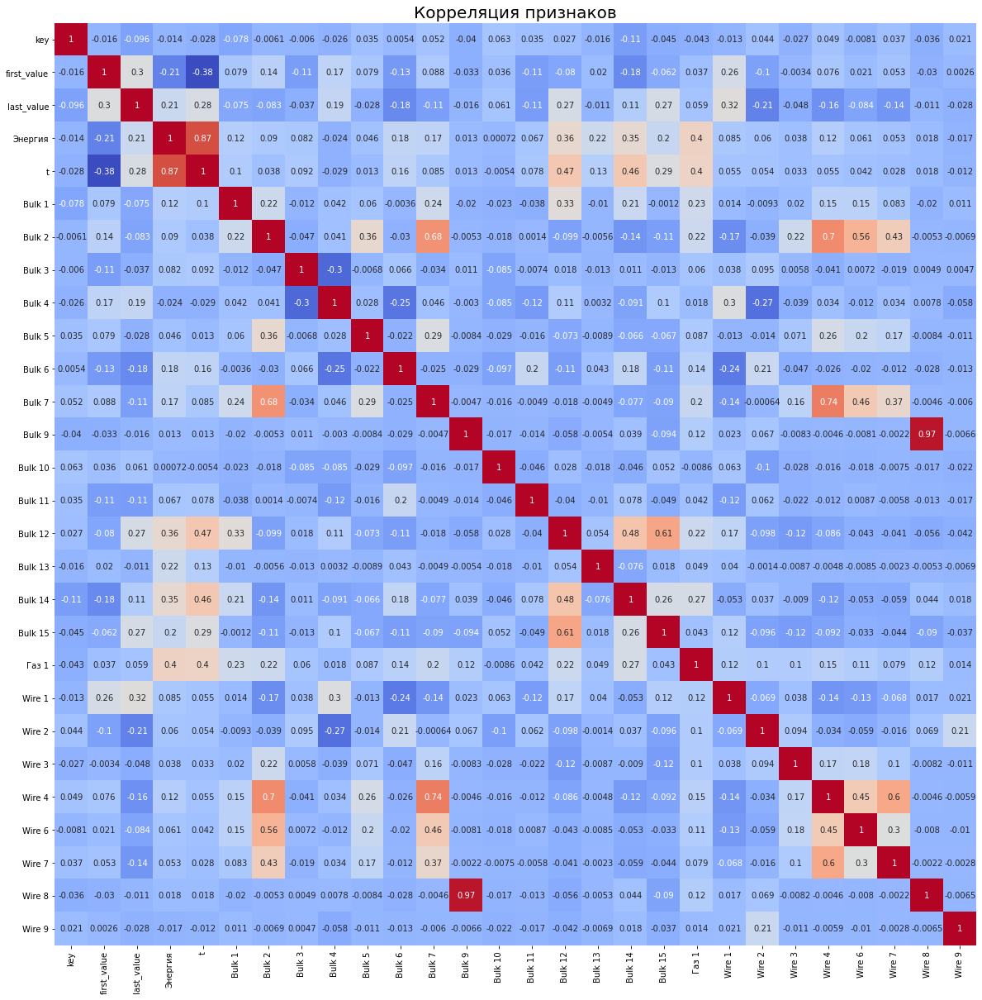
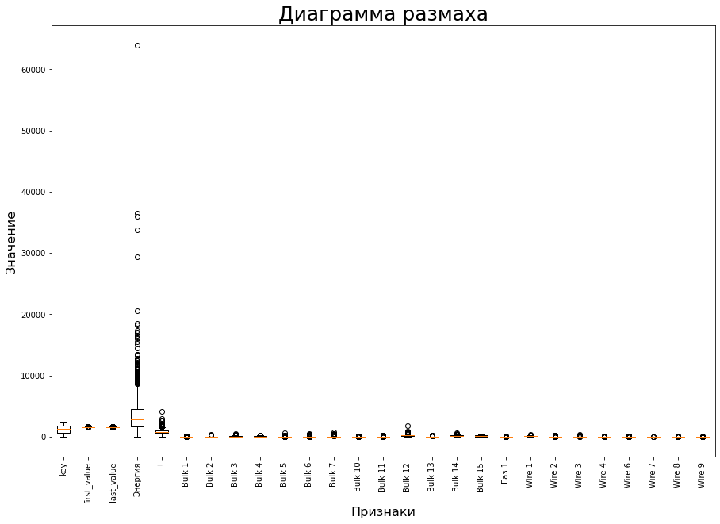
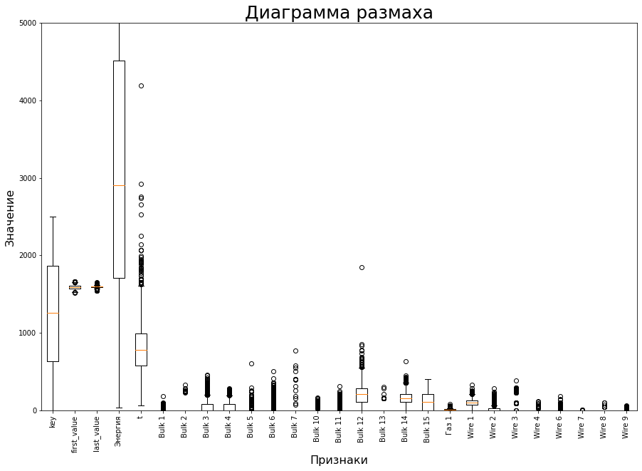
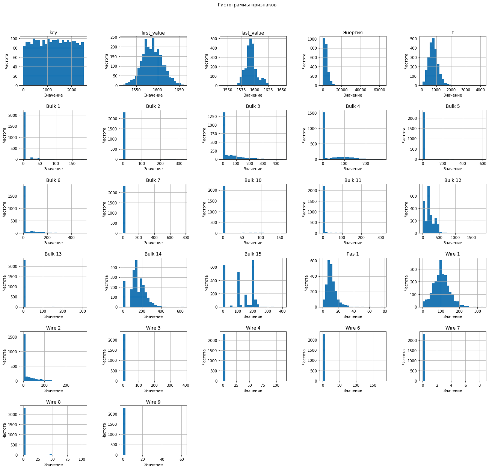
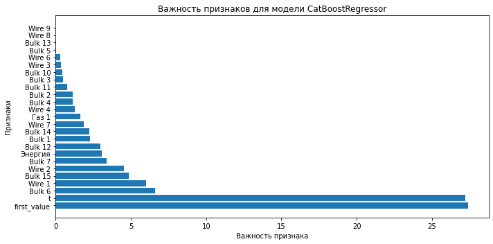

# Предсказание температуры стали

# Описание проекта: промышленность


Чтобы оптимизировать производственные расходы, металлургический комбинат ООО «Так закаляем сталь» решил уменьшить потребление электроэнергии на этапе обработки стали. Задача: построить модель, которая предскажет температуру стали.


# Описание данных

Данные состоят из файлов, полученных из разных источников:

data_arc_new.csv — данные об электродах;

data_bulk_new.csv — данные о подаче сыпучих материалов (объём);

data_bulk_time_new.csv — данные о подаче сыпучих материалов (время);

data_gas_new.csv — данные о продувке сплава газом;

data_temp_new.csv — результаты измерения температуры;

data_wire_new.csv — данные о проволочных материалах (объём);

data_wire_time_new.csv — данные о проволочных материалах (время).

Во всех файлах столбец key содержит номер партии. В файлах может быть несколько строк с одинаковым значением key: они соответствуют разным итерациям обработки.


# План работы

1.Знакомство с данными: загрузка и подготовка, их описание, промежуточные выводы

2.Предобработка данных: обработка пропусков и выбросов, соединение датафреймов

3.Разделение на обучающую и тестовую выборки в соотношении 75/25

4.Выбор и обучение моделей (минимум 2)

5.Проверка качества лучшей модели на тестовой выборке, сравнение с константной моделью

6.Анализ важности признаков модели-победителя

7.Итоговый вывод

8.Отчет по решению


## Знакомство с данными


```python
import pandas as pd
import numpy as np
from sklearn.dummy import DummyRegressor
import os
import matplotlib.pyplot as plt
import seaborn as sns
from sklearn.model_selection import train_test_split
from sklearn.metrics import mean_absolute_error
from sklearn.model_selection import cross_val_score
from sklearn.ensemble import RandomForestRegressor
from sklearn.model_selection import GridSearchCV
from sklearn.model_selection import RandomizedSearchCV
from catboost import CatBoostRegressor
from lightgbm import LGBMRegressor
```

### Данные об электродах


```python
data_arc_new = pd.read_csv('/datasets/data_arc_new.csv')
data_arc_new.head()
```


<div>

<table border="1" class="dataframe">
  <thead>
    <tr style="text-align: right;">
      <th></th>
      <th>key</th>
      <th>Начало нагрева дугой</th>
      <th>Конец нагрева дугой</th>
      <th>Активная мощность</th>
      <th>Реактивная мощность</th>
    </tr>
  </thead>
  <tbody>
    <tr>
      <th>0</th>
      <td>1</td>
      <td>2019-05-03 11:02:14</td>
      <td>2019-05-03 11:06:02</td>
      <td>0.305130</td>
      <td>0.211253</td>
    </tr>
    <tr>
      <th>1</th>
      <td>1</td>
      <td>2019-05-03 11:07:28</td>
      <td>2019-05-03 11:10:33</td>
      <td>0.765658</td>
      <td>0.477438</td>
    </tr>
    <tr>
      <th>2</th>
      <td>1</td>
      <td>2019-05-03 11:11:44</td>
      <td>2019-05-03 11:14:36</td>
      <td>0.580313</td>
      <td>0.430460</td>
    </tr>
    <tr>
      <th>3</th>
      <td>1</td>
      <td>2019-05-03 11:18:14</td>
      <td>2019-05-03 11:24:19</td>
      <td>0.518496</td>
      <td>0.379979</td>
    </tr>
    <tr>
      <th>4</th>
      <td>1</td>
      <td>2019-05-03 11:26:09</td>
      <td>2019-05-03 11:28:37</td>
      <td>0.867133</td>
      <td>0.643691</td>
    </tr>
  </tbody>
</table>
</div>


```python
data_arc_new.info()
```

    <class 'pandas.core.frame.DataFrame'>
    RangeIndex: 14876 entries, 0 to 14875
    Data columns (total 5 columns):
     #   Column                Non-Null Count  Dtype  
    ---  ------                --------------  -----  
     0   key                   14876 non-null  int64  
     1   Начало нагрева дугой  14876 non-null  object 
     2   Конец нагрева дугой   14876 non-null  object 
     3   Активная мощность     14876 non-null  float64
     4   Реактивная мощность   14876 non-null  float64
    dtypes: float64(2), int64(1), object(2)
    memory usage: 581.2+ KB


Проверим, есть ли в данных отрицательная активная мощность


```python
data_arc_new.sort_values('Реактивная мощность', ascending=True).head()
```


<table border="1" class="dataframe">
  <thead>
    <tr style="text-align: right;">
      <th></th>
      <th>key</th>
      <th>Начало нагрева дугой</th>
      <th>Конец нагрева дугой</th>
      <th>Активная мощность</th>
      <th>Реактивная мощность</th>
    </tr>
  </thead>
  <tbody>
    <tr>
      <th>9780</th>
      <td>2116</td>
      <td>2019-07-28 02:22:08</td>
      <td>2019-07-28 02:23:57</td>
      <td>0.705344</td>
      <td>-715.479924</td>
    </tr>
    <tr>
      <th>709</th>
      <td>152</td>
      <td>2019-05-09 11:26:58</td>
      <td>2019-05-09 11:29:41</td>
      <td>0.228852</td>
      <td>0.153777</td>
    </tr>
    <tr>
      <th>3290</th>
      <td>711</td>
      <td>2019-05-31 07:16:01</td>
      <td>2019-05-31 07:20:05</td>
      <td>0.242989</td>
      <td>0.153921</td>
    </tr>
    <tr>
      <th>11794</th>
      <td>2567</td>
      <td>2019-08-13 05:51:16</td>
      <td>2019-08-13 05:52:22</td>
      <td>0.288314</td>
      <td>0.155221</td>
    </tr>
    <tr>
      <th>6130</th>
      <td>1336</td>
      <td>2019-06-22 15:46:26</td>
      <td>2019-06-22 15:47:50</td>
      <td>0.244191</td>
      <td>0.156525</td>
    </tr>
  </tbody>
</table>
</div>


Вывод: пропусков нет, обнаружено одно отрицательное значение реактивной мощности

### Данные о подаче сыпучих материалов (объём)


```python
data_bulk_new = pd.read_csv('/datasets/data_bulk_new.csv')
data_bulk_new.head()
```


<div>

<table border="1" class="dataframe">
  <thead>
    <tr style="text-align: right;">
      <th></th>
      <th>key</th>
      <th>Bulk 1</th>
      <th>Bulk 2</th>
      <th>Bulk 3</th>
      <th>Bulk 4</th>
      <th>Bulk 5</th>
      <th>Bulk 6</th>
      <th>Bulk 7</th>
      <th>Bulk 8</th>
      <th>Bulk 9</th>
      <th>Bulk 10</th>
      <th>Bulk 11</th>
      <th>Bulk 12</th>
      <th>Bulk 13</th>
      <th>Bulk 14</th>
      <th>Bulk 15</th>
    </tr>
  </thead>
  <tbody>
    <tr>
      <th>0</th>
      <td>1</td>
      <td>NaN</td>
      <td>NaN</td>
      <td>NaN</td>
      <td>43.0</td>
      <td>NaN</td>
      <td>NaN</td>
      <td>NaN</td>
      <td>NaN</td>
      <td>NaN</td>
      <td>NaN</td>
      <td>NaN</td>
      <td>206.0</td>
      <td>NaN</td>
      <td>150.0</td>
      <td>154.0</td>
    </tr>
    <tr>
      <th>1</th>
      <td>2</td>
      <td>NaN</td>
      <td>NaN</td>
      <td>NaN</td>
      <td>73.0</td>
      <td>NaN</td>
      <td>NaN</td>
      <td>NaN</td>
      <td>NaN</td>
      <td>NaN</td>
      <td>NaN</td>
      <td>NaN</td>
      <td>206.0</td>
      <td>NaN</td>
      <td>149.0</td>
      <td>154.0</td>
    </tr>
    <tr>
      <th>2</th>
      <td>3</td>
      <td>NaN</td>
      <td>NaN</td>
      <td>NaN</td>
      <td>34.0</td>
      <td>NaN</td>
      <td>NaN</td>
      <td>NaN</td>
      <td>NaN</td>
      <td>NaN</td>
      <td>NaN</td>
      <td>NaN</td>
      <td>205.0</td>
      <td>NaN</td>
      <td>152.0</td>
      <td>153.0</td>
    </tr>
    <tr>
      <th>3</th>
      <td>4</td>
      <td>NaN</td>
      <td>NaN</td>
      <td>NaN</td>
      <td>81.0</td>
      <td>NaN</td>
      <td>NaN</td>
      <td>NaN</td>
      <td>NaN</td>
      <td>NaN</td>
      <td>NaN</td>
      <td>NaN</td>
      <td>207.0</td>
      <td>NaN</td>
      <td>153.0</td>
      <td>154.0</td>
    </tr>
    <tr>
      <th>4</th>
      <td>5</td>
      <td>NaN</td>
      <td>NaN</td>
      <td>NaN</td>
      <td>78.0</td>
      <td>NaN</td>
      <td>NaN</td>
      <td>NaN</td>
      <td>NaN</td>
      <td>NaN</td>
      <td>NaN</td>
      <td>NaN</td>
      <td>203.0</td>
      <td>NaN</td>
      <td>151.0</td>
      <td>152.0</td>
    </tr>
  </tbody>
</table>
</div>


```python
data_bulk_new.info()
```

    <class 'pandas.core.frame.DataFrame'>
    RangeIndex: 3129 entries, 0 to 3128
    Data columns (total 16 columns):
     #   Column   Non-Null Count  Dtype  
    ---  ------   --------------  -----  
     0   key      3129 non-null   int64  
     1   Bulk 1   252 non-null    float64
     2   Bulk 2   22 non-null     float64
     3   Bulk 3   1298 non-null   float64
     4   Bulk 4   1014 non-null   float64
     5   Bulk 5   77 non-null     float64
     6   Bulk 6   576 non-null    float64
     7   Bulk 7   25 non-null     float64
     8   Bulk 8   1 non-null      float64
     9   Bulk 9   19 non-null     float64
     10  Bulk 10  176 non-null    float64
     11  Bulk 11  177 non-null    float64
     12  Bulk 12  2450 non-null   float64
     13  Bulk 13  18 non-null     float64
     14  Bulk 14  2806 non-null   float64
     15  Bulk 15  2248 non-null   float64
    dtypes: float64(15), int64(1)
    memory usage: 391.2 KB


Вывод: множество пропусков означают неучастие соответствующих сыпучих материалов в данной плавке

### Данные о подаче сыпучих материалов (время)


```python
data_bulk_time_new = pd.read_csv('/datasets/data_bulk_time_new.csv')
data_bulk_time_new.head()
```


<table border="1" class="dataframe">
  <thead>
    <tr style="text-align: right;">
      <th></th>
      <th>key</th>
      <th>Bulk 1</th>
      <th>Bulk 2</th>
      <th>Bulk 3</th>
      <th>Bulk 4</th>
      <th>Bulk 5</th>
      <th>Bulk 6</th>
      <th>Bulk 7</th>
      <th>Bulk 8</th>
      <th>Bulk 9</th>
      <th>Bulk 10</th>
      <th>Bulk 11</th>
      <th>Bulk 12</th>
      <th>Bulk 13</th>
      <th>Bulk 14</th>
      <th>Bulk 15</th>
    </tr>
  </thead>
  <tbody>
    <tr>
      <th>0</th>
      <td>1</td>
      <td>NaN</td>
      <td>NaN</td>
      <td>NaN</td>
      <td>2019-05-03 11:28:48</td>
      <td>NaN</td>
      <td>NaN</td>
      <td>NaN</td>
      <td>NaN</td>
      <td>NaN</td>
      <td>NaN</td>
      <td>NaN</td>
      <td>2019-05-03 11:24:31</td>
      <td>NaN</td>
      <td>2019-05-03 11:14:50</td>
      <td>2019-05-03 11:10:43</td>
    </tr>
    <tr>
      <th>1</th>
      <td>2</td>
      <td>NaN</td>
      <td>NaN</td>
      <td>NaN</td>
      <td>2019-05-03 11:36:50</td>
      <td>NaN</td>
      <td>NaN</td>
      <td>NaN</td>
      <td>NaN</td>
      <td>NaN</td>
      <td>NaN</td>
      <td>NaN</td>
      <td>2019-05-03 11:53:30</td>
      <td>NaN</td>
      <td>2019-05-03 11:48:37</td>
      <td>2019-05-03 11:44:39</td>
    </tr>
    <tr>
      <th>2</th>
      <td>3</td>
      <td>NaN</td>
      <td>NaN</td>
      <td>NaN</td>
      <td>2019-05-03 12:32:39</td>
      <td>NaN</td>
      <td>NaN</td>
      <td>NaN</td>
      <td>NaN</td>
      <td>NaN</td>
      <td>NaN</td>
      <td>NaN</td>
      <td>2019-05-03 12:27:13</td>
      <td>NaN</td>
      <td>2019-05-03 12:21:01</td>
      <td>2019-05-03 12:16:16</td>
    </tr>
    <tr>
      <th>3</th>
      <td>4</td>
      <td>NaN</td>
      <td>NaN</td>
      <td>NaN</td>
      <td>2019-05-03 12:43:22</td>
      <td>NaN</td>
      <td>NaN</td>
      <td>NaN</td>
      <td>NaN</td>
      <td>NaN</td>
      <td>NaN</td>
      <td>NaN</td>
      <td>2019-05-03 12:58:00</td>
      <td>NaN</td>
      <td>2019-05-03 12:51:11</td>
      <td>2019-05-03 12:46:36</td>
    </tr>
    <tr>
      <th>4</th>
      <td>5</td>
      <td>NaN</td>
      <td>NaN</td>
      <td>NaN</td>
      <td>2019-05-03 13:30:47</td>
      <td>NaN</td>
      <td>NaN</td>
      <td>NaN</td>
      <td>NaN</td>
      <td>NaN</td>
      <td>NaN</td>
      <td>NaN</td>
      <td>2019-05-03 13:30:47</td>
      <td>NaN</td>
      <td>2019-05-03 13:34:12</td>
      <td>2019-05-03 13:30:47</td>
    </tr>
  </tbody>
</table>
</div>


```python
data_bulk_time_new.info()
```

    <class 'pandas.core.frame.DataFrame'>
    RangeIndex: 3129 entries, 0 to 3128
    Data columns (total 16 columns):
     #   Column   Non-Null Count  Dtype 
    ---  ------   --------------  ----- 
     0   key      3129 non-null   int64 
     1   Bulk 1   252 non-null    object
     2   Bulk 2   22 non-null     object
     3   Bulk 3   1298 non-null   object
     4   Bulk 4   1014 non-null   object
     5   Bulk 5   77 non-null     object
     6   Bulk 6   576 non-null    object
     7   Bulk 7   25 non-null     object
     8   Bulk 8   1 non-null      object
     9   Bulk 9   19 non-null     object
     10  Bulk 10  176 non-null    object
     11  Bulk 11  177 non-null    object
     12  Bulk 12  2450 non-null   object
     13  Bulk 13  18 non-null     object
     14  Bulk 14  2806 non-null   object
     15  Bulk 15  2248 non-null   object
    dtypes: int64(1), object(15)
    memory usage: 391.2+ KB


Вывод: как и в предыдущем датафрейме, пропуски означают неучастие соответствующих сыпучих материалов в данной плавке

### Данные о продувке сплава газом


```python
data_gas_new = pd.read_csv('/datasets/data_gas_new.csv')
data_gas_new.head()
```


<table border="1" class="dataframe">
  <thead>
    <tr style="text-align: right;">
      <th></th>
      <th>key</th>
      <th>Газ 1</th>
    </tr>
  </thead>
  <tbody>
    <tr>
      <th>0</th>
      <td>1</td>
      <td>29.749986</td>
    </tr>
    <tr>
      <th>1</th>
      <td>2</td>
      <td>12.555561</td>
    </tr>
    <tr>
      <th>2</th>
      <td>3</td>
      <td>28.554793</td>
    </tr>
    <tr>
      <th>3</th>
      <td>4</td>
      <td>18.841219</td>
    </tr>
    <tr>
      <th>4</th>
      <td>5</td>
      <td>5.413692</td>
    </tr>
  </tbody>
</table>
</div>


```python
data_gas_new.info()
```

    <class 'pandas.core.frame.DataFrame'>
    RangeIndex: 3239 entries, 0 to 3238
    Data columns (total 2 columns):
     #   Column  Non-Null Count  Dtype  
    ---  ------  --------------  -----  
     0   key     3239 non-null   int64  
     1   Газ 1   3239 non-null   float64
    dtypes: float64(1), int64(1)
    memory usage: 50.7 KB


Вывод: пропусков нет, каждая партия состоит только из одной итерации

### Результаты измерения температуры


```python
data_temp_new = pd.read_csv('/datasets/data_temp_new.csv')
data_temp_new.head()
```


<table border="1" class="dataframe">
  <thead>
    <tr style="text-align: right;">
      <th></th>
      <th>key</th>
      <th>Время замера</th>
      <th>Температура</th>
    </tr>
  </thead>
  <tbody>
    <tr>
      <th>0</th>
      <td>1</td>
      <td>2019-05-03 11:02:04</td>
      <td>1571.0</td>
    </tr>
    <tr>
      <th>1</th>
      <td>1</td>
      <td>2019-05-03 11:07:18</td>
      <td>1604.0</td>
    </tr>
    <tr>
      <th>2</th>
      <td>1</td>
      <td>2019-05-03 11:11:34</td>
      <td>1618.0</td>
    </tr>
    <tr>
      <th>3</th>
      <td>1</td>
      <td>2019-05-03 11:18:04</td>
      <td>1601.0</td>
    </tr>
    <tr>
      <th>4</th>
      <td>1</td>
      <td>2019-05-03 11:25:59</td>
      <td>1606.0</td>
    </tr>
  </tbody>
</table>
</div>


```python
data_temp_new.info()
```

    <class 'pandas.core.frame.DataFrame'>
    RangeIndex: 18092 entries, 0 to 18091
    Data columns (total 3 columns):
     #   Column        Non-Null Count  Dtype  
    ---  ------        --------------  -----  
     0   key           18092 non-null  int64  
     1   Время замера  18092 non-null  object 
     2   Температура   14665 non-null  float64
    dtypes: float64(1), int64(1), object(1)
    memory usage: 424.2+ KB


Вывод: пропуски в столбце с температурой означают ошибку измерения

### Данные о проволочных материалах (объём)


```python
data_wire_new = pd.read_csv('/datasets/data_wire_new.csv')
data_wire_new.head()
```


<table border="1" class="dataframe">
  <thead>
    <tr style="text-align: right;">
      <th></th>
      <th>key</th>
      <th>Wire 1</th>
      <th>Wire 2</th>
      <th>Wire 3</th>
      <th>Wire 4</th>
      <th>Wire 5</th>
      <th>Wire 6</th>
      <th>Wire 7</th>
      <th>Wire 8</th>
      <th>Wire 9</th>
    </tr>
  </thead>
  <tbody>
    <tr>
      <th>0</th>
      <td>1</td>
      <td>60.059998</td>
      <td>NaN</td>
      <td>NaN</td>
      <td>NaN</td>
      <td>NaN</td>
      <td>NaN</td>
      <td>NaN</td>
      <td>NaN</td>
      <td>NaN</td>
    </tr>
    <tr>
      <th>1</th>
      <td>2</td>
      <td>96.052315</td>
      <td>NaN</td>
      <td>NaN</td>
      <td>NaN</td>
      <td>NaN</td>
      <td>NaN</td>
      <td>NaN</td>
      <td>NaN</td>
      <td>NaN</td>
    </tr>
    <tr>
      <th>2</th>
      <td>3</td>
      <td>91.160157</td>
      <td>NaN</td>
      <td>NaN</td>
      <td>NaN</td>
      <td>NaN</td>
      <td>NaN</td>
      <td>NaN</td>
      <td>NaN</td>
      <td>NaN</td>
    </tr>
    <tr>
      <th>3</th>
      <td>4</td>
      <td>89.063515</td>
      <td>NaN</td>
      <td>NaN</td>
      <td>NaN</td>
      <td>NaN</td>
      <td>NaN</td>
      <td>NaN</td>
      <td>NaN</td>
      <td>NaN</td>
    </tr>
    <tr>
      <th>4</th>
      <td>5</td>
      <td>89.238236</td>
      <td>9.11456</td>
      <td>NaN</td>
      <td>NaN</td>
      <td>NaN</td>
      <td>NaN</td>
      <td>NaN</td>
      <td>NaN</td>
      <td>NaN</td>
    </tr>
  </tbody>
</table>
</div>


```python
data_wire_new.info()
```

    <class 'pandas.core.frame.DataFrame'>
    RangeIndex: 3081 entries, 0 to 3080
    Data columns (total 10 columns):
     #   Column  Non-Null Count  Dtype  
    ---  ------  --------------  -----  
     0   key     3081 non-null   int64  
     1   Wire 1  3055 non-null   float64
     2   Wire 2  1079 non-null   float64
     3   Wire 3  63 non-null     float64
     4   Wire 4  14 non-null     float64
     5   Wire 5  1 non-null      float64
     6   Wire 6  73 non-null     float64
     7   Wire 7  11 non-null     float64
     8   Wire 8  19 non-null     float64
     9   Wire 9  29 non-null     float64
    dtypes: float64(9), int64(1)
    memory usage: 240.8 KB


Вывод: множество пропусков означают неучастие соответствующих проволочных материалов в данной плавке

### Данные о проволочных материалах (время)


```python
data_wire_time = pd.read_csv('/datasets/data_wire_time_new.csv')
data_wire_time.head()
```


<table border="1" class="dataframe">
  <thead>
    <tr style="text-align: right;">
      <th></th>
      <th>key</th>
      <th>Wire 1</th>
      <th>Wire 2</th>
      <th>Wire 3</th>
      <th>Wire 4</th>
      <th>Wire 5</th>
      <th>Wire 6</th>
      <th>Wire 7</th>
      <th>Wire 8</th>
      <th>Wire 9</th>
    </tr>
  </thead>
  <tbody>
    <tr>
      <th>0</th>
      <td>1</td>
      <td>2019-05-03 11:06:19</td>
      <td>NaN</td>
      <td>NaN</td>
      <td>NaN</td>
      <td>NaN</td>
      <td>NaN</td>
      <td>NaN</td>
      <td>NaN</td>
      <td>NaN</td>
    </tr>
    <tr>
      <th>1</th>
      <td>2</td>
      <td>2019-05-03 11:36:50</td>
      <td>NaN</td>
      <td>NaN</td>
      <td>NaN</td>
      <td>NaN</td>
      <td>NaN</td>
      <td>NaN</td>
      <td>NaN</td>
      <td>NaN</td>
    </tr>
    <tr>
      <th>2</th>
      <td>3</td>
      <td>2019-05-03 12:11:46</td>
      <td>NaN</td>
      <td>NaN</td>
      <td>NaN</td>
      <td>NaN</td>
      <td>NaN</td>
      <td>NaN</td>
      <td>NaN</td>
      <td>NaN</td>
    </tr>
    <tr>
      <th>3</th>
      <td>4</td>
      <td>2019-05-03 12:43:22</td>
      <td>NaN</td>
      <td>NaN</td>
      <td>NaN</td>
      <td>NaN</td>
      <td>NaN</td>
      <td>NaN</td>
      <td>NaN</td>
      <td>NaN</td>
    </tr>
    <tr>
      <th>4</th>
      <td>5</td>
      <td>2019-05-03 13:20:44</td>
      <td>2019-05-03 13:15:34</td>
      <td>NaN</td>
      <td>NaN</td>
      <td>NaN</td>
      <td>NaN</td>
      <td>NaN</td>
      <td>NaN</td>
      <td>NaN</td>
    </tr>
  </tbody>
</table>
</div>


```python
data_wire_time.info()
```

    <class 'pandas.core.frame.DataFrame'>
    RangeIndex: 3081 entries, 0 to 3080
    Data columns (total 10 columns):
     #   Column  Non-Null Count  Dtype 
    ---  ------  --------------  ----- 
     0   key     3081 non-null   int64 
     1   Wire 1  3055 non-null   object
     2   Wire 2  1079 non-null   object
     3   Wire 3  63 non-null     object
     4   Wire 4  14 non-null     object
     5   Wire 5  1 non-null      object
     6   Wire 6  73 non-null     object
     7   Wire 7  11 non-null     object
     8   Wire 8  19 non-null     object
     9   Wire 9  29 non-null     object
    dtypes: int64(1), object(9)
    memory usage: 240.8+ KB


Вывод: как и в предыдущем датафрейме, пропуски означают неучастие соответствующих проволочных материалов в данной плавке

### Промежуточные выводы:

В датафрейме data_arc_new следует удалить партию, содержащую отрицательную реактивную мощность

В датафреймах data_bulk_new и data_wire_new пропуски означают, что соответствующие wire и bulk не добавлялись, поэтому заменим их нулями

В датафрейме data_temp_new избавимся от низких температур, т.е. ниже 1450, и от партий, где присутствуют пропуски в столбце с температурой, т.к., по информации заказчика, это ошибка измерения, также устраним ключи с одним замером


## Предобработка данных: обработка пропусков и выбросов, соединение датафреймов

### Данные об электродах

Из датафрейма data_arc_new удалим партию 2116 с отрицательной реактивной мощностью


```python
data_arc_new.loc[data_arc_new['key'] == 2116]
```


<table border="1" class="dataframe">
  <thead>
    <tr style="text-align: right;">
      <th></th>
      <th>key</th>
      <th>Начало нагрева дугой</th>
      <th>Конец нагрева дугой</th>
      <th>Активная мощность</th>
      <th>Реактивная мощность</th>
    </tr>
  </thead>
  <tbody>
    <tr>
      <th>9778</th>
      <td>2116</td>
      <td>2019-07-28 02:07:12</td>
      <td>2019-07-28 02:09:14</td>
      <td>0.787549</td>
      <td>0.693881</td>
    </tr>
    <tr>
      <th>9779</th>
      <td>2116</td>
      <td>2019-07-28 02:13:10</td>
      <td>2019-07-28 02:15:25</td>
      <td>0.580263</td>
      <td>0.411498</td>
    </tr>
    <tr>
      <th>9780</th>
      <td>2116</td>
      <td>2019-07-28 02:22:08</td>
      <td>2019-07-28 02:23:57</td>
      <td>0.705344</td>
      <td>-715.479924</td>
    </tr>
    <tr>
      <th>9781</th>
      <td>2116</td>
      <td>2019-07-28 02:29:11</td>
      <td>2019-07-28 02:30:18</td>
      <td>0.563641</td>
      <td>0.408513</td>
    </tr>
  </tbody>
</table>
</div>


```python
data_arc_new.drop(data_arc_new[data_arc_new['key'] == 2116].index, inplace=True)
```


```python
data_arc_new.head()
```


<table border="1" class="dataframe">
  <thead>
    <tr style="text-align: right;">
      <th></th>
      <th>key</th>
      <th>Начало нагрева дугой</th>
      <th>Конец нагрева дугой</th>
      <th>Активная мощность</th>
      <th>Реактивная мощность</th>
    </tr>
  </thead>
  <tbody>
    <tr>
      <th>0</th>
      <td>1</td>
      <td>2019-05-03 11:02:14</td>
      <td>2019-05-03 11:06:02</td>
      <td>0.305130</td>
      <td>0.211253</td>
    </tr>
    <tr>
      <th>1</th>
      <td>1</td>
      <td>2019-05-03 11:07:28</td>
      <td>2019-05-03 11:10:33</td>
      <td>0.765658</td>
      <td>0.477438</td>
    </tr>
    <tr>
      <th>2</th>
      <td>1</td>
      <td>2019-05-03 11:11:44</td>
      <td>2019-05-03 11:14:36</td>
      <td>0.580313</td>
      <td>0.430460</td>
    </tr>
    <tr>
      <th>3</th>
      <td>1</td>
      <td>2019-05-03 11:18:14</td>
      <td>2019-05-03 11:24:19</td>
      <td>0.518496</td>
      <td>0.379979</td>
    </tr>
    <tr>
      <th>4</th>
      <td>1</td>
      <td>2019-05-03 11:26:09</td>
      <td>2019-05-03 11:28:37</td>
      <td>0.867133</td>
      <td>0.643691</td>
    </tr>
  </tbody>
</table>
</div>


```python
data_arc_new.info()
```

    <class 'pandas.core.frame.DataFrame'>
    Int64Index: 14872 entries, 0 to 14875
    Data columns (total 5 columns):
     #   Column                Non-Null Count  Dtype  
    ---  ------                --------------  -----  
     0   key                   14872 non-null  int64  
     1   Начало нагрева дугой  14872 non-null  object 
     2   Конец нагрева дугой   14872 non-null  object 
     3   Активная мощность     14872 non-null  float64
     4   Реактивная мощность   14872 non-null  float64
    dtypes: float64(2), int64(1), object(2)
    memory usage: 697.1+ KB


### Данные о подаче сыпучих материалов (объём)

В датафрейме data_bulk_new пропуски заменим нулями, также удалим столбец 'Bulk 8' как неинформативный


```python
data_bulk_new = data_bulk_new.fillna(0)
```


```python
data_bulk_new.drop(['Bulk 8'], inplace=True, axis=1)
```


```python
data_bulk_new.head()
```


<table border="1" class="dataframe">
  <thead>
    <tr style="text-align: right;">
      <th></th>
      <th>key</th>
      <th>Bulk 1</th>
      <th>Bulk 2</th>
      <th>Bulk 3</th>
      <th>Bulk 4</th>
      <th>Bulk 5</th>
      <th>Bulk 6</th>
      <th>Bulk 7</th>
      <th>Bulk 9</th>
      <th>Bulk 10</th>
      <th>Bulk 11</th>
      <th>Bulk 12</th>
      <th>Bulk 13</th>
      <th>Bulk 14</th>
      <th>Bulk 15</th>
    </tr>
  </thead>
  <tbody>
    <tr>
      <th>0</th>
      <td>1</td>
      <td>0.0</td>
      <td>0.0</td>
      <td>0.0</td>
      <td>43.0</td>
      <td>0.0</td>
      <td>0.0</td>
      <td>0.0</td>
      <td>0.0</td>
      <td>0.0</td>
      <td>0.0</td>
      <td>206.0</td>
      <td>0.0</td>
      <td>150.0</td>
      <td>154.0</td>
    </tr>
    <tr>
      <th>1</th>
      <td>2</td>
      <td>0.0</td>
      <td>0.0</td>
      <td>0.0</td>
      <td>73.0</td>
      <td>0.0</td>
      <td>0.0</td>
      <td>0.0</td>
      <td>0.0</td>
      <td>0.0</td>
      <td>0.0</td>
      <td>206.0</td>
      <td>0.0</td>
      <td>149.0</td>
      <td>154.0</td>
    </tr>
    <tr>
      <th>2</th>
      <td>3</td>
      <td>0.0</td>
      <td>0.0</td>
      <td>0.0</td>
      <td>34.0</td>
      <td>0.0</td>
      <td>0.0</td>
      <td>0.0</td>
      <td>0.0</td>
      <td>0.0</td>
      <td>0.0</td>
      <td>205.0</td>
      <td>0.0</td>
      <td>152.0</td>
      <td>153.0</td>
    </tr>
    <tr>
      <th>3</th>
      <td>4</td>
      <td>0.0</td>
      <td>0.0</td>
      <td>0.0</td>
      <td>81.0</td>
      <td>0.0</td>
      <td>0.0</td>
      <td>0.0</td>
      <td>0.0</td>
      <td>0.0</td>
      <td>0.0</td>
      <td>207.0</td>
      <td>0.0</td>
      <td>153.0</td>
      <td>154.0</td>
    </tr>
    <tr>
      <th>4</th>
      <td>5</td>
      <td>0.0</td>
      <td>0.0</td>
      <td>0.0</td>
      <td>78.0</td>
      <td>0.0</td>
      <td>0.0</td>
      <td>0.0</td>
      <td>0.0</td>
      <td>0.0</td>
      <td>0.0</td>
      <td>203.0</td>
      <td>0.0</td>
      <td>151.0</td>
      <td>152.0</td>
    </tr>
  </tbody>
</table>
</div>


```python
data_bulk_new.info()
```

    <class 'pandas.core.frame.DataFrame'>
    RangeIndex: 3129 entries, 0 to 3128
    Data columns (total 15 columns):
     #   Column   Non-Null Count  Dtype  
    ---  ------   --------------  -----  
     0   key      3129 non-null   int64  
     1   Bulk 1   3129 non-null   float64
     2   Bulk 2   3129 non-null   float64
     3   Bulk 3   3129 non-null   float64
     4   Bulk 4   3129 non-null   float64
     5   Bulk 5   3129 non-null   float64
     6   Bulk 6   3129 non-null   float64
     7   Bulk 7   3129 non-null   float64
     8   Bulk 9   3129 non-null   float64
     9   Bulk 10  3129 non-null   float64
     10  Bulk 11  3129 non-null   float64
     11  Bulk 12  3129 non-null   float64
     12  Bulk 13  3129 non-null   float64
     13  Bulk 14  3129 non-null   float64
     14  Bulk 15  3129 non-null   float64
    dtypes: float64(14), int64(1)
    memory usage: 366.8 KB


### Данные о проволочных материалах (объём)

В датафрейме data_wire_new пропуски заменим нулями, также удалим столбец 'Wire 5' как неинформативный


```python
data_wire_new = data_wire_new.fillna(0)
```


```python
data_wire_new.drop(['Wire 5'], inplace=True, axis=1)
```


```python
data_wire_new.head()
```


<table border="1" class="dataframe">
  <thead>
    <tr style="text-align: right;">
      <th></th>
      <th>key</th>
      <th>Wire 1</th>
      <th>Wire 2</th>
      <th>Wire 3</th>
      <th>Wire 4</th>
      <th>Wire 6</th>
      <th>Wire 7</th>
      <th>Wire 8</th>
      <th>Wire 9</th>
    </tr>
  </thead>
  <tbody>
    <tr>
      <th>0</th>
      <td>1</td>
      <td>60.059998</td>
      <td>0.00000</td>
      <td>0.0</td>
      <td>0.0</td>
      <td>0.0</td>
      <td>0.0</td>
      <td>0.0</td>
      <td>0.0</td>
    </tr>
    <tr>
      <th>1</th>
      <td>2</td>
      <td>96.052315</td>
      <td>0.00000</td>
      <td>0.0</td>
      <td>0.0</td>
      <td>0.0</td>
      <td>0.0</td>
      <td>0.0</td>
      <td>0.0</td>
    </tr>
    <tr>
      <th>2</th>
      <td>3</td>
      <td>91.160157</td>
      <td>0.00000</td>
      <td>0.0</td>
      <td>0.0</td>
      <td>0.0</td>
      <td>0.0</td>
      <td>0.0</td>
      <td>0.0</td>
    </tr>
    <tr>
      <th>3</th>
      <td>4</td>
      <td>89.063515</td>
      <td>0.00000</td>
      <td>0.0</td>
      <td>0.0</td>
      <td>0.0</td>
      <td>0.0</td>
      <td>0.0</td>
      <td>0.0</td>
    </tr>
    <tr>
      <th>4</th>
      <td>5</td>
      <td>89.238236</td>
      <td>9.11456</td>
      <td>0.0</td>
      <td>0.0</td>
      <td>0.0</td>
      <td>0.0</td>
      <td>0.0</td>
      <td>0.0</td>
    </tr>
  </tbody>
</table>
</div>


```python
data_wire_new.info()
```

    <class 'pandas.core.frame.DataFrame'>
    RangeIndex: 3081 entries, 0 to 3080
    Data columns (total 9 columns):
     #   Column  Non-Null Count  Dtype  
    ---  ------  --------------  -----  
     0   key     3081 non-null   int64  
     1   Wire 1  3081 non-null   float64
     2   Wire 2  3081 non-null   float64
     3   Wire 3  3081 non-null   float64
     4   Wire 4  3081 non-null   float64
     5   Wire 6  3081 non-null   float64
     6   Wire 7  3081 non-null   float64
     7   Wire 8  3081 non-null   float64
     8   Wire 9  3081 non-null   float64
    dtypes: float64(8), int64(1)
    memory usage: 216.8 KB


### Результаты измерения температуры

В датафрейме data_temp_new избавимся от всех партий с низкими температурами и с пропусками в столбце с температурой, т.к., по информации заказчика, это ошибки измерения, также устраним ключи с одним замером

#### Удаляем партии с низкими температурами


```python
data_temp_new.sort_values('Температура', ascending=True).head(10)
```


<table border="1" class="dataframe">
  <thead>
    <tr style="text-align: right;">
      <th></th>
      <th>key</th>
      <th>Время замера</th>
      <th>Температура</th>
    </tr>
  </thead>
  <tbody>
    <tr>
      <th>4883</th>
      <td>867</td>
      <td>2019-06-06 08:03:39</td>
      <td>1191.0</td>
    </tr>
    <tr>
      <th>14283</th>
      <td>2561</td>
      <td>2019-08-12 18:49:29</td>
      <td>1204.0</td>
    </tr>
    <tr>
      <th>6784</th>
      <td>1214</td>
      <td>2019-06-18 08:01:03</td>
      <td>1208.0</td>
    </tr>
    <tr>
      <th>9050</th>
      <td>1619</td>
      <td>2019-07-03 02:34:41</td>
      <td>1218.0</td>
    </tr>
    <tr>
      <th>11495</th>
      <td>2052</td>
      <td>2019-07-25 08:49:15</td>
      <td>1227.0</td>
    </tr>
    <tr>
      <th>11499</th>
      <td>2052</td>
      <td>2019-07-25 09:20:11</td>
      <td>1515.0</td>
    </tr>
    <tr>
      <th>9359</th>
      <td>1671</td>
      <td>2019-07-04 17:02:03</td>
      <td>1519.0</td>
    </tr>
    <tr>
      <th>5117</th>
      <td>908</td>
      <td>2019-06-07 14:32:37</td>
      <td>1520.0</td>
    </tr>
    <tr>
      <th>2881</th>
      <td>512</td>
      <td>2019-05-23 02:49:33</td>
      <td>1520.0</td>
    </tr>
    <tr>
      <th>4889</th>
      <td>867</td>
      <td>2019-06-06 08:43:02</td>
      <td>1521.0</td>
    </tr>
  </tbody>
</table>
</div>


```python
keys_to_remove = [867, 2561, 1214, 1619, 2052]
data_temp_new.drop(data_temp_new[data_temp_new['key'].isin(keys_to_remove)].index, inplace=True)
```


```python
data_temp_new.head()
```


<table border="1" class="dataframe">
  <thead>
    <tr style="text-align: right;">
      <th></th>
      <th>key</th>
      <th>Время замера</th>
      <th>Температура</th>
    </tr>
  </thead>
  <tbody>
    <tr>
      <th>0</th>
      <td>1</td>
      <td>2019-05-03 11:02:04</td>
      <td>1571.0</td>
    </tr>
    <tr>
      <th>1</th>
      <td>1</td>
      <td>2019-05-03 11:07:18</td>
      <td>1604.0</td>
    </tr>
    <tr>
      <th>2</th>
      <td>1</td>
      <td>2019-05-03 11:11:34</td>
      <td>1618.0</td>
    </tr>
    <tr>
      <th>3</th>
      <td>1</td>
      <td>2019-05-03 11:18:04</td>
      <td>1601.0</td>
    </tr>
    <tr>
      <th>4</th>
      <td>1</td>
      <td>2019-05-03 11:25:59</td>
      <td>1606.0</td>
    </tr>
  </tbody>
</table>
</div>


```python
data_temp_new.info()
```

    <class 'pandas.core.frame.DataFrame'>
    Int64Index: 18065 entries, 0 to 18091
    Data columns (total 3 columns):
     #   Column        Non-Null Count  Dtype  
    ---  ------        --------------  -----  
     0   key           18065 non-null  int64  
     1   Время замера  18065 non-null  object 
     2   Температура   14643 non-null  float64
    dtypes: float64(1), int64(1), object(1)
    memory usage: 564.5+ KB


#### Удаляем партии с пропусками в столбце с температурой


```python
unique_keys = data_temp_new[data_temp_new['Температура'].isna()]['key'].unique()
data_temp_new = data_temp_new[~data_temp_new['key'].isin(unique_keys)]
```


```python
data_temp_new.head()
```


<table border="1" class="dataframe">
  <thead>
    <tr style="text-align: right;">
      <th></th>
      <th>key</th>
      <th>Время замера</th>
      <th>Температура</th>
    </tr>
  </thead>
  <tbody>
    <tr>
      <th>0</th>
      <td>1</td>
      <td>2019-05-03 11:02:04</td>
      <td>1571.0</td>
    </tr>
    <tr>
      <th>1</th>
      <td>1</td>
      <td>2019-05-03 11:07:18</td>
      <td>1604.0</td>
    </tr>
    <tr>
      <th>2</th>
      <td>1</td>
      <td>2019-05-03 11:11:34</td>
      <td>1618.0</td>
    </tr>
    <tr>
      <th>3</th>
      <td>1</td>
      <td>2019-05-03 11:18:04</td>
      <td>1601.0</td>
    </tr>
    <tr>
      <th>4</th>
      <td>1</td>
      <td>2019-05-03 11:25:59</td>
      <td>1606.0</td>
    </tr>
  </tbody>
</table>
</div>


```python
data_temp_new.info()
```

    <class 'pandas.core.frame.DataFrame'>
    Int64Index: 13905 entries, 0 to 13925
    Data columns (total 3 columns):
     #   Column        Non-Null Count  Dtype  
    ---  ------        --------------  -----  
     0   key           13905 non-null  int64  
     1   Время замера  13905 non-null  object 
     2   Температура   13905 non-null  float64
    dtypes: float64(1), int64(1), object(1)
    memory usage: 434.5+ KB


#### Удаляем ключи с одним замером


```python
value_counts = data_temp_new['key'].value_counts()
one_occurrence_keys = value_counts[value_counts == 1].index
data_temp_new.drop(data_temp_new[data_temp_new['key'].isin(one_occurrence_keys)].index, inplace=True)
```


```python
data_temp_new.head(10)
```


<div>

<table border="1" class="dataframe">
  <thead>
    <tr style="text-align: right;">
      <th></th>
      <th>key</th>
      <th>Время замера</th>
      <th>Температура</th>
    </tr>
  </thead>
  <tbody>
    <tr>
      <th>0</th>
      <td>1</td>
      <td>2019-05-03 11:02:04</td>
      <td>1571.0</td>
    </tr>
    <tr>
      <th>1</th>
      <td>1</td>
      <td>2019-05-03 11:07:18</td>
      <td>1604.0</td>
    </tr>
    <tr>
      <th>2</th>
      <td>1</td>
      <td>2019-05-03 11:11:34</td>
      <td>1618.0</td>
    </tr>
    <tr>
      <th>3</th>
      <td>1</td>
      <td>2019-05-03 11:18:04</td>
      <td>1601.0</td>
    </tr>
    <tr>
      <th>4</th>
      <td>1</td>
      <td>2019-05-03 11:25:59</td>
      <td>1606.0</td>
    </tr>
    <tr>
      <th>5</th>
      <td>1</td>
      <td>2019-05-03 11:30:38</td>
      <td>1613.0</td>
    </tr>
    <tr>
      <th>6</th>
      <td>2</td>
      <td>2019-05-03 11:34:04</td>
      <td>1581.0</td>
    </tr>
    <tr>
      <th>7</th>
      <td>2</td>
      <td>2019-05-03 11:38:40</td>
      <td>1577.0</td>
    </tr>
    <tr>
      <th>8</th>
      <td>2</td>
      <td>2019-05-03 11:46:09</td>
      <td>1589.0</td>
    </tr>
    <tr>
      <th>9</th>
      <td>2</td>
      <td>2019-05-03 11:49:38</td>
      <td>1604.0</td>
    </tr>
  </tbody>
</table>
</div>


```python
data_temp_new.info()
```

    <class 'pandas.core.frame.DataFrame'>
    Int64Index: 13903 entries, 0 to 13925
    Data columns (total 3 columns):
     #   Column        Non-Null Count  Dtype  
    ---  ------        --------------  -----  
     0   key           13903 non-null  int64  
     1   Время замера  13903 non-null  object 
     2   Температура   13903 non-null  float64
    dtypes: float64(1), int64(1), object(1)
    memory usage: 434.5+ KB


### Соединение датафреймов

#### Агрегация первого и последнего замеров температуры для каждой партии


```python
data_temp_new = data_temp_new.groupby('key').agg(first_value=('Температура', 'first'), last_value=('Температура', 'last'))
```


```python
data_temp_new.head()
```


<div>

<table border="1" class="dataframe">
  <thead>
    <tr style="text-align: right;">
      <th></th>
      <th>first_value</th>
      <th>last_value</th>
    </tr>
    <tr>
      <th>key</th>
      <th></th>
      <th></th>
    </tr>
  </thead>
  <tbody>
    <tr>
      <th>1</th>
      <td>1571.0</td>
      <td>1613.0</td>
    </tr>
    <tr>
      <th>2</th>
      <td>1581.0</td>
      <td>1602.0</td>
    </tr>
    <tr>
      <th>3</th>
      <td>1596.0</td>
      <td>1599.0</td>
    </tr>
    <tr>
      <th>4</th>
      <td>1601.0</td>
      <td>1625.0</td>
    </tr>
    <tr>
      <th>5</th>
      <td>1576.0</td>
      <td>1602.0</td>
    </tr>
  </tbody>
</table>
</div>


```python
data_temp_new.info()
```

    <class 'pandas.core.frame.DataFrame'>
    Int64Index: 2471 entries, 1 to 2499
    Data columns (total 2 columns):
     #   Column       Non-Null Count  Dtype  
    ---  ------       --------------  -----  
     0   first_value  2471 non-null   float64
     1   last_value   2471 non-null   float64
    dtypes: float64(2)
    memory usage: 57.9 KB


#### Расчет длительности нагрева в секундах


```python
data_arc_new['Конец нагрева дугой'] = pd.to_datetime(data_arc_new['Конец нагрева дугой'])
data_arc_new['Начало нагрева дугой'] = pd.to_datetime(data_arc_new['Начало нагрева дугой'])


data_arc_new["Длительность нагрева"] = (data_arc_new['Конец нагрева дугой'] - data_arc_new['Начало нагрева дугой']).dt.seconds
```


```python
data_arc_new.head()
```


<div>

<table border="1" class="dataframe">
  <thead>
    <tr style="text-align: right;">
      <th></th>
      <th>key</th>
      <th>Начало нагрева дугой</th>
      <th>Конец нагрева дугой</th>
      <th>Активная мощность</th>
      <th>Реактивная мощность</th>
      <th>Длительность нагрева</th>
    </tr>
  </thead>
  <tbody>
    <tr>
      <th>0</th>
      <td>1</td>
      <td>2019-05-03 11:02:14</td>
      <td>2019-05-03 11:06:02</td>
      <td>0.305130</td>
      <td>0.211253</td>
      <td>228</td>
    </tr>
    <tr>
      <th>1</th>
      <td>1</td>
      <td>2019-05-03 11:07:28</td>
      <td>2019-05-03 11:10:33</td>
      <td>0.765658</td>
      <td>0.477438</td>
      <td>185</td>
    </tr>
    <tr>
      <th>2</th>
      <td>1</td>
      <td>2019-05-03 11:11:44</td>
      <td>2019-05-03 11:14:36</td>
      <td>0.580313</td>
      <td>0.430460</td>
      <td>172</td>
    </tr>
    <tr>
      <th>3</th>
      <td>1</td>
      <td>2019-05-03 11:18:14</td>
      <td>2019-05-03 11:24:19</td>
      <td>0.518496</td>
      <td>0.379979</td>
      <td>365</td>
    </tr>
    <tr>
      <th>4</th>
      <td>1</td>
      <td>2019-05-03 11:26:09</td>
      <td>2019-05-03 11:28:37</td>
      <td>0.867133</td>
      <td>0.643691</td>
      <td>148</td>
    </tr>
  </tbody>
</table>
</div>


```python
data_arc_new.info()
```

    <class 'pandas.core.frame.DataFrame'>
    Int64Index: 14872 entries, 0 to 14875
    Data columns (total 6 columns):
     #   Column                Non-Null Count  Dtype         
    ---  ------                --------------  -----         
     0   key                   14872 non-null  int64         
     1   Начало нагрева дугой  14872 non-null  datetime64[ns]
     2   Конец нагрева дугой   14872 non-null  datetime64[ns]
     3   Активная мощность     14872 non-null  float64       
     4   Реактивная мощность   14872 non-null  float64       
     5   Длительность нагрева  14872 non-null  int64         
    dtypes: datetime64[ns](2), float64(2), int64(2)
    memory usage: 813.3 KB


#### Агрегация сумм длительности нагрева(t), активной мощности(P) и реактивной мощности(Q) плюс расчет полной мощности и энергии


```python
data_arc_new = data_arc_new.groupby('key').agg(t = ('Длительность нагрева', 'sum'), P = ('Активная мощность', 'sum'),
                                           Q = ('Реактивная мощность', 'sum'))    
```


```python
data_arc_new['Полная мощность'] = np.sqrt(data_arc_new['P']**2 + data_arc_new['Q']**2)
```


```python
data_arc_new['Энергия'] = data_arc_new['t'] * data_arc_new['Полная мощность']
```


```python
data_arc_new.head()
```


<div>

<table border="1" class="dataframe">
  <thead>
    <tr style="text-align: right;">
      <th></th>
      <th>t</th>
      <th>P</th>
      <th>Q</th>
      <th>Полная мощность</th>
      <th>Энергия</th>
    </tr>
    <tr>
      <th>key</th>
      <th></th>
      <th></th>
      <th></th>
      <th></th>
      <th></th>
    </tr>
  </thead>
  <tbody>
    <tr>
      <th>1</th>
      <td>1098</td>
      <td>3.036730</td>
      <td>2.142821</td>
      <td>3.716640</td>
      <td>4080.870431</td>
    </tr>
    <tr>
      <th>2</th>
      <td>811</td>
      <td>2.139408</td>
      <td>1.453357</td>
      <td>2.586371</td>
      <td>2097.546600</td>
    </tr>
    <tr>
      <th>3</th>
      <td>655</td>
      <td>4.063641</td>
      <td>2.937457</td>
      <td>5.014163</td>
      <td>3284.276844</td>
    </tr>
    <tr>
      <th>4</th>
      <td>741</td>
      <td>2.706489</td>
      <td>2.056992</td>
      <td>3.399456</td>
      <td>2518.996645</td>
    </tr>
    <tr>
      <th>5</th>
      <td>869</td>
      <td>2.252950</td>
      <td>1.687991</td>
      <td>2.815155</td>
      <td>2446.369640</td>
    </tr>
  </tbody>
</table>
</div>


```python
data_arc_new.info()
```

    <class 'pandas.core.frame.DataFrame'>
    Int64Index: 3213 entries, 1 to 3241
    Data columns (total 5 columns):
     #   Column           Non-Null Count  Dtype  
    ---  ------           --------------  -----  
     0   t                3213 non-null   int64  
     1   P                3213 non-null   float64
     2   Q                3213 non-null   float64
     3   Полная мощность  3213 non-null   float64
     4   Энергия          3213 non-null   float64
    dtypes: float64(4), int64(1)
    memory usage: 150.6 KB


#### Оставим в этом датафрейме энергию и суммарное время нагрева по партии


```python
data_arc_new = data_arc_new.groupby('key').agg({'Энергия': sum, 't': sum})
```


```python
data_arc_new.head()
```


<div>

<table border="1" class="dataframe">
  <thead>
    <tr style="text-align: right;">
      <th></th>
      <th>Энергия</th>
      <th>t</th>
    </tr>
    <tr>
      <th>key</th>
      <th></th>
      <th></th>
    </tr>
  </thead>
  <tbody>
    <tr>
      <th>1</th>
      <td>4080.870431</td>
      <td>1098</td>
    </tr>
    <tr>
      <th>2</th>
      <td>2097.546600</td>
      <td>811</td>
    </tr>
    <tr>
      <th>3</th>
      <td>3284.276844</td>
      <td>655</td>
    </tr>
    <tr>
      <th>4</th>
      <td>2518.996645</td>
      <td>741</td>
    </tr>
    <tr>
      <th>5</th>
      <td>2446.369640</td>
      <td>869</td>
    </tr>
  </tbody>
</table>
</div>


```python
data_arc_new.info()
```

    <class 'pandas.core.frame.DataFrame'>
    Int64Index: 3213 entries, 1 to 3241
    Data columns (total 2 columns):
     #   Column   Non-Null Count  Dtype  
    ---  ------   --------------  -----  
     0   Энергия  3213 non-null   float64
     1   t        3213 non-null   int64  
    dtypes: float64(1), int64(1)
    memory usage: 75.3 KB


#### Получение финального датафрейма


```python
data_final = data_temp_new.merge(right=data_arc_new, how='inner', on='key')\
                .merge(right=data_bulk_new, how='inner', on='key')\
                .merge(right=data_gas_new, how='inner', on='key')\
                .merge(right=data_wire_new, how='inner', on='key')
```


```python
data_final.head()
```


<div>

<table border="1" class="dataframe">
  <thead>
    <tr style="text-align: right;">
      <th></th>
      <th>key</th>
      <th>first_value</th>
      <th>last_value</th>
      <th>Энергия</th>
      <th>t</th>
      <th>Bulk 1</th>
      <th>Bulk 2</th>
      <th>Bulk 3</th>
      <th>Bulk 4</th>
      <th>Bulk 5</th>
      <th>...</th>
      <th>Bulk 15</th>
      <th>Газ 1</th>
      <th>Wire 1</th>
      <th>Wire 2</th>
      <th>Wire 3</th>
      <th>Wire 4</th>
      <th>Wire 6</th>
      <th>Wire 7</th>
      <th>Wire 8</th>
      <th>Wire 9</th>
    </tr>
  </thead>
  <tbody>
    <tr>
      <th>0</th>
      <td>1</td>
      <td>1571.0</td>
      <td>1613.0</td>
      <td>4080.870431</td>
      <td>1098</td>
      <td>0.0</td>
      <td>0.0</td>
      <td>0.0</td>
      <td>43.0</td>
      <td>0.0</td>
      <td>...</td>
      <td>154.0</td>
      <td>29.749986</td>
      <td>60.059998</td>
      <td>0.00000</td>
      <td>0.0</td>
      <td>0.0</td>
      <td>0.0</td>
      <td>0.0</td>
      <td>0.0</td>
      <td>0.0</td>
    </tr>
    <tr>
      <th>1</th>
      <td>2</td>
      <td>1581.0</td>
      <td>1602.0</td>
      <td>2097.546600</td>
      <td>811</td>
      <td>0.0</td>
      <td>0.0</td>
      <td>0.0</td>
      <td>73.0</td>
      <td>0.0</td>
      <td>...</td>
      <td>154.0</td>
      <td>12.555561</td>
      <td>96.052315</td>
      <td>0.00000</td>
      <td>0.0</td>
      <td>0.0</td>
      <td>0.0</td>
      <td>0.0</td>
      <td>0.0</td>
      <td>0.0</td>
    </tr>
    <tr>
      <th>2</th>
      <td>3</td>
      <td>1596.0</td>
      <td>1599.0</td>
      <td>3284.276844</td>
      <td>655</td>
      <td>0.0</td>
      <td>0.0</td>
      <td>0.0</td>
      <td>34.0</td>
      <td>0.0</td>
      <td>...</td>
      <td>153.0</td>
      <td>28.554793</td>
      <td>91.160157</td>
      <td>0.00000</td>
      <td>0.0</td>
      <td>0.0</td>
      <td>0.0</td>
      <td>0.0</td>
      <td>0.0</td>
      <td>0.0</td>
    </tr>
    <tr>
      <th>3</th>
      <td>4</td>
      <td>1601.0</td>
      <td>1625.0</td>
      <td>2518.996645</td>
      <td>741</td>
      <td>0.0</td>
      <td>0.0</td>
      <td>0.0</td>
      <td>81.0</td>
      <td>0.0</td>
      <td>...</td>
      <td>154.0</td>
      <td>18.841219</td>
      <td>89.063515</td>
      <td>0.00000</td>
      <td>0.0</td>
      <td>0.0</td>
      <td>0.0</td>
      <td>0.0</td>
      <td>0.0</td>
      <td>0.0</td>
    </tr>
    <tr>
      <th>4</th>
      <td>5</td>
      <td>1576.0</td>
      <td>1602.0</td>
      <td>2446.369640</td>
      <td>869</td>
      <td>0.0</td>
      <td>0.0</td>
      <td>0.0</td>
      <td>78.0</td>
      <td>0.0</td>
      <td>...</td>
      <td>152.0</td>
      <td>5.413692</td>
      <td>89.238236</td>
      <td>9.11456</td>
      <td>0.0</td>
      <td>0.0</td>
      <td>0.0</td>
      <td>0.0</td>
      <td>0.0</td>
      <td>0.0</td>
    </tr>
  </tbody>
</table>
<p>5 rows × 28 columns</p>
</div>


```python
data_final.info()
```

    <class 'pandas.core.frame.DataFrame'>
    Int64Index: 2324 entries, 0 to 2323
    Data columns (total 28 columns):
     #   Column       Non-Null Count  Dtype  
    ---  ------       --------------  -----  
     0   key          2324 non-null   int64  
     1   first_value  2324 non-null   float64
     2   last_value   2324 non-null   float64
     3   Энергия      2324 non-null   float64
     4   t            2324 non-null   int64  
     5   Bulk 1       2324 non-null   float64
     6   Bulk 2       2324 non-null   float64
     7   Bulk 3       2324 non-null   float64
     8   Bulk 4       2324 non-null   float64
     9   Bulk 5       2324 non-null   float64
     10  Bulk 6       2324 non-null   float64
     11  Bulk 7       2324 non-null   float64
     12  Bulk 9       2324 non-null   float64
     13  Bulk 10      2324 non-null   float64
     14  Bulk 11      2324 non-null   float64
     15  Bulk 12      2324 non-null   float64
     16  Bulk 13      2324 non-null   float64
     17  Bulk 14      2324 non-null   float64
     18  Bulk 15      2324 non-null   float64
     19  Газ 1        2324 non-null   float64
     20  Wire 1       2324 non-null   float64
     21  Wire 2       2324 non-null   float64
     22  Wire 3       2324 non-null   float64
     23  Wire 4       2324 non-null   float64
     24  Wire 6       2324 non-null   float64
     25  Wire 7       2324 non-null   float64
     26  Wire 8       2324 non-null   float64
     27  Wire 9       2324 non-null   float64
    dtypes: float64(26), int64(2)
    memory usage: 526.5 KB


### Тепловая карта корреляции признаков


```python
plt.figure(figsize=(20, 25))
matrix = np.triu(data_final.corr())
heatmap = sns.heatmap(data_final.corr(),
                      annot=True,
                      square=True,
                      cmap='coolwarm',
                      cbar=False,
                      fmt='0.2g')
heatmap.set_title('Корреляция признаков', fontsize=20);
```


    

    


Мы видим, что 'wire 8' и 'Bulk 9' сильно коррелируют между собой. Удалим один столбец.


```python
data_final.drop(['Bulk 9'], inplace=True, axis=1)
```

### Графический анализ финального датафрейма

#### Диаграмма размаха


```python
fig, ax = plt.subplots(figsize=(15, 10))
ax.boxplot(data_final.values)
ax.set_xticklabels(data_final.columns)
plt.xticks(rotation=90)
plt.xlabel('Признаки', fontsize=16)
plt.ylabel('Значение', fontsize=16)
plt.title('Диаграмма размаха', fontsize=25)
plt.show()
```


    

    


На графике видим выбросы в столбце 'Энергия'. Не удаляем их, так они могут быть в действительности. То же касается суммарной длительности нагрева.


```python
fig, ax = plt.subplots(figsize=(15, 10))
ax.boxplot(data_final.values)
ax.set_xticklabels(data_final.columns)
plt.xticks(rotation=90)
plt.xlabel('Признаки', fontsize=16)
plt.ylabel('Значение', fontsize=16)
plt.title('Диаграмма размаха', fontsize=25)

ax.set_ylim(0, 5000)
plt.show()
```


    

    


Также не трогаем выбросы по сыпучим материалам и проволоке по аналогичной причине.

#### Гистограммы


```python
data_final.hist(bins=25, figsize=(18,18))

plt.suptitle('Гистограммы признаков')
plt.tight_layout(rect=[0, 0.03, 1, 0.95])

plt.subplots_adjust(wspace=0.5, hspace=0.5)

for ax in plt.gcf().axes:
    ax.set_xlabel('Значение')
    ax.set_ylabel('Частота')

plt.show()
```


    

    


Распределения начальных и конечных температур, энергии, продувки газом, длительности нагрева нормальны. Наиболее популярные сыпучие материалы - Bulk 12, Bulk 14, Bulk 15, из проволочных - это Wire 1.


## Разделение на обучающую и тестовую выборки в соотношении 75/25


```python
features = data_final.drop(['last_value', 'key'], axis=1)
target = data_final['last_value']
```


```python
features_train, features_test, target_train, target_test = train_test_split(features,
 target, test_size=0.25, random_state=110923)
```


```python
features_train.shape, target_train.shape
```


    ((1743, 25), (1743,))


```python
features_test.shape, target_test.shape
```


    ((581, 25), (581,))


</div>

## Выбор и обучение моделей

### RandomForestRegressor


```python
%%time

rf = RandomForestRegressor() 

rf_params = [{'criterion':['mae'],
               'n_estimators':[x for x in range(50, 250, 50)],
               'random_state':[110923]}]

gscv = GridSearchCV(rf, rf_params, scoring='neg_mean_absolute_error', cv=5)
gscv.fit(features_train, target_train)

print('Параметры:', gscv.best_params_)

MAE_rf = gscv.best_score_ * -1
print('MAE RandomForestRegressor:', MAE_rf)
```

    Параметры: {'criterion': 'mae', 'n_estimators': 200, 'random_state': 110923}
    MAE RandomForestRegressor: 6.26778271251194
    CPU times: user 4min 34s, sys: 368 ms, total: 4min 34s
    Wall time: 4min 35s


### CatBoostRegressor


```python
%%time

param_dist = {
    'learning_rate': [0.01, 0.03],
    'depth': np.arange(2, 5),
    'l2_leaf_reg': np.arange(1, 11),
}


rnd_search_cv = RandomizedSearchCV(
    CatBoostRegressor(verbose=False, random_state=110923),
    param_distributions=param_dist,
    n_iter=5,
    cv=5,
    scoring='neg_mean_absolute_error',
    n_jobs=2,
)

rnd_search_cv.fit(features_train, target_train)

best_params = rnd_search_cv.best_params_
best_mae = rnd_search_cv.best_score_ * -1
print("Лучшие параметры:", best_params)
print("Лучший MAE:", best_mae)
```

    Лучшие параметры: {'learning_rate': 0.03, 'l2_leaf_reg': 2, 'depth': 2}
    Лучший MAE: 6.054963423490324
    CPU times: user 810 ms, sys: 144 ms, total: 955 ms
    Wall time: 52 s


### LGBMRegressor


```python
%%time


lgbm = LGBMRegressor() 
lgbm_params = [{'num_leaves':[x for x in range(10,16)], 
                'learning_rate':[0.05],
                'random_state':[110923]}]

lgbm_gscv = GridSearchCV(lgbm, lgbm_params, scoring='neg_mean_absolute_error', cv=5)

lgbm_gscv.fit(features_train, target_train)

print('Параметры:', lgbm_gscv.best_params_)

MAE_lgbm = lgbm_gscv.best_score_ * -1
print('MAE LGBMRegressor:', MAE_lgbm)
```

    Параметры: {'learning_rate': 0.05, 'num_leaves': 10, 'random_state': 110923}
    MAE LGBMRegressor: 6.1189413274694315
    CPU times: user 20.9 s, sys: 205 ms, total: 21.1 s
    Wall time: 21.2 s


Вывод: По результатам исследований лучший показатель MAE у модели CatBoostRegressor. На ней и проведем финальное тестирование.


## Проверка качества лучшей модели на тестовой выборке, сравнение с константной моделью

### Проверка качества лучшей модели на тестовой выборке


```python
best_model = rnd_search_cv.best_estimator_

predictions_test = best_model.predict(features_test)

mae_test = mean_absolute_error(target_test, predictions_test)
print("MAE на тестовой выборке:", mae_test)
```

    MAE на тестовой выборке: 6.473036039791814


### Сравнение с константной моделью


```python
for strategy in ['mean', 'median']:
    dummy = DummyRegressor(strategy=strategy)
    dummy.fit(features_train, target_train)   
    predict = dummy.predict(features_test)   
    MAE_dummy = mean_absolute_error(target_test, predict)   
    print('Для стратегии', strategy, 'MAE -', MAE_dummy)
```

    Для стратегии mean MAE - 8.16165374554526
    Для стратегии median MAE - 8.122203098106713


Вывод: значения MAE на DummyRegressor выше, чем у CatBoostRegressor, а значит, модель прошла проверку на адекватность

## Анализ важности признаков модели-победителя


```python
model = best_model

importances = model.get_feature_importance()
feature_importance_list = list(zip(features_train.columns, importances))
sorted_feature_importance_list = sorted(feature_importance_list, key=lambda x: x[1], reverse=True)

for feature, importance in sorted_feature_importance_list:
    print(f"{feature}: {importance}")
```

    first_value: 27.3924738598222
    t: 27.211846122354984
    Bulk 6: 6.610870682606902
    Wire 1: 6.020033385870905
    Bulk 15: 4.859018471666711
    Wire 2: 4.536103128663098
    Bulk 7: 3.379445825990898
    Энергия: 3.0586822650930947
    Bulk 12: 2.985458691435822
    Bulk 1: 2.306593378325222
    Bulk 14: 2.219797594162256
    Wire 7: 1.8682751173946928
    Газ 1: 1.662075713920476
    Wire 4: 1.2809861569552292
    Bulk 4: 1.114715208971218
    Bulk 2: 1.113803972085877
    Bulk 11: 0.7538833486476814
    Bulk 3: 0.4735201633775919
    Bulk 10: 0.45258758911282293
    Wire 3: 0.33231173446120454
    Wire 6: 0.32596271921065284
    Bulk 5: 0.024308555701501363
    Bulk 13: 0.01724631416897446
    Wire 8: 0.0
    Wire 9: 0.0


```python
fig, ax = plt.subplots(figsize=(10, 5))
ax.barh([x[0] for x in sorted_feature_importance_list], [x[1] for x in sorted_feature_importance_list])

ax.set_xlabel('Важность признака')
ax.set_ylabel('Признаки')
ax.set_title('Важность признаков для модели CatBoostRegressor')
plt.tight_layout()

plt.show()
```


    

    


Вывод: на конечную температуру больше всего влияют такие признаки, как суммарное время нагрева в партии, начальная температура, что логично. Также заметно влияние энергии, Wire 1, Wire 2, Bulk 6, Bulk 15, Bulk 12, Bulk 7, Bulk 1. Остальные признаки не так заметны.

## Итоговый вывод

Перед нами стояла задача построить модель, которая предскажет температуру стали. Изначально было дано 7 датафреймов. В процессе работы был проведен их анализ, данные были обработаны: мы устранили ненужные данные и получили один финальный датафрейм. Были использованы следующие модели: RandomForestRegressor, CatBoostRegressor, LGBMRegressor. Лучше всех себя показала CatBoostRegressor. Требуемое заказчиком значение метрики на тестовой выборке достигнуто: MAE = 6.5. Задача выполнена.


## Отчет по решению

### Сравнение решения и плана 

Напомним изначальный план:

1.Знакомство с данными: загрузка и подготовка, их описание, промежуточные выводы

2.Предобработка данных: обработка пропусков и выбросов, соединение датафреймов

3.Разделение на обучающую и тестовую выборки в соотношении 75/25

4.Выбор и обучение моделей (минимум 2)

5.Проверка качества лучшей модели на тестовой выборке, сравнение с константной моделью

6.Анализ важности признаков модели-победителя

7.Итоговый вывод

8.Отчет по решению

В процессе работы над проектом мы строго придерживались нашего плана. Все пункты были выполнены.

### Описание трудностей проекта

Были обнаружены явные ошибки в измерениях: одно измерение отрицательной реактивной мощностью, низкие температуры и пропуски в данных по температуре. Нужно было удалить не только эти строки, а всю партию целиком.

Пропуски по сыпучим материалам и проволоке удалять было нельзя, так как они означают неучастие добавок в партии, поэтому заменили пропуски нулями. 

При получении финального датафрейма нужно было учитывать, что туда должны были попасть только данные с общим ключом во всех предварительных датафреймах.

### Ключевые шаги решения

Предобработка датафреймов: обработали пропуски: заполнили нулями в сыпучих материалах и проволоке и удалили в температуре, избавились от выбросов и ключей с одним замером, получили финальный датафрейм.

Обучение: были обучены три модели: RandomForestRegressor, CatBoostRegressor, LGBMRegressor.

Выбор лучшей модели: из выбранных моделей была взята модель с наименьшим MAE на тренировочной выборке. Это CatBoostRegressor.

Тестирование лучшей модели: получено нужное значение MAE на тестовой выборке.

### Признаки, которые использовали для обучения и их предобработка

Рассчитаны значения первого и последнего замеров температуры для каждой партии, длительность нагрева по партии, энергия. Убрали признаки 'Bulk 8' и 'Wire 5' как неинформативные. Остальные данные оставили. Все соединили в финальный датафрейм.

### Полное описание модели (с гиперпараметрами, включая random_state)

Модель CatBoostRegressor. Лучшие параметры: {'learning_rate': 0.03, 'l2_leaf_reg': 1, 'depth': 2, 'random_state': 110923}.

### Итоговая метрика

Требование заказчика: MAE < 6.8. Нужное значение было получено.

### Рекомендации по улучшению решения

Оптимизация гиперпараметров может увеличить качество модели на тестовой выборке. Возможно также использование других моделей.


```python

```
