# Описание проекта
Вы работаете в интернет-магазине «Стримчик», который продаёт по всему миру компьютерные игры. Из открытых источников доступны исторические данные о продажах игр, оценки пользователей и экспертов, жанры и платформы (например, Xbox или PlayStation). 

<b>Цель исследования</b>

Выявление определяющих успешность игры закономерностей. Это позволит сделать ставку на потенциально популярный продукт и спланировать рекламные кампании.
Перед вами данные до 2016 года. Представим, что сейчас декабрь 2016 г., и вы планируете кампанию на 2017-й. Нужно отработать принцип работы с данными. Неважно, прогнозируете ли вы продажи на 2017 год по данным 2016-го или же 2027-й — по данным 2026 года.
В наборе данных попадается аббревиатура ESRB (Entertainment Software Rating Board) — это ассоциация, определяющая возрастной рейтинг компьютерных игр. ESRB оценивает игровой контент и присваивает ему подходящую возрастную категорию, например, «Для взрослых», «Для детей младшего возраста» или «Для подростков».

<font color='DarkBlue'><b>Комментарий ревьюера</b></font><br>
<font color='DarkGreen'>👌 Хорошо, сделано описание проекта. 👍</font>

## Откройте файл с данными и изучите общую информацию


```python
import pandas as pd
import numpy as np
import matplotlib.pyplot as plt
from scipy import stats as st
```


```python
data = pd.read_csv('/datasets/games.csv') #Загрузим данные из файла в датафрейм
```


```python
data.info()
```

    <class 'pandas.core.frame.DataFrame'>
    RangeIndex: 16715 entries, 0 to 16714
    Data columns (total 11 columns):
     #   Column           Non-Null Count  Dtype  
    ---  ------           --------------  -----  
     0   Name             16713 non-null  object 
     1   Platform         16715 non-null  object 
     2   Year_of_Release  16446 non-null  float64
     3   Genre            16713 non-null  object 
     4   NA_sales         16715 non-null  float64
     5   EU_sales         16715 non-null  float64
     6   JP_sales         16715 non-null  float64
     7   Other_sales      16715 non-null  float64
     8   Critic_Score     8137 non-null   float64
     9   User_Score       10014 non-null  object 
     10  Rating           9949 non-null   object 
    dtypes: float64(6), object(5)
    memory usage: 1.4+ MB


```python
data.head(10)
```


<div>
<style scoped>
    .dataframe tbody tr th:only-of-type {
        vertical-align: middle;
    }

    .dataframe tbody tr th {
        vertical-align: top;
    }

    .dataframe thead th {
        text-align: right;
    }
</style>
<table border="1" class="dataframe">
  <thead>
    <tr style="text-align: right;">
      <th></th>
      <th>Name</th>
      <th>Platform</th>
      <th>Year_of_Release</th>
      <th>Genre</th>
      <th>NA_sales</th>
      <th>EU_sales</th>
      <th>JP_sales</th>
      <th>Other_sales</th>
      <th>Critic_Score</th>
      <th>User_Score</th>
      <th>Rating</th>
    </tr>
  </thead>
  <tbody>
    <tr>
      <th>0</th>
      <td>Wii Sports</td>
      <td>Wii</td>
      <td>2006.0</td>
      <td>Sports</td>
      <td>41.36</td>
      <td>28.96</td>
      <td>3.77</td>
      <td>8.45</td>
      <td>76.0</td>
      <td>8</td>
      <td>E</td>
    </tr>
    <tr>
      <th>1</th>
      <td>Super Mario Bros.</td>
      <td>NES</td>
      <td>1985.0</td>
      <td>Platform</td>
      <td>29.08</td>
      <td>3.58</td>
      <td>6.81</td>
      <td>0.77</td>
      <td>NaN</td>
      <td>NaN</td>
      <td>NaN</td>
    </tr>
    <tr>
      <th>2</th>
      <td>Mario Kart Wii</td>
      <td>Wii</td>
      <td>2008.0</td>
      <td>Racing</td>
      <td>15.68</td>
      <td>12.76</td>
      <td>3.79</td>
      <td>3.29</td>
      <td>82.0</td>
      <td>8.3</td>
      <td>E</td>
    </tr>
    <tr>
      <th>3</th>
      <td>Wii Sports Resort</td>
      <td>Wii</td>
      <td>2009.0</td>
      <td>Sports</td>
      <td>15.61</td>
      <td>10.93</td>
      <td>3.28</td>
      <td>2.95</td>
      <td>80.0</td>
      <td>8</td>
      <td>E</td>
    </tr>
    <tr>
      <th>4</th>
      <td>Pokemon Red/Pokemon Blue</td>
      <td>GB</td>
      <td>1996.0</td>
      <td>Role-Playing</td>
      <td>11.27</td>
      <td>8.89</td>
      <td>10.22</td>
      <td>1.00</td>
      <td>NaN</td>
      <td>NaN</td>
      <td>NaN</td>
    </tr>
    <tr>
      <th>5</th>
      <td>Tetris</td>
      <td>GB</td>
      <td>1989.0</td>
      <td>Puzzle</td>
      <td>23.20</td>
      <td>2.26</td>
      <td>4.22</td>
      <td>0.58</td>
      <td>NaN</td>
      <td>NaN</td>
      <td>NaN</td>
    </tr>
    <tr>
      <th>6</th>
      <td>New Super Mario Bros.</td>
      <td>DS</td>
      <td>2006.0</td>
      <td>Platform</td>
      <td>11.28</td>
      <td>9.14</td>
      <td>6.50</td>
      <td>2.88</td>
      <td>89.0</td>
      <td>8.5</td>
      <td>E</td>
    </tr>
    <tr>
      <th>7</th>
      <td>Wii Play</td>
      <td>Wii</td>
      <td>2006.0</td>
      <td>Misc</td>
      <td>13.96</td>
      <td>9.18</td>
      <td>2.93</td>
      <td>2.84</td>
      <td>58.0</td>
      <td>6.6</td>
      <td>E</td>
    </tr>
    <tr>
      <th>8</th>
      <td>New Super Mario Bros. Wii</td>
      <td>Wii</td>
      <td>2009.0</td>
      <td>Platform</td>
      <td>14.44</td>
      <td>6.94</td>
      <td>4.70</td>
      <td>2.24</td>
      <td>87.0</td>
      <td>8.4</td>
      <td>E</td>
    </tr>
    <tr>
      <th>9</th>
      <td>Duck Hunt</td>
      <td>NES</td>
      <td>1984.0</td>
      <td>Shooter</td>
      <td>26.93</td>
      <td>0.63</td>
      <td>0.28</td>
      <td>0.47</td>
      <td>NaN</td>
      <td>NaN</td>
      <td>NaN</td>
    </tr>
  </tbody>
</table>
</div>


```python

```

## Предобработка данных

#### Замените названия столбцов (приведите к нижнему регистру)


```python
data.columns = data.columns.str.lower() #Приведем названия столбцов к нижнему регистру
```

<font color='DarkBlue'><b>Комментарий ревьюера</b></font><br>
<font color='DarkGreen'>👌 Молодец! 👍 Иногда пишут длинный словарь для замены колонок, как в проекте по музыке.</font>

#### Преобразуйте данные в нужные типы. Опишите, в каких столбцах заменили тип данных и почему


```python
data['user_score'].unique() #В столбце ['user_score'] видим значение tbd
```


    array(['8', nan, '8.3', '8.5', '6.6', '8.4', '8.6', '7.7', '6.3', '7.4',
           '8.2', '9', '7.9', '8.1', '8.7', '7.1', '3.4', '5.3', '4.8', '3.2',
           '8.9', '6.4', '7.8', '7.5', '2.6', '7.2', '9.2', '7', '7.3', '4.3',
           '7.6', '5.7', '5', '9.1', '6.5', 'tbd', '8.8', '6.9', '9.4', '6.8',
           '6.1', '6.7', '5.4', '4', '4.9', '4.5', '9.3', '6.2', '4.2', '6',
           '3.7', '4.1', '5.8', '5.6', '5.5', '4.4', '4.6', '5.9', '3.9',
           '3.1', '2.9', '5.2', '3.3', '4.7', '5.1', '3.5', '2.5', '1.9', '3',
           '2.7', '2.2', '2', '9.5', '2.1', '3.6', '2.8', '1.8', '3.8', '0',
           '1.6', '9.6', '2.4', '1.7', '1.1', '0.3', '1.5', '0.7', '1.2',
           '2.3', '0.5', '1.3', '0.2', '0.6', '1.4', '0.9', '1', '9.7'],
          dtype=object)


```python
data['year_of_release'] = data['year_of_release'].astype('Int64') #Преобразуем данные в нужные типы
data['user_score'] = pd.to_numeric(data['user_score'], errors='coerce')
```

<font color='DarkBlue'><b>Комментарий ревьюера</b></font><br>
<font color='DarkGreen'>👌 Хорошо, что перевели типы данных. 👍</font>

Для удобства изменим тип данных в столбцах с годом выпуска, а также уберем tbd из оценки пользователей


```python
data['user_score'].unique()
```


    array([8. , nan, 8.3, 8.5, 6.6, 8.4, 8.6, 7.7, 6.3, 7.4, 8.2, 9. , 7.9,
           8.1, 8.7, 7.1, 3.4, 5.3, 4.8, 3.2, 8.9, 6.4, 7.8, 7.5, 2.6, 7.2,
           9.2, 7. , 7.3, 4.3, 7.6, 5.7, 5. , 9.1, 6.5, 8.8, 6.9, 9.4, 6.8,
           6.1, 6.7, 5.4, 4. , 4.9, 4.5, 9.3, 6.2, 4.2, 6. , 3.7, 4.1, 5.8,
           5.6, 5.5, 4.4, 4.6, 5.9, 3.9, 3.1, 2.9, 5.2, 3.3, 4.7, 5.1, 3.5,
           2.5, 1.9, 3. , 2.7, 2.2, 2. , 9.5, 2.1, 3.6, 2.8, 1.8, 3.8, 0. ,
           1.6, 9.6, 2.4, 1.7, 1.1, 0.3, 1.5, 0.7, 1.2, 2.3, 0.5, 1.3, 0.2,
           0.6, 1.4, 0.9, 1. , 9.7])


```python
data.info()
```

    <class 'pandas.core.frame.DataFrame'>
    RangeIndex: 16715 entries, 0 to 16714
    Data columns (total 11 columns):
     #   Column           Non-Null Count  Dtype  
    ---  ------           --------------  -----  
     0   name             16713 non-null  object 
     1   platform         16715 non-null  object 
     2   year_of_release  16446 non-null  Int64  
     3   genre            16713 non-null  object 
     4   na_sales         16715 non-null  float64
     5   eu_sales         16715 non-null  float64
     6   jp_sales         16715 non-null  float64
     7   other_sales      16715 non-null  float64
     8   critic_score     8137 non-null   float64
     9   user_score       7590 non-null   float64
     10  rating           9949 non-null   object 
    dtypes: Int64(1), float64(6), object(4)
    memory usage: 1.4+ MB


#### Обработайте пропуски при необходимости

**Объясните, почему заполнили пропуски определённым образом или почему не стали это делать**

**Опишите причины, которые могли привести к пропускам**

**Обратите внимание на аббревиатуру 'tbd' в столбце с оценкой пользователей. Отдельно разберите это значение и опишите, как его обработать**


```python
data.isna().sum() #Обработаем пропуски
```


    name                  2
    platform              0
    year_of_release     269
    genre                 2
    na_sales              0
    eu_sales              0
    jp_sales              0
    other_sales           0
    critic_score       8578
    user_score         9125
    rating             6766
    dtype: int64


```python
data.dropna(subset = ['name'], inplace = True) 
data.dropna(subset = ['year_of_release'], inplace = True)
data['rating'] = data['rating'].fillna('unr')
```

<font color='DarkBlue'><b>Комментарий ревьюера 2</b></font><br>
<font color='DarkGreen'>👌 Хорошо, теперь правильно. 👍</font>

<font color='DarkBlue'><b>Комментарий ревьюера</b></font><br>
<font color='DarkGreen'>👌 Хорошо, что удалили пропуски, тем более в этих строках еще хватает пропусков по другим колонкам.</font>

Устраним пропуски в столбце ['name'], так без названия игр строки неинформативны.
Также уберем строки с пустым годом выпуска, так как их общая часть составляет менее 2%. Кроме того, заменим пропуски в столбце ['rating'] на unr.


```python
data.isna().sum()
```


    name                  0
    platform              0
    year_of_release       0
    genre                 0
    na_sales              0
    eu_sales              0
    jp_sales              0
    other_sales           0
    critic_score       8461
    user_score         8981
    rating                0
    dtype: int64


Причинами пропусков в оценках могут быть технические неполадки и ошибки в данных. Заменять их не будем, чтобы не искажать данные. Пропуски в столбце с рейтингом вызваны тем, что ESRB ориентирован на американский регион.

<font color='DarkBlue'><b>Комментарий ревьюера 2</b></font><br>
<font color='DarkMagenta'>👉 Анализ причин пропусков позволяет нам принять правильное решение по их обработке.</font>

#### Посчитайте суммарные продажи во всех регионах и запишите их в отдельный столбец


```python
#Посчитаем суммарные продажи во всех регионах и запишем их в отдельный столбец
data['total_sales'] = data['na_sales'] + data['eu_sales'] + data['jp_sales'] + data['other_sales']
```

<font color='DarkBlue'><b>Комментарий ревьюера</b></font><br>
<font color='DarkGreen'>👌 Молодец, не забыли создать колонку с общими продажами. 👍 <br> А можно использовать вот такой код:</font><br>
`= data.loc[:,['na_sales','eu_sales', 'jp_sales', 'other_sales']].sum(axis=1)`

#### Проверьте явные дубликаты


```python
data.duplicated().sum() #Проверка явных дубликатов
```


    0


<font color='DarkBlue'><b>Комментарий ревьюера</b></font><br>
<font color='DarkGreen'>👌 Хорошо, что проверены дубликаты, иногда они сильно искажают анализ.</font>

Явные дубликаты отсутствуют

<font color='DarkBlue'><b>Комментарий ревьюера</b></font><br>
<font color='Red'>🛠 Вот, что написано в задании: <br><b>Обработайте пропуски при необходимости:<br>
Объясните, почему заполнили пропуски определённым образом или почему не стали это делать;<br>
Опишите причины, которые могли привести к пропускам;</b> <br>Это не сделано.</font>

<div class="alert alert-info" style="border-radius: 10px; box-shadow: 2px 2px 2px; border: 1px solid; padding: 10px "> 
<b>Комментарий студента</b> 
    
Причины указаны
</div> 


```python
# Комментарий ревьюера
# Посмотрим, что осталось
temp = data.copy() 
list_c = ['name', 'platform', 'year_of_release', 'genre', 'critic_score', 'user_score', 'rating']
print(temp.info())
for col_l in list_c:
  print('-'* 25)
  print(col_l, temp[col_l].sort_values().unique())
  print(col_l,': кол-во NaN',temp[col_l].isna().sum(),
        ', процент NaN', round(temp[col_l].isna().sum()/len(temp)*100, 2),'%')
```

    <class 'pandas.core.frame.DataFrame'>
    Int64Index: 16444 entries, 0 to 16714
    Data columns (total 12 columns):
     #   Column           Non-Null Count  Dtype  
    ---  ------           --------------  -----  
     0   name             16444 non-null  object 
     1   platform         16444 non-null  object 
     2   year_of_release  16444 non-null  Int64  
     3   genre            16444 non-null  object 
     4   na_sales         16444 non-null  float64
     5   eu_sales         16444 non-null  float64
     6   jp_sales         16444 non-null  float64
     7   other_sales      16444 non-null  float64
     8   critic_score     7983 non-null   float64
     9   user_score       7463 non-null   float64
     10  rating           16444 non-null  object 
     11  total_sales      16444 non-null  float64
    dtypes: Int64(1), float64(7), object(4)
    memory usage: 1.6+ MB
    None
    -------------------------
    name [' Beyblade Burst' ' Fire Emblem Fates' " Frozen: Olaf's Quest" ...
     'uDraw Studio' 'uDraw Studio: Instant Artist'
     '¡Shin Chan Flipa en colores!']
    name : кол-во NaN 0 , процент NaN 0.0 %
    -------------------------
    platform ['2600' '3DO' '3DS' 'DC' 'DS' 'GB' 'GBA' 'GC' 'GEN' 'GG' 'N64' 'NES' 'NG'
     'PC' 'PCFX' 'PS' 'PS2' 'PS3' 'PS4' 'PSP' 'PSV' 'SAT' 'SCD' 'SNES' 'TG16'
     'WS' 'Wii' 'WiiU' 'X360' 'XB' 'XOne']
    platform : кол-во NaN 0 , процент NaN 0.0 %
    -------------------------
    year_of_release <IntegerArray>
    [1980, 1981, 1982, 1983, 1984, 1985, 1986, 1987, 1988, 1989, 1990, 1991, 1992,
     1993, 1994, 1995, 1996, 1997, 1998, 1999, 2000, 2001, 2002, 2003, 2004, 2005,
     2006, 2007, 2008, 2009, 2010, 2011, 2012, 2013, 2014, 2015, 2016]
    Length: 37, dtype: Int64
    year_of_release : кол-во NaN 0 , процент NaN 0.0 %
    -------------------------
    genre ['Action' 'Adventure' 'Fighting' 'Misc' 'Platform' 'Puzzle' 'Racing'
     'Role-Playing' 'Shooter' 'Simulation' 'Sports' 'Strategy']
    genre : кол-во NaN 0 , процент NaN 0.0 %
    -------------------------
    critic_score [13. 17. 19. 20. 21. 23. 24. 25. 26. 27. 28. 29. 30. 31. 32. 33. 34. 35.
     36. 37. 38. 39. 40. 41. 42. 43. 44. 45. 46. 47. 48. 49. 50. 51. 52. 53.
     54. 55. 56. 57. 58. 59. 60. 61. 62. 63. 64. 65. 66. 67. 68. 69. 70. 71.
     72. 73. 74. 75. 76. 77. 78. 79. 80. 81. 82. 83. 84. 85. 86. 87. 88. 89.
     90. 91. 92. 93. 94. 95. 96. 97. 98. nan]
    critic_score : кол-во NaN 8461 , процент NaN 51.45 %
    -------------------------
    user_score [0.  0.2 0.3 0.5 0.6 0.7 0.9 1.  1.1 1.2 1.3 1.4 1.5 1.6 1.7 1.8 1.9 2.
     2.1 2.2 2.3 2.4 2.5 2.6 2.7 2.8 2.9 3.  3.1 3.2 3.3 3.4 3.5 3.6 3.7 3.8
     3.9 4.  4.1 4.2 4.3 4.4 4.5 4.6 4.7 4.8 4.9 5.  5.1 5.2 5.3 5.4 5.5 5.6
     5.7 5.8 5.9 6.  6.1 6.2 6.3 6.4 6.5 6.6 6.7 6.8 6.9 7.  7.1 7.2 7.3 7.4
     7.5 7.6 7.7 7.8 7.9 8.  8.1 8.2 8.3 8.4 8.5 8.6 8.7 8.8 8.9 9.  9.1 9.2
     9.3 9.4 9.5 9.6 9.7 nan]
    user_score : кол-во NaN 8981 , процент NaN 54.62 %
    -------------------------
    rating ['AO' 'E' 'E10+' 'EC' 'K-A' 'M' 'RP' 'T' 'unr']
    rating : кол-во NaN 0 , процент NaN 0.0 %


<font color='DarkBlue'><b>Комментарий ревьюера</b></font><br>
<font color='DarkMagenta'>👉 Я бы порекомендовал посмотреть в инете, что означает рейтинг ESRB. И пропуски в этой колонке не являются просто ошибкой заполнения данных, а несут определенную информацию. Что бы проанализировать ее, на пропуски следует поставить заглушку. Но может это мы сделаем позже? Ладно, будем смотреть дальше. </font>

<div class="alert alert-info" style="border-radius: 10px; box-shadow: 2px 2px 2px; border: 1px solid; padding: 10px "> 
<b>Комментарий студента</b> 
    
Заглушка поставлена
</div>   


## Исследовательский анализ данных

#### Посмотрите, сколько игр выпускалось в разные годы. Важны ли данные за все периоды?


```python
years = data.pivot_table(index='year_of_release', values='total_sales', aggfunc='count')
years
```


<div>
<style scoped>
    .dataframe tbody tr th:only-of-type {
        vertical-align: middle;
    }

    .dataframe tbody tr th {
        vertical-align: top;
    }

    .dataframe thead th {
        text-align: right;
    }
</style>
<table border="1" class="dataframe">
  <thead>
    <tr style="text-align: right;">
      <th></th>
      <th>total_sales</th>
    </tr>
    <tr>
      <th>year_of_release</th>
      <th></th>
    </tr>
  </thead>
  <tbody>
    <tr>
      <th>1980</th>
      <td>9</td>
    </tr>
    <tr>
      <th>1981</th>
      <td>46</td>
    </tr>
    <tr>
      <th>1982</th>
      <td>36</td>
    </tr>
    <tr>
      <th>1983</th>
      <td>17</td>
    </tr>
    <tr>
      <th>1984</th>
      <td>14</td>
    </tr>
    <tr>
      <th>1985</th>
      <td>14</td>
    </tr>
    <tr>
      <th>1986</th>
      <td>21</td>
    </tr>
    <tr>
      <th>1987</th>
      <td>16</td>
    </tr>
    <tr>
      <th>1988</th>
      <td>15</td>
    </tr>
    <tr>
      <th>1989</th>
      <td>17</td>
    </tr>
    <tr>
      <th>1990</th>
      <td>16</td>
    </tr>
    <tr>
      <th>1991</th>
      <td>41</td>
    </tr>
    <tr>
      <th>1992</th>
      <td>43</td>
    </tr>
    <tr>
      <th>1993</th>
      <td>60</td>
    </tr>
    <tr>
      <th>1994</th>
      <td>121</td>
    </tr>
    <tr>
      <th>1995</th>
      <td>219</td>
    </tr>
    <tr>
      <th>1996</th>
      <td>263</td>
    </tr>
    <tr>
      <th>1997</th>
      <td>289</td>
    </tr>
    <tr>
      <th>1998</th>
      <td>379</td>
    </tr>
    <tr>
      <th>1999</th>
      <td>338</td>
    </tr>
    <tr>
      <th>2000</th>
      <td>350</td>
    </tr>
    <tr>
      <th>2001</th>
      <td>482</td>
    </tr>
    <tr>
      <th>2002</th>
      <td>829</td>
    </tr>
    <tr>
      <th>2003</th>
      <td>775</td>
    </tr>
    <tr>
      <th>2004</th>
      <td>762</td>
    </tr>
    <tr>
      <th>2005</th>
      <td>939</td>
    </tr>
    <tr>
      <th>2006</th>
      <td>1006</td>
    </tr>
    <tr>
      <th>2007</th>
      <td>1197</td>
    </tr>
    <tr>
      <th>2008</th>
      <td>1427</td>
    </tr>
    <tr>
      <th>2009</th>
      <td>1426</td>
    </tr>
    <tr>
      <th>2010</th>
      <td>1255</td>
    </tr>
    <tr>
      <th>2011</th>
      <td>1136</td>
    </tr>
    <tr>
      <th>2012</th>
      <td>653</td>
    </tr>
    <tr>
      <th>2013</th>
      <td>544</td>
    </tr>
    <tr>
      <th>2014</th>
      <td>581</td>
    </tr>
    <tr>
      <th>2015</th>
      <td>606</td>
    </tr>
    <tr>
      <th>2016</th>
      <td>502</td>
    </tr>
  </tbody>
</table>
</div>


```python
years.plot()
plt.show()
```


    
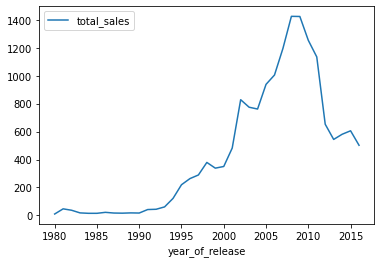
    


<font color='DarkBlue'><b>Комментарий ревьюера</b></font><br>
<font color='DarkGreen'>👌 Хорошая визуализация. 👍</font><br>
<font color='DarkMagenta'>👉 А вот подписи по оси Y и названия графика не хватает. Это относится и к некоторым другим графикам проекта.</font>

<font color='DarkBlue'><b>Комментарий ревьюера 2</b></font><br>
<font color='DarkMagenta'>👉 Так и нет подписей. 😢 А можно вот так:</font>


```python
# Комментарий ревьюера 2
data.hist(column='year_of_release', bins=37)
plt.title('Я название графика')
plt.xlabel('Я название оси Х')
plt.ylabel('Я название оси Y')
plt.legend(['Я метка или легенда'])
plt.show()
```


    
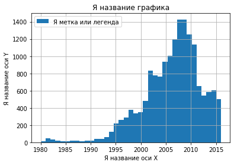
    


Период с 1980 по 1993 является начальным этапом развития индустрии игр. Продажи увеличились, но незначительно. Однако с 1994 года мы наблюдаем всплеск, который достигает пика в 2008-2009 годах. Это можно объяснить стремительным развитием технологий, увеличением мощности компьютеров, игровых платформ, появлением интернета, и, как следствие, ростом популярности игр. Далее мы видим спад интереса к играм. Возможно, это объясняется некоторой пресыщенностью игроков, отсутствием новых идей у разработчиков или даже финансовым кризисом.

#### Посмотрите, как менялись продажи по платформам. Выберите платформы с наибольшими суммарными продажами и постройте распределение по годам. За какой характерный срок появляются новые и исчезают старые платформы?


```python
#Посмотрим, как менялись продажи по платформам.
platforms = data.pivot_table(index='platform', values='total_sales', aggfunc='sum').sort_values(by='total_sales',ascending=False)
platforms
```


<div>
<style scoped>
    .dataframe tbody tr th:only-of-type {
        vertical-align: middle;
    }

    .dataframe tbody tr th {
        vertical-align: top;
    }

    .dataframe thead th {
        text-align: right;
    }
</style>
<table border="1" class="dataframe">
  <thead>
    <tr style="text-align: right;">
      <th></th>
      <th>total_sales</th>
    </tr>
    <tr>
      <th>platform</th>
      <th></th>
    </tr>
  </thead>
  <tbody>
    <tr>
      <th>PS2</th>
      <td>1233.56</td>
    </tr>
    <tr>
      <th>X360</th>
      <td>961.24</td>
    </tr>
    <tr>
      <th>PS3</th>
      <td>931.34</td>
    </tr>
    <tr>
      <th>Wii</th>
      <td>891.18</td>
    </tr>
    <tr>
      <th>DS</th>
      <td>802.78</td>
    </tr>
    <tr>
      <th>PS</th>
      <td>727.58</td>
    </tr>
    <tr>
      <th>PS4</th>
      <td>314.14</td>
    </tr>
    <tr>
      <th>GBA</th>
      <td>312.88</td>
    </tr>
    <tr>
      <th>PSP</th>
      <td>289.53</td>
    </tr>
    <tr>
      <th>3DS</th>
      <td>257.81</td>
    </tr>
    <tr>
      <th>PC</th>
      <td>255.76</td>
    </tr>
    <tr>
      <th>GB</th>
      <td>254.43</td>
    </tr>
    <tr>
      <th>XB</th>
      <td>251.57</td>
    </tr>
    <tr>
      <th>NES</th>
      <td>251.05</td>
    </tr>
    <tr>
      <th>N64</th>
      <td>218.01</td>
    </tr>
    <tr>
      <th>SNES</th>
      <td>200.04</td>
    </tr>
    <tr>
      <th>GC</th>
      <td>196.73</td>
    </tr>
    <tr>
      <th>XOne</th>
      <td>159.32</td>
    </tr>
    <tr>
      <th>2600</th>
      <td>86.48</td>
    </tr>
    <tr>
      <th>WiiU</th>
      <td>82.19</td>
    </tr>
    <tr>
      <th>PSV</th>
      <td>53.81</td>
    </tr>
    <tr>
      <th>SAT</th>
      <td>33.59</td>
    </tr>
    <tr>
      <th>GEN</th>
      <td>28.35</td>
    </tr>
    <tr>
      <th>DC</th>
      <td>15.95</td>
    </tr>
    <tr>
      <th>SCD</th>
      <td>1.86</td>
    </tr>
    <tr>
      <th>NG</th>
      <td>1.44</td>
    </tr>
    <tr>
      <th>WS</th>
      <td>1.42</td>
    </tr>
    <tr>
      <th>TG16</th>
      <td>0.16</td>
    </tr>
    <tr>
      <th>3DO</th>
      <td>0.10</td>
    </tr>
    <tr>
      <th>GG</th>
      <td>0.04</td>
    </tr>
    <tr>
      <th>PCFX</th>
      <td>0.03</td>
    </tr>
  </tbody>
</table>
</div>


<font color='DarkBlue'><b>Комментарий ревьюера</b></font><br>
<font color='DarkMagenta'>👉 При анализе принято визуализировать результаты в виде графиков или диаграмм. Таблицы малоинформативны и не наглядны. Можно вот так:</font>


Для анализа выберем 6 первых платформ с наибольшими суммарными продажами, так как, начиная с 7 позиции, видим уже значительное отставание. Рассмотрим их жизненный цикл.


```python
a = data.pivot_table(index='year_of_release', columns='platform', values='total_sales', aggfunc='sum')
```


```python
a1 = a[['PS2', 'X360','PS3', 'Wii', 'DS', 'PS', 'PS4']]
a1
```


<div>
<style scoped>
    .dataframe tbody tr th:only-of-type {
        vertical-align: middle;
    }

    .dataframe tbody tr th {
        vertical-align: top;
    }

    .dataframe thead th {
        text-align: right;
    }
</style>
<table border="1" class="dataframe">
  <thead>
    <tr style="text-align: right;">
      <th>platform</th>
      <th>PS2</th>
      <th>X360</th>
      <th>PS3</th>
      <th>Wii</th>
      <th>DS</th>
      <th>PS</th>
      <th>PS4</th>
    </tr>
    <tr>
      <th>year_of_release</th>
      <th></th>
      <th></th>
      <th></th>
      <th></th>
      <th></th>
      <th></th>
      <th></th>
    </tr>
  </thead>
  <tbody>
    <tr>
      <th>1980</th>
      <td>NaN</td>
      <td>NaN</td>
      <td>NaN</td>
      <td>NaN</td>
      <td>NaN</td>
      <td>NaN</td>
      <td>NaN</td>
    </tr>
    <tr>
      <th>1981</th>
      <td>NaN</td>
      <td>NaN</td>
      <td>NaN</td>
      <td>NaN</td>
      <td>NaN</td>
      <td>NaN</td>
      <td>NaN</td>
    </tr>
    <tr>
      <th>1982</th>
      <td>NaN</td>
      <td>NaN</td>
      <td>NaN</td>
      <td>NaN</td>
      <td>NaN</td>
      <td>NaN</td>
      <td>NaN</td>
    </tr>
    <tr>
      <th>1983</th>
      <td>NaN</td>
      <td>NaN</td>
      <td>NaN</td>
      <td>NaN</td>
      <td>NaN</td>
      <td>NaN</td>
      <td>NaN</td>
    </tr>
    <tr>
      <th>1984</th>
      <td>NaN</td>
      <td>NaN</td>
      <td>NaN</td>
      <td>NaN</td>
      <td>NaN</td>
      <td>NaN</td>
      <td>NaN</td>
    </tr>
    <tr>
      <th>1985</th>
      <td>NaN</td>
      <td>NaN</td>
      <td>NaN</td>
      <td>NaN</td>
      <td>0.02</td>
      <td>NaN</td>
      <td>NaN</td>
    </tr>
    <tr>
      <th>1986</th>
      <td>NaN</td>
      <td>NaN</td>
      <td>NaN</td>
      <td>NaN</td>
      <td>NaN</td>
      <td>NaN</td>
      <td>NaN</td>
    </tr>
    <tr>
      <th>1987</th>
      <td>NaN</td>
      <td>NaN</td>
      <td>NaN</td>
      <td>NaN</td>
      <td>NaN</td>
      <td>NaN</td>
      <td>NaN</td>
    </tr>
    <tr>
      <th>1988</th>
      <td>NaN</td>
      <td>NaN</td>
      <td>NaN</td>
      <td>NaN</td>
      <td>NaN</td>
      <td>NaN</td>
      <td>NaN</td>
    </tr>
    <tr>
      <th>1989</th>
      <td>NaN</td>
      <td>NaN</td>
      <td>NaN</td>
      <td>NaN</td>
      <td>NaN</td>
      <td>NaN</td>
      <td>NaN</td>
    </tr>
    <tr>
      <th>1990</th>
      <td>NaN</td>
      <td>NaN</td>
      <td>NaN</td>
      <td>NaN</td>
      <td>NaN</td>
      <td>NaN</td>
      <td>NaN</td>
    </tr>
    <tr>
      <th>1991</th>
      <td>NaN</td>
      <td>NaN</td>
      <td>NaN</td>
      <td>NaN</td>
      <td>NaN</td>
      <td>NaN</td>
      <td>NaN</td>
    </tr>
    <tr>
      <th>1992</th>
      <td>NaN</td>
      <td>NaN</td>
      <td>NaN</td>
      <td>NaN</td>
      <td>NaN</td>
      <td>NaN</td>
      <td>NaN</td>
    </tr>
    <tr>
      <th>1993</th>
      <td>NaN</td>
      <td>NaN</td>
      <td>NaN</td>
      <td>NaN</td>
      <td>NaN</td>
      <td>NaN</td>
      <td>NaN</td>
    </tr>
    <tr>
      <th>1994</th>
      <td>NaN</td>
      <td>NaN</td>
      <td>NaN</td>
      <td>NaN</td>
      <td>NaN</td>
      <td>6.03</td>
      <td>NaN</td>
    </tr>
    <tr>
      <th>1995</th>
      <td>NaN</td>
      <td>NaN</td>
      <td>NaN</td>
      <td>NaN</td>
      <td>NaN</td>
      <td>35.96</td>
      <td>NaN</td>
    </tr>
    <tr>
      <th>1996</th>
      <td>NaN</td>
      <td>NaN</td>
      <td>NaN</td>
      <td>NaN</td>
      <td>NaN</td>
      <td>94.70</td>
      <td>NaN</td>
    </tr>
    <tr>
      <th>1997</th>
      <td>NaN</td>
      <td>NaN</td>
      <td>NaN</td>
      <td>NaN</td>
      <td>NaN</td>
      <td>136.17</td>
      <td>NaN</td>
    </tr>
    <tr>
      <th>1998</th>
      <td>NaN</td>
      <td>NaN</td>
      <td>NaN</td>
      <td>NaN</td>
      <td>NaN</td>
      <td>169.49</td>
      <td>NaN</td>
    </tr>
    <tr>
      <th>1999</th>
      <td>NaN</td>
      <td>NaN</td>
      <td>NaN</td>
      <td>NaN</td>
      <td>NaN</td>
      <td>144.53</td>
      <td>NaN</td>
    </tr>
    <tr>
      <th>2000</th>
      <td>39.17</td>
      <td>NaN</td>
      <td>NaN</td>
      <td>NaN</td>
      <td>NaN</td>
      <td>96.37</td>
      <td>NaN</td>
    </tr>
    <tr>
      <th>2001</th>
      <td>166.43</td>
      <td>NaN</td>
      <td>NaN</td>
      <td>NaN</td>
      <td>NaN</td>
      <td>35.59</td>
      <td>NaN</td>
    </tr>
    <tr>
      <th>2002</th>
      <td>205.38</td>
      <td>NaN</td>
      <td>NaN</td>
      <td>NaN</td>
      <td>NaN</td>
      <td>6.67</td>
      <td>NaN</td>
    </tr>
    <tr>
      <th>2003</th>
      <td>184.31</td>
      <td>NaN</td>
      <td>NaN</td>
      <td>NaN</td>
      <td>NaN</td>
      <td>2.07</td>
      <td>NaN</td>
    </tr>
    <tr>
      <th>2004</th>
      <td>211.81</td>
      <td>NaN</td>
      <td>NaN</td>
      <td>NaN</td>
      <td>17.27</td>
      <td>NaN</td>
      <td>NaN</td>
    </tr>
    <tr>
      <th>2005</th>
      <td>160.66</td>
      <td>8.25</td>
      <td>NaN</td>
      <td>NaN</td>
      <td>130.14</td>
      <td>NaN</td>
      <td>NaN</td>
    </tr>
    <tr>
      <th>2006</th>
      <td>103.42</td>
      <td>51.62</td>
      <td>20.96</td>
      <td>137.15</td>
      <td>119.81</td>
      <td>NaN</td>
      <td>NaN</td>
    </tr>
    <tr>
      <th>2007</th>
      <td>75.99</td>
      <td>95.41</td>
      <td>73.19</td>
      <td>152.77</td>
      <td>146.94</td>
      <td>NaN</td>
      <td>NaN</td>
    </tr>
    <tr>
      <th>2008</th>
      <td>53.90</td>
      <td>135.26</td>
      <td>118.52</td>
      <td>171.32</td>
      <td>145.31</td>
      <td>NaN</td>
      <td>NaN</td>
    </tr>
    <tr>
      <th>2009</th>
      <td>26.40</td>
      <td>120.29</td>
      <td>130.93</td>
      <td>206.97</td>
      <td>119.54</td>
      <td>NaN</td>
      <td>NaN</td>
    </tr>
    <tr>
      <th>2010</th>
      <td>5.64</td>
      <td>170.03</td>
      <td>142.17</td>
      <td>127.95</td>
      <td>85.02</td>
      <td>NaN</td>
      <td>NaN</td>
    </tr>
    <tr>
      <th>2011</th>
      <td>0.45</td>
      <td>143.84</td>
      <td>156.78</td>
      <td>59.65</td>
      <td>26.18</td>
      <td>NaN</td>
      <td>NaN</td>
    </tr>
    <tr>
      <th>2012</th>
      <td>NaN</td>
      <td>99.74</td>
      <td>107.36</td>
      <td>21.71</td>
      <td>11.01</td>
      <td>NaN</td>
      <td>NaN</td>
    </tr>
    <tr>
      <th>2013</th>
      <td>NaN</td>
      <td>88.58</td>
      <td>113.25</td>
      <td>8.59</td>
      <td>1.54</td>
      <td>NaN</td>
      <td>25.99</td>
    </tr>
    <tr>
      <th>2014</th>
      <td>NaN</td>
      <td>34.74</td>
      <td>47.76</td>
      <td>3.75</td>
      <td>NaN</td>
      <td>NaN</td>
      <td>100.00</td>
    </tr>
    <tr>
      <th>2015</th>
      <td>NaN</td>
      <td>11.96</td>
      <td>16.82</td>
      <td>1.14</td>
      <td>NaN</td>
      <td>NaN</td>
      <td>118.90</td>
    </tr>
    <tr>
      <th>2016</th>
      <td>NaN</td>
      <td>1.52</td>
      <td>3.60</td>
      <td>0.18</td>
      <td>NaN</td>
      <td>NaN</td>
      <td>69.25</td>
    </tr>
  </tbody>
</table>
</div>


<font color='DarkBlue'><b>Комментарий ревьюера</b></font><br>
<font color='DarkMagenta'>👉 Наверное, стоило попробовать разобраться с таким артефактом у платформы DS. Тогда бы обнаружили, что это ошибка, так как в 1985 году этой платформы еще не существовало. Визуализация помогает не только определять закономерности, но еще и находить ошибки.</font>


<font color='DarkBlue'><b>Комментарий ревьюера 2</b></font><br>
<font color='DarkMagenta'>👉 Если делать расчет срока жизни платформы, расчитывая из min и max года релиза, то эти лишние 19 лет внесли бы искажение. Если определять на глаз, то не мешает. В актуальный период эта ошибка не войдет, но необходимо демонстрировать, что тщательно готовятся данные для анализа.</font>

PS2: 2000 - 2011

X360:2005 - 2016

PS3: 2006 - 2016

Wii: 2006 - 2016

DS:  2004 - 2013

PS:  1994 - 2003

Итак, мы видим, что время существования этих платформ примерно одинаковое - от 10 до 12 лет. Также для наглядности приведена статистика по актуальной на данный момент платформе PS4. Жизненный цикл этой приставки по состоянию на 2016 год продолжается.

<font color='DarkBlue'><b>Комментарий ревьюера</b></font><br>
<font color='DarkGreen'>👌 Правильно выбран актуальный период. 👍 Сейчас в наше динамичное время в бизнесе уже используются для прогноза периоды в 2-3 года.</font>

#### Возьмите данные за соответствующий актуальный период. Актуальный период определите самостоятельно в результате исследования предыдущих вопросов. Основной фактор — эти данные помогут построить прогноз на 2017 год.


```python
#Возьмем данные за соответствующий актуальный период. 
period = data.query('year_of_release >= 2014')
period
```


<div>
<style scoped>
    .dataframe tbody tr th:only-of-type {
        vertical-align: middle;
    }

    .dataframe tbody tr th {
        vertical-align: top;
    }

    .dataframe thead th {
        text-align: right;
    }
</style>
<table border="1" class="dataframe">
  <thead>
    <tr style="text-align: right;">
      <th></th>
      <th>name</th>
      <th>platform</th>
      <th>year_of_release</th>
      <th>genre</th>
      <th>na_sales</th>
      <th>eu_sales</th>
      <th>jp_sales</th>
      <th>other_sales</th>
      <th>critic_score</th>
      <th>user_score</th>
      <th>rating</th>
      <th>total_sales</th>
    </tr>
  </thead>
  <tbody>
    <tr>
      <th>31</th>
      <td>Call of Duty: Black Ops 3</td>
      <td>PS4</td>
      <td>2015</td>
      <td>Shooter</td>
      <td>6.03</td>
      <td>5.86</td>
      <td>0.36</td>
      <td>2.38</td>
      <td>NaN</td>
      <td>NaN</td>
      <td>unr</td>
      <td>14.63</td>
    </tr>
    <tr>
      <th>42</th>
      <td>Grand Theft Auto V</td>
      <td>PS4</td>
      <td>2014</td>
      <td>Action</td>
      <td>3.96</td>
      <td>6.31</td>
      <td>0.38</td>
      <td>1.97</td>
      <td>97.0</td>
      <td>8.3</td>
      <td>M</td>
      <td>12.62</td>
    </tr>
    <tr>
      <th>47</th>
      <td>Pokemon Omega Ruby/Pokemon Alpha Sapphire</td>
      <td>3DS</td>
      <td>2014</td>
      <td>Role-Playing</td>
      <td>4.35</td>
      <td>3.49</td>
      <td>3.10</td>
      <td>0.74</td>
      <td>NaN</td>
      <td>NaN</td>
      <td>unr</td>
      <td>11.68</td>
    </tr>
    <tr>
      <th>77</th>
      <td>FIFA 16</td>
      <td>PS4</td>
      <td>2015</td>
      <td>Sports</td>
      <td>1.12</td>
      <td>6.12</td>
      <td>0.06</td>
      <td>1.28</td>
      <td>82.0</td>
      <td>4.3</td>
      <td>E</td>
      <td>8.58</td>
    </tr>
    <tr>
      <th>87</th>
      <td>Star Wars Battlefront (2015)</td>
      <td>PS4</td>
      <td>2015</td>
      <td>Shooter</td>
      <td>2.99</td>
      <td>3.49</td>
      <td>0.22</td>
      <td>1.28</td>
      <td>NaN</td>
      <td>NaN</td>
      <td>unr</td>
      <td>7.98</td>
    </tr>
    <tr>
      <th>...</th>
      <td>...</td>
      <td>...</td>
      <td>...</td>
      <td>...</td>
      <td>...</td>
      <td>...</td>
      <td>...</td>
      <td>...</td>
      <td>...</td>
      <td>...</td>
      <td>...</td>
      <td>...</td>
    </tr>
    <tr>
      <th>16703</th>
      <td>Strawberry Nauts</td>
      <td>PSV</td>
      <td>2016</td>
      <td>Adventure</td>
      <td>0.00</td>
      <td>0.00</td>
      <td>0.01</td>
      <td>0.00</td>
      <td>NaN</td>
      <td>NaN</td>
      <td>unr</td>
      <td>0.01</td>
    </tr>
    <tr>
      <th>16707</th>
      <td>Aiyoku no Eustia</td>
      <td>PSV</td>
      <td>2014</td>
      <td>Misc</td>
      <td>0.00</td>
      <td>0.00</td>
      <td>0.01</td>
      <td>0.00</td>
      <td>NaN</td>
      <td>NaN</td>
      <td>unr</td>
      <td>0.01</td>
    </tr>
    <tr>
      <th>16710</th>
      <td>Samurai Warriors: Sanada Maru</td>
      <td>PS3</td>
      <td>2016</td>
      <td>Action</td>
      <td>0.00</td>
      <td>0.00</td>
      <td>0.01</td>
      <td>0.00</td>
      <td>NaN</td>
      <td>NaN</td>
      <td>unr</td>
      <td>0.01</td>
    </tr>
    <tr>
      <th>16712</th>
      <td>Haitaka no Psychedelica</td>
      <td>PSV</td>
      <td>2016</td>
      <td>Adventure</td>
      <td>0.00</td>
      <td>0.00</td>
      <td>0.01</td>
      <td>0.00</td>
      <td>NaN</td>
      <td>NaN</td>
      <td>unr</td>
      <td>0.01</td>
    </tr>
    <tr>
      <th>16714</th>
      <td>Winning Post 8 2016</td>
      <td>PSV</td>
      <td>2016</td>
      <td>Simulation</td>
      <td>0.00</td>
      <td>0.00</td>
      <td>0.01</td>
      <td>0.00</td>
      <td>NaN</td>
      <td>NaN</td>
      <td>unr</td>
      <td>0.01</td>
    </tr>
  </tbody>
</table>
<p>1689 rows × 12 columns</p>
</div>


Актуальным периодом будут данные с 2014 года, так как индустрия игр развивается стремительно, и, чтобы сделать прогноз на 2017 год, нам нужны последние данные.


```python
period.info()
```

    <class 'pandas.core.frame.DataFrame'>
    Int64Index: 1689 entries, 31 to 16714
    Data columns (total 12 columns):
     #   Column           Non-Null Count  Dtype  
    ---  ------           --------------  -----  
     0   name             1689 non-null   object 
     1   platform         1689 non-null   object 
     2   year_of_release  1689 non-null   Int64  
     3   genre            1689 non-null   object 
     4   na_sales         1689 non-null   float64
     5   eu_sales         1689 non-null   float64
     6   jp_sales         1689 non-null   float64
     7   other_sales      1689 non-null   float64
     8   critic_score     718 non-null    float64
     9   user_score       888 non-null    float64
     10  rating           1689 non-null   object 
     11  total_sales      1689 non-null   float64
    dtypes: Int64(1), float64(7), object(4)
    memory usage: 173.2+ KB


#### Какие платформы лидируют по продажам, растут или падают? Выберите несколько потенциально прибыльных платформ


```python
period.pivot_table(index=['platform','year_of_release'], values='total_sales', aggfunc='sum')
```


<div>
<style scoped>
    .dataframe tbody tr th:only-of-type {
        vertical-align: middle;
    }

    .dataframe tbody tr th {
        vertical-align: top;
    }

    .dataframe thead th {
        text-align: right;
    }
</style>
<table border="1" class="dataframe">
  <thead>
    <tr style="text-align: right;">
      <th></th>
      <th></th>
      <th>total_sales</th>
    </tr>
    <tr>
      <th>platform</th>
      <th>year_of_release</th>
      <th></th>
    </tr>
  </thead>
  <tbody>
    <tr>
      <th rowspan="3" valign="top">3DS</th>
      <th>2014</th>
      <td>43.76</td>
    </tr>
    <tr>
      <th>2015</th>
      <td>27.78</td>
    </tr>
    <tr>
      <th>2016</th>
      <td>15.14</td>
    </tr>
    <tr>
      <th rowspan="3" valign="top">PC</th>
      <th>2014</th>
      <td>13.28</td>
    </tr>
    <tr>
      <th>2015</th>
      <td>8.52</td>
    </tr>
    <tr>
      <th>2016</th>
      <td>5.25</td>
    </tr>
    <tr>
      <th rowspan="3" valign="top">PS3</th>
      <th>2014</th>
      <td>47.76</td>
    </tr>
    <tr>
      <th>2015</th>
      <td>16.82</td>
    </tr>
    <tr>
      <th>2016</th>
      <td>3.60</td>
    </tr>
    <tr>
      <th rowspan="3" valign="top">PS4</th>
      <th>2014</th>
      <td>100.00</td>
    </tr>
    <tr>
      <th>2015</th>
      <td>118.90</td>
    </tr>
    <tr>
      <th>2016</th>
      <td>69.25</td>
    </tr>
    <tr>
      <th rowspan="2" valign="top">PSP</th>
      <th>2014</th>
      <td>0.24</td>
    </tr>
    <tr>
      <th>2015</th>
      <td>0.12</td>
    </tr>
    <tr>
      <th rowspan="3" valign="top">PSV</th>
      <th>2014</th>
      <td>11.90</td>
    </tr>
    <tr>
      <th>2015</th>
      <td>6.25</td>
    </tr>
    <tr>
      <th>2016</th>
      <td>4.25</td>
    </tr>
    <tr>
      <th rowspan="3" valign="top">Wii</th>
      <th>2014</th>
      <td>3.75</td>
    </tr>
    <tr>
      <th>2015</th>
      <td>1.14</td>
    </tr>
    <tr>
      <th>2016</th>
      <td>0.18</td>
    </tr>
    <tr>
      <th rowspan="3" valign="top">WiiU</th>
      <th>2014</th>
      <td>22.03</td>
    </tr>
    <tr>
      <th>2015</th>
      <td>16.35</td>
    </tr>
    <tr>
      <th>2016</th>
      <td>4.60</td>
    </tr>
    <tr>
      <th rowspan="3" valign="top">X360</th>
      <th>2014</th>
      <td>34.74</td>
    </tr>
    <tr>
      <th>2015</th>
      <td>11.96</td>
    </tr>
    <tr>
      <th>2016</th>
      <td>1.52</td>
    </tr>
    <tr>
      <th rowspan="3" valign="top">XOne</th>
      <th>2014</th>
      <td>54.07</td>
    </tr>
    <tr>
      <th>2015</th>
      <td>60.14</td>
    </tr>
    <tr>
      <th>2016</th>
      <td>26.15</td>
    </tr>
  </tbody>
</table>
</div>


Платформы PS4 и XOne - самые актуальные платформы на текущий момент. Они и будут потенциально прибыльными. WiiU, 3DS и PC еще неокончательно сошли с дистанции. Остальные платформы практически прошли свой жизненный цикл.

<font color='DarkBlue'><b>Комментарий ревьюера</b></font><br>
<font color='Red'>🛠 Обращаю внимание, что проект не имеет необходимого оформления. Проект должен иметь структру с разделами и подразделами исследования, с формулировкой промежуточной задачи, с комментариями, что мы делаем, что получили. Каждый раздел/подраздел должен начинаться с названия, отражающего его содержание, и решаемой задачи, заканчиваться промежуточным выводом. Отдельные строки кода выполняющие необходимые преобразования должны находиться в отдельных исполняемых ячейках, комментарии и промежуточные выводы должны размещаться в отдельных ячейках 'markdown'. Необходимо пройти по шагам проекта и добавить необходимые элементы. Подробнее описано в "Полезных инструкциях для учёбы".</font>

<div class="alert alert-info" style="border-radius: 10px; box-shadow: 2px 2px 2px; border: 1px solid; padding: 10px "> 
<b>Комментарий студента</b> 
    
Исправлено
</div>

#### Построим график «ящик с усами» по глобальным продажам игр в разбивке по платформам


```python
period.boxplot(column='total_sales', by='platform', figsize = (10,5))
plt.ylim(0, 3)
plt.show()
```


    
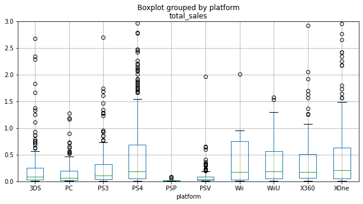
    


```python
period.boxplot(column='total_sales', by='platform', figsize = (10,5))
plt.show()
```


    
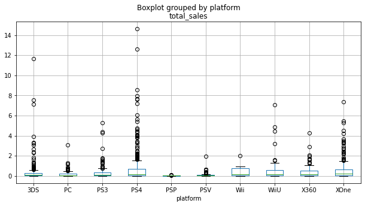
    


<font color='DarkBlue'><b>Комментарий ревьюера</b></font><br>
<font color='DarkMagenta'>👉 Здесь уместна <b>вторая</b> диаграмма размаха со всеми максимумами продаж за актуальный период, а не только с масштабированными данными. А так мы не видим выбросы.</font>
<br><font color='Red'>🛠 Не сделаны выводы анализа.</font>

На диаграмме видим, что медианы у XOne, PS4, PS3 и X360 примерно равны, несмотря на разный размах продаж. Наибольшое количество выбросов видим у PS4, на втором месте по выбросам стоит XOne. Это означает, что на этих платформах вышло множество популярных игр.

<font color='DarkBlue'><b>Комментарий ревьюера 2</b></font><br>
<font color='DarkMagenta'>👉 Для интерпретации диаграмм размаха помогает вспомнить, что означают боксплоты. В данном случае расположение боксплота и медианы показывают у какой платформы стабильно высокие продажи. Соответственно, Стримчик должен ориентироваться на такие платформы, так как какая игра в 2017 году выстрелит не известно.</font>


<div class="alert alert-info" style="border-radius: 10px; box-shadow: 2px 2px 2px; border: 1px solid; padding: 10px "> 
<b>Комментарий студента</b> 
    
Выводы приведены
</div>

<font color='DarkBlue'><b>Комментарий ревьюера</b></font><br>
<font color='Red'>🛠 Нет названия подраздела и не сформулирована задача. Не понятно, что и зачем делаем далее.</font>

<div class="alert alert-info" style="border-radius: 10px; box-shadow: 2px 2px 2px; border: 1px solid; padding: 10px "> 
<b>Комментарий студента</b> 
    
Исправлено
</div>

#### Посмотрите, как влияют на продажи внутри одной популярной платформы отзывы пользователей и критиков. Постройте диаграмму рассеяния и посчитайте корреляцию между отзывами и продажами. Сформулируйте выводы


```python
period[period['platform']=='PS4'].plot(x='user_score', y='total_sales', kind='scatter')
plt.show()
period[period['platform']=='PS4'].plot(x='critic_score', y='total_sales', kind='scatter')
plt.show()
```


    
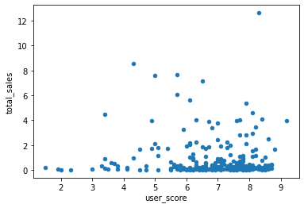
    


    
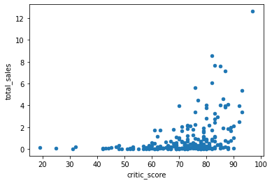
    


```python
po_ps4 = period[period['platform']=='PS4']
po_ps4['user_score'].corr(po_ps4['total_sales'])
```


    -0.040131589472697356


Корреляция между отзывами пользователей и продажами составляет -0.04. Связь не обнаружена.


```python
po_ps4['critic_score'].corr(po_ps4['total_sales'])
```


    0.40266141068104083


Корреляция между отзывами критиков и продажами составляет 0.4. Влияние умеренное.

#### Соотнесем выводы с продажами игр на других платформах


```python
period[period['platform']=='XOne'].plot(x='user_score', y='total_sales', kind='scatter')
plt.show()
period[period['platform']=='XOne'].plot(x='critic_score', y='total_sales', kind='scatter')
plt.show()
```


    
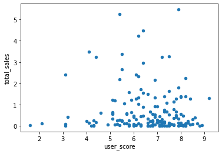
    


    
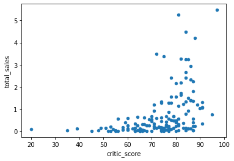
    


```python
po_xone = period[period['platform']=='XOne']
po_xone['user_score'].corr(po_xone['total_sales'])
```


    -0.0703839280647581


Корреляция между отзывами пользователей и продажами составляет -0.07. Связь не обнаружена.


```python
po_xone['critic_score'].corr(po_xone['total_sales'])
```


    0.42867694370333226


Корреляция между отзывами критиков и продажами составляет 0.42. Влияние умеренное.


```python
period[period['platform']=='X360'].plot(x='user_score', y='total_sales', kind='scatter')
plt.show()
period[period['platform']=='X360'].plot(x='critic_score', y='total_sales', kind='scatter')
plt.show()
```


    
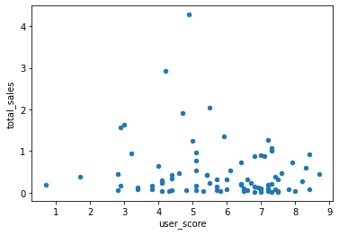
    


    
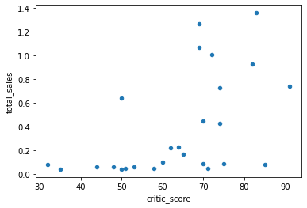
    


```python
po_x360 = period[period['platform']=='X360']
po_x360['user_score'].corr(po_x360['total_sales'])
```


    -0.138444570945665


Корреляция между отзывами пользователей и продажами составляет -0.14. Есть слабая связь.


```python
po_x360['critic_score'].corr(po_x360['total_sales'])
```


    0.5257228356581523


Корреляция между отзывами критиков и продажами составляет 0.52. Достаточно заметное влияние.


```python
period[period['platform']=='PS3'].plot(x='user_score', y='total_sales', kind='scatter')
plt.show()
period[period['platform']=='PS3'].plot(x='critic_score', y='total_sales', kind='scatter')
plt.show()
```


    

    


    
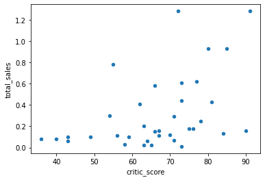
    


```python
po_ps3 = period[period['platform']=='PS3']
po_ps3['user_score'].corr(po_ps3['total_sales'])
```


    -0.16676141347662118


Корреляция между отзывами пользователей и продажами составляет -0.16. Есть слабая связь.


```python
po_ps3['critic_score'].corr(po_ps3['total_sales'])
```


    0.44657460493190704


Корреляция между отзывами критиков и продажами составляет 0.42. Влияние умеренное.


```python
period[period['platform']=='WiiU'].plot(x='user_score', y='total_sales', kind='scatter')
plt.show()
period[period['platform']=='WiiU'].plot(x='critic_score', y='total_sales', kind='scatter')
plt.show()
```


    
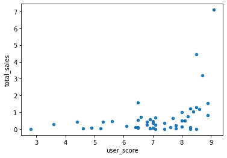
    


    
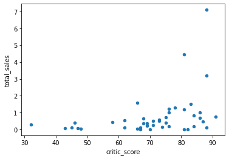
    


```python
po_wiiu = period[period['platform']=='WiiU']
po_wiiu['user_score'].corr(po_wiiu['total_sales'])
```


    0.40792645792170773


Корреляция между отзывами пользователей и продажами составляет 0.4. Влияние умеренное.


```python
po_wiiu['critic_score'].corr(po_wiiu['total_sales'])
```


    0.370201412480884


Корреляция между отзывами критиков и продажами составляет 0.37. Влияние умеренное.

В целом, мы видим, что корреляции между отзывами пользователей и продажами практически нет. Корреляция между отзывами критиков и продажами имеется, но она умеренная.

<font color='DarkBlue'><b>Комментарий ревьюера</b></font><br>
<font color='DarkGreen'>👌 Хороший анализ и визуализация! 👍 А для оценки корреляции лучше пользоваться вот этой шкалой:</font>


<font color='DarkBlue'><b>Комментарий ревьюера</b></font><br>
<font color='DarkMagenta'>👉 Этот комментарий должен быть в ячейке Markdown, а не в ячейке кода. Проект должен иметь структуру отделяющую код от комментариев, что мы делаем и результатов преобразования.</font>


#### Посмотрите на общее распределение игр по жанрам. Что можно сказать о самых прибыльных жанрах? Выделяются ли жанры с высокими и низкими продажами?


```python
period.pivot_table(index='genre', values='total_sales', aggfunc='sum').sort_values('total_sales', ascending=False)
```


<div>
<style scoped>
    .dataframe tbody tr th:only-of-type {
        vertical-align: middle;
    }

    .dataframe tbody tr th {
        vertical-align: top;
    }

    .dataframe thead th {
        text-align: right;
    }
</style>
<table border="1" class="dataframe">
  <thead>
    <tr style="text-align: right;">
      <th></th>
      <th>total_sales</th>
    </tr>
    <tr>
      <th>genre</th>
      <th></th>
    </tr>
  </thead>
  <tbody>
    <tr>
      <th>Action</th>
      <td>199.36</td>
    </tr>
    <tr>
      <th>Shooter</th>
      <td>170.94</td>
    </tr>
    <tr>
      <th>Sports</th>
      <td>109.48</td>
    </tr>
    <tr>
      <th>Role-Playing</th>
      <td>101.44</td>
    </tr>
    <tr>
      <th>Misc</th>
      <td>37.55</td>
    </tr>
    <tr>
      <th>Fighting</th>
      <td>28.22</td>
    </tr>
    <tr>
      <th>Racing</th>
      <td>27.52</td>
    </tr>
    <tr>
      <th>Platform</th>
      <td>18.09</td>
    </tr>
    <tr>
      <th>Adventure</th>
      <td>17.55</td>
    </tr>
    <tr>
      <th>Simulation</th>
      <td>13.13</td>
    </tr>
    <tr>
      <th>Strategy</th>
      <td>3.96</td>
    </tr>
    <tr>
      <th>Puzzle</th>
      <td>2.21</td>
    </tr>
  </tbody>
</table>
</div>


```python
period.pivot_table(index='genre', values='total_sales', aggfunc='median').sort_values('total_sales', ascending=False)
#Выведем медианные значения продаж

```


<div>
<style scoped>
    .dataframe tbody tr th:only-of-type {
        vertical-align: middle;
    }

    .dataframe tbody tr th {
        vertical-align: top;
    }

    .dataframe thead th {
        text-align: right;
    }
</style>
<table border="1" class="dataframe">
  <thead>
    <tr style="text-align: right;">
      <th></th>
      <th>total_sales</th>
    </tr>
    <tr>
      <th>genre</th>
      <th></th>
    </tr>
  </thead>
  <tbody>
    <tr>
      <th>Shooter</th>
      <td>0.515</td>
    </tr>
    <tr>
      <th>Sports</th>
      <td>0.180</td>
    </tr>
    <tr>
      <th>Platform</th>
      <td>0.140</td>
    </tr>
    <tr>
      <th>Fighting</th>
      <td>0.125</td>
    </tr>
    <tr>
      <th>Role-Playing</th>
      <td>0.110</td>
    </tr>
    <tr>
      <th>Simulation</th>
      <td>0.100</td>
    </tr>
    <tr>
      <th>Action</th>
      <td>0.090</td>
    </tr>
    <tr>
      <th>Misc</th>
      <td>0.090</td>
    </tr>
    <tr>
      <th>Racing</th>
      <td>0.090</td>
    </tr>
    <tr>
      <th>Strategy</th>
      <td>0.060</td>
    </tr>
    <tr>
      <th>Puzzle</th>
      <td>0.045</td>
    </tr>
    <tr>
      <th>Adventure</th>
      <td>0.030</td>
    </tr>
  </tbody>
</table>
</div>


Ориентируемся на медиану по продажам. Это позволит нам убрать выбросы в виде продаж очень популярных игр. Самый прибыльный жанр - это шутер. Далее идут спотивные игры, а экшн лишь на седьмом месте. Такие жанры как пазлы, стратегии находятся в конце списка. Можно сделать вывод, что для современного пользователя имеет значения быстрота действия, в неспешные игры играть почти никто не хочет.


```python
period.boxplot(column='total_sales', by='genre', figsize = (10,10))
plt.show()
```


    
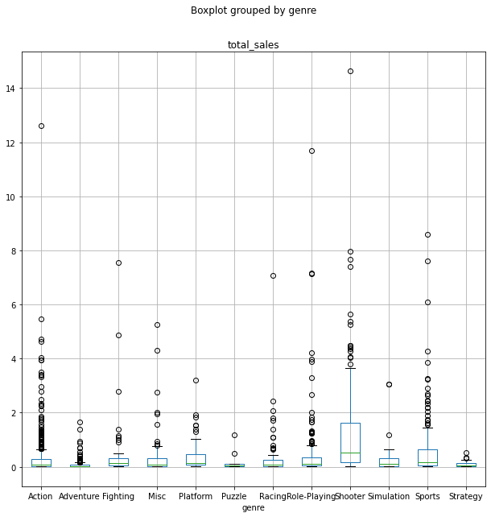
    


На диаграмме размаха видно множество выбросов у экшна. Именно поэтому он и был первым в списке, если не учитывать медианы. Шутеры и спортивные игры куда стабильнее.

<font color='DarkBlue'><b>Комментарий ревьюера</b></font><br>
<font color='DarkGreen'>👌 Хорошо, что не попали в ловушку, что максимальные продажи являются самыми прибыльными. В данных продажи по жанру для разных платформ и если одна платформа со своей одной игрой в данном жанре выстрелила, а остальные провалились, то все равно будем видеть максимум общих продаж, даже если остальные платформы по этому жанру были не удачны. Но для прибыльности нужны стабильные жанры, которые приносят доход не зависимо от платформы, значит на этот жанр есть устойчивый спрос.  Было бы не плохо сравнение продаж проиллюстрировать диаграммой размаха. Сделаем? </font>

## Составьте портрет пользователя каждого региона

**Определите для пользователя каждого региона (NA, EU, JP):**

#### Самые популярные платформы (топ-5). Опишите различия в долях продаж

<font color='DarkBlue'><b>Комментарий ревьюера</b></font><br>
<font color='Red'>🛠 Это все должно находится в ячейке Markdown, а не в ячейке кода. </font>


```python
period.pivot_table(index='platform', values='na_sales',aggfunc='sum').sort_values('na_sales', ascending=False)[:5]
```


<div>
<style scoped>
    .dataframe tbody tr th:only-of-type {
        vertical-align: middle;
    }

    .dataframe tbody tr th {
        vertical-align: top;
    }

    .dataframe thead th {
        text-align: right;
    }
</style>
<table border="1" class="dataframe">
  <thead>
    <tr style="text-align: right;">
      <th></th>
      <th>na_sales</th>
    </tr>
    <tr>
      <th>platform</th>
      <th></th>
    </tr>
  </thead>
  <tbody>
    <tr>
      <th>PS4</th>
      <td>98.61</td>
    </tr>
    <tr>
      <th>XOne</th>
      <td>81.27</td>
    </tr>
    <tr>
      <th>X360</th>
      <td>28.30</td>
    </tr>
    <tr>
      <th>3DS</th>
      <td>22.64</td>
    </tr>
    <tr>
      <th>PS3</th>
      <td>22.05</td>
    </tr>
  </tbody>
</table>
</div>


```python
period.pivot_table(index='platform', values='eu_sales',aggfunc='sum').sort_values('eu_sales', ascending=False)[:5]
```


<div>
<style scoped>
    .dataframe tbody tr th:only-of-type {
        vertical-align: middle;
    }

    .dataframe tbody tr th {
        vertical-align: top;
    }

    .dataframe thead th {
        text-align: right;
    }
</style>
<table border="1" class="dataframe">
  <thead>
    <tr style="text-align: right;">
      <th></th>
      <th>eu_sales</th>
    </tr>
    <tr>
      <th>platform</th>
      <th></th>
    </tr>
  </thead>
  <tbody>
    <tr>
      <th>PS4</th>
      <td>130.04</td>
    </tr>
    <tr>
      <th>XOne</th>
      <td>46.25</td>
    </tr>
    <tr>
      <th>PS3</th>
      <td>25.54</td>
    </tr>
    <tr>
      <th>PC</th>
      <td>17.97</td>
    </tr>
    <tr>
      <th>3DS</th>
      <td>16.12</td>
    </tr>
  </tbody>
</table>
</div>


```python
period.pivot_table(index='platform', values='jp_sales',aggfunc='sum').sort_values('jp_sales', ascending=False)[:5]
```


<div>
<style scoped>
    .dataframe tbody tr th:only-of-type {
        vertical-align: middle;
    }

    .dataframe tbody tr th {
        vertical-align: top;
    }

    .dataframe thead th {
        text-align: right;
    }
</style>
<table border="1" class="dataframe">
  <thead>
    <tr style="text-align: right;">
      <th></th>
      <th>jp_sales</th>
    </tr>
    <tr>
      <th>platform</th>
      <th></th>
    </tr>
  </thead>
  <tbody>
    <tr>
      <th>3DS</th>
      <td>44.24</td>
    </tr>
    <tr>
      <th>PS4</th>
      <td>15.02</td>
    </tr>
    <tr>
      <th>PSV</th>
      <td>14.54</td>
    </tr>
    <tr>
      <th>PS3</th>
      <td>11.22</td>
    </tr>
    <tr>
      <th>WiiU</th>
      <td>7.31</td>
    </tr>
  </tbody>
</table>
</div>


Видим, что японский рынок отличается от европейского и североамериканского. В Америке лидируют местные производители, японская 3DS занимает четвертое место.
В Японии та же картина: лидирует свой 3DS, а американцы значительно отстают. В Европе конкуренцию выигрывают американцы: первые -  Sony Interactive Entertainment, на втором месте Microsoft, японцы в конце списка. Таким образом, японские приставки популярны у себя на родине, в Европе они менее распространены. Американцы, в свою очередь, также популярны у себя плюс в Европе их куда больше японских. 

#### Самые популярные жанры (топ-5). Поясните разницу


```python
period.pivot_table(index='genre', values='na_sales',aggfunc='sum').sort_values('na_sales', ascending=False)[:5]
```


<div>
<style scoped>
    .dataframe tbody tr th:only-of-type {
        vertical-align: middle;
    }

    .dataframe tbody tr th {
        vertical-align: top;
    }

    .dataframe thead th {
        text-align: right;
    }
</style>
<table border="1" class="dataframe">
  <thead>
    <tr style="text-align: right;">
      <th></th>
      <th>na_sales</th>
    </tr>
    <tr>
      <th>genre</th>
      <th></th>
    </tr>
  </thead>
  <tbody>
    <tr>
      <th>Shooter</th>
      <td>79.02</td>
    </tr>
    <tr>
      <th>Action</th>
      <td>72.53</td>
    </tr>
    <tr>
      <th>Sports</th>
      <td>46.13</td>
    </tr>
    <tr>
      <th>Role-Playing</th>
      <td>33.47</td>
    </tr>
    <tr>
      <th>Misc</th>
      <td>15.05</td>
    </tr>
  </tbody>
</table>
</div>


```python
period.pivot_table(index='genre', values='eu_sales',aggfunc='sum').sort_values('eu_sales', ascending=False)[:5]
```


<div>
<style scoped>
    .dataframe tbody tr th:only-of-type {
        vertical-align: middle;
    }

    .dataframe tbody tr th {
        vertical-align: top;
    }

    .dataframe thead th {
        text-align: right;
    }
</style>
<table border="1" class="dataframe">
  <thead>
    <tr style="text-align: right;">
      <th></th>
      <th>eu_sales</th>
    </tr>
    <tr>
      <th>genre</th>
      <th></th>
    </tr>
  </thead>
  <tbody>
    <tr>
      <th>Action</th>
      <td>74.68</td>
    </tr>
    <tr>
      <th>Shooter</th>
      <td>65.52</td>
    </tr>
    <tr>
      <th>Sports</th>
      <td>45.73</td>
    </tr>
    <tr>
      <th>Role-Playing</th>
      <td>28.17</td>
    </tr>
    <tr>
      <th>Racing</th>
      <td>14.13</td>
    </tr>
  </tbody>
</table>
</div>


```python
period.pivot_table(index='genre', values='jp_sales',aggfunc='sum').sort_values('jp_sales', ascending=False)[:5]
```


<div>
<style scoped>
    .dataframe tbody tr th:only-of-type {
        vertical-align: middle;
    }

    .dataframe tbody tr th {
        vertical-align: top;
    }

    .dataframe thead th {
        text-align: right;
    }
</style>
<table border="1" class="dataframe">
  <thead>
    <tr style="text-align: right;">
      <th></th>
      <th>jp_sales</th>
    </tr>
    <tr>
      <th>genre</th>
      <th></th>
    </tr>
  </thead>
  <tbody>
    <tr>
      <th>Role-Playing</th>
      <td>31.16</td>
    </tr>
    <tr>
      <th>Action</th>
      <td>29.58</td>
    </tr>
    <tr>
      <th>Fighting</th>
      <td>6.37</td>
    </tr>
    <tr>
      <th>Misc</th>
      <td>5.61</td>
    </tr>
    <tr>
      <th>Shooter</th>
      <td>4.87</td>
    </tr>
  </tbody>
</table>
</div>


<font color='DarkBlue'><b>Комментарий ревьюера</b></font><br>
<font color='DarkMagenta'>👉 Любой анализ данных требует визуализации его результатов. Табличные данные не всегда информативны. Здесь этого не сделано. Лучше сделать круговые диаграммы, а данные не вошедшие в ТОП просуммировать и вывести отдельной группой "Другие", и по платформам, и по жанрам. Тогда на такой диаграмме хорошо видны все региональные рынки игр с разбиением на платформы/жанры. Какая платформа/жанр занимает какую долю рынка. И наша визуализация несет определенную бизнес-логику, связанную именно с долями рынка занимаемыми платформами/жанрами. А этого не дают другие виды диаграмм. Примерно вот так:</font>


И снова различия между японцами и остальными. Видим практически полное совпадение по интересам у американцев и европейцев: самые популярные - экшны и стрелялки, далее идут спортивные игры и ролевые. У американцев список замыкают игры в жанре Misc, у Европы - гонки. Совсем иная картина в Японии: там лидируют ролевые игры, только потом идет экшн. Затем с большим отрывом идут другие жанры, которые в Европе и Америке в пятерку лидеров не попали. Отметим, что стрелялки лишь замыкают список.

#### Влияет ли рейтинг ESRB на продажи в отдельном регионе?


```python
period.pivot_table(index='rating', values='na_sales',aggfunc='sum').sort_values('na_sales', ascending=False)
```


<div>
<style scoped>
    .dataframe tbody tr th:only-of-type {
        vertical-align: middle;
    }

    .dataframe tbody tr th {
        vertical-align: top;
    }

    .dataframe thead th {
        text-align: right;
    }
</style>
<table border="1" class="dataframe">
  <thead>
    <tr style="text-align: right;">
      <th></th>
      <th>na_sales</th>
    </tr>
    <tr>
      <th>rating</th>
      <th></th>
    </tr>
  </thead>
  <tbody>
    <tr>
      <th>M</th>
      <td>96.42</td>
    </tr>
    <tr>
      <th>unr</th>
      <td>64.72</td>
    </tr>
    <tr>
      <th>E</th>
      <td>50.74</td>
    </tr>
    <tr>
      <th>T</th>
      <td>38.95</td>
    </tr>
    <tr>
      <th>E10+</th>
      <td>33.23</td>
    </tr>
  </tbody>
</table>
</div>


```python
period.pivot_table(index='rating', values='eu_sales',aggfunc='sum').sort_values('eu_sales', ascending=False)
```


<div>
<style scoped>
    .dataframe tbody tr th:only-of-type {
        vertical-align: middle;
    }

    .dataframe tbody tr th {
        vertical-align: top;
    }

    .dataframe thead th {
        text-align: right;
    }
</style>
<table border="1" class="dataframe">
  <thead>
    <tr style="text-align: right;">
      <th></th>
      <th>eu_sales</th>
    </tr>
    <tr>
      <th>rating</th>
      <th></th>
    </tr>
  </thead>
  <tbody>
    <tr>
      <th>M</th>
      <td>93.44</td>
    </tr>
    <tr>
      <th>unr</th>
      <td>58.95</td>
    </tr>
    <tr>
      <th>E</th>
      <td>58.06</td>
    </tr>
    <tr>
      <th>T</th>
      <td>34.07</td>
    </tr>
    <tr>
      <th>E10+</th>
      <td>26.16</td>
    </tr>
  </tbody>
</table>
</div>


```python
period.pivot_table(index='rating', values='jp_sales',aggfunc='sum').sort_values('jp_sales', ascending=False)
```


<div>
<style scoped>
    .dataframe tbody tr th:only-of-type {
        vertical-align: middle;
    }

    .dataframe tbody tr th {
        vertical-align: top;
    }

    .dataframe thead th {
        text-align: right;
    }
</style>
<table border="1" class="dataframe">
  <thead>
    <tr style="text-align: right;">
      <th></th>
      <th>jp_sales</th>
    </tr>
    <tr>
      <th>rating</th>
      <th></th>
    </tr>
  </thead>
  <tbody>
    <tr>
      <th>unr</th>
      <td>56.90</td>
    </tr>
    <tr>
      <th>T</th>
      <td>14.78</td>
    </tr>
    <tr>
      <th>E</th>
      <td>8.94</td>
    </tr>
    <tr>
      <th>M</th>
      <td>8.01</td>
    </tr>
    <tr>
      <th>E10+</th>
      <td>4.46</td>
    </tr>
  </tbody>
</table>
</div>


Американский и европейский рынки ориентированы на взрослых пользователей. На втором месте игры с рейтингом unr. В Японии уверенное лидерство держат игры с рейтингом unr. Таким образом, можно сделать вывод, что в Японии не слишком уделяют внимание рейтингу ESRB, в отличие от Америки и Европы.

<font color='DarkBlue'><b>Комментарий ревьюера 2</b></font><br>
<font color='DarkGreen'>👌 Это пример, когда пропуски в датасете имеют значение. В Японии свой рейтинг и им мало интересны игры с Северо-Американским рейтингом. А есть еще рейтинги ЕС, отдельно в Германии, в Австралии и т.д. Но у нас нет по ним данных и в данном случае пропуск является признаком, что игра имеет другой рейтинг и выпускалась не в Северной Америке.</font>

<div class="alert alert-info" style="border-radius: 10px; box-shadow: 2px 2px 2px; border: 1px solid; padding: 10px "> 
<b>Комментарий студента</b> 
    
Выводы отредактированы, заглушка при анализе учтена
</div>    

<font color='DarkBlue'><b>Комментарий ревьюера</b></font><br>
<font color='Red'>🛠 Мы при предобработке данных не поставили заглушку на пропуски в рейтинге ESRB. И игры без рейтинга оказываются полностью исключенными из анализа. Но продажи именно этих игр могут указать на ключевое различие в регионах.</font><br>
<font color='DarkMagenta'>👉 А проблема у нас в том, что если посмотреть в инете, что из себя представляет рейтинг ESRB, то окажется, что он предназначен для маркировки игр для США и Канады. И логично, что для других регионов он не заполняется. Наша задача смотреть шире на исходный датасет, так как за цифрами находятся реальные бизнес-процессы. И мы должны это учитывать при предобработке данных.  Для этого лучше поставить заглушку и вывести ее при анализе.</font>


```python
# Комментарий ревьюера
temp = period.copy()
print(temp.rating.isna().sum(), temp.rating.isna().sum()/len(temp))
temp.rating.value_counts()
```

    0 0.0


    unr     749
    T       271
    M       265
    E       219
    E10+    185
    Name: rating, dtype: int64


## Проверьте гипотезы

#### Поясните, как вы сформулировали нулевую и альтернативную гипотезы, какой критерий применили для проверки гипотез и почему

Нулевая гипотеза: Средние пользовательские рейтинги платформ Xbox One и PC одинаковые

Альтернативная гипотеза: Средние пользовательские рейтинги платформ Xbox One и PC не равны

<font color='DarkBlue'><b>Комментарий ревьюера</b></font><br>
<font color='DarkGreen'>👌 Хорошо, правильно сформулированы гипотезы.</font>


```python
period = period.dropna(subset = ['user_score'])
c = period[period['platform'] == 'XOne']
rating_xone = c['user_score']
d = period[period['platform'] == 'PC']
rating_pc = d['user_score']
alpha = 0.05
results = st.ttest_ind(rating_xone, rating_pc)
print('p-значение:', results.pvalue)
if results.pvalue < alpha:
    print("Отвергаем нулевую гипотезу")
else:
    print("Не получилось отвергнуть нулевую гипотезу")
```

    p-значение: 0.10450507919348415
    Не получилось отвергнуть нулевую гипотезу


<font color='DarkBlue'><b>Комментарий ревьюера</b></font><br>
<font color='DarkGreen'>👌 Хорошо, что отфильтровали пропуски. 👍</font><br>
<font color='DarkGreen'>👌 Правильно, что для тестирования гипотез использован двусторонний t-тест.</font>

Нулевая гипотеза подтверждена

<font color='DarkBlue'><b>Комментарий ревьюера</b></font><br>
<font color='Red'>🛠 Не корректно сформулирован вывод теста гипотезы. Тест не устанавливает равенство или не равенство, отличие или не отличие.</font>

<div class="alert alert-info" style="border-radius: 10px; box-shadow: 2px 2px 2px; border: 1px solid; padding: 10px "> 
<b>Комментарий студента</b> 
    
Исправлено
</div>

Нулевая гипотеза: Средние пользовательские рейтинги жанров Action (англ. «действие», экшен-игры) и Sports (англ. «спортивные соревнования») равны

Альтернативная гипотеза: Средние пользовательские рейтинги жанров Action (англ. «действие», экшен-игры) и Sports (англ. «спортивные соревнования») разные

<font color='DarkBlue'><b>Комментарий ревьюера 2</b></font><br>
<font color='DarkGreen'>👌 Хорошо, теперь правильно. 👍</font>

<font color='DarkBlue'><b>Комментарий ревьюера</b></font><br>
<font color='Red'>🛠 Не правильно сформулированы гипотезы.</font>

<div class="alert alert-info" style="border-radius: 10px; box-shadow: 2px 2px 2px; border: 1px solid; padding: 10px "> 
<b>Комментарий студента</b> 
    
Исправлено
</div>


```python
period = period.dropna(subset = ['user_score'])
x = period[period['genre'] == 'Action']
rating_action = x['user_score']
y = period[period['genre'] == 'Sports']
rating_sports = y['user_score']
alpha = 0.05
results = st.ttest_ind(rating_action, rating_sports)
print('p-значение:', results.pvalue)
if results.pvalue < alpha:
    print("Отвергаем нулевую гипотезу")
else:
    print("Не получилось отвергнуть нулевую гипотезу")
```

    p-значение: 2.8711147985105864e-19
    Отвергаем нулевую гипотезу


Нулевая гипотеза не подтверждена. Верна альтернативная гипотеза.

<font color='DarkBlue'><b>Комментарий ревьюера 2</b></font><br>
<font color='DarkMagenta'>👉 Лучше было написать, что на имеющихся данных, на уровне значимости 5% есть основания отвергнуть нулевую гипотезу о равенстве средних значений пользовательских рейтингов (отзывов) жанров Action и Sports в пользу альтернативной гипотезы.</font>

<font color='DarkBlue'><b>Комментарий ревьюера</b></font><br>
<font color='Red'>🛠 И тут не корректно сформулирован вывод теста гипотезы. </font><br>
<font color='DarkMagenta'>👉 Было бы правильным показать дополнительно средние пользовательские рейтинги и по платформам, и по жанрам, как иллюстрации не противоречивости наших гипотез.</font><br>
<font color='Red'>🛠 Необходимо сделать выводы по данному разделу согласно заданию:<br>
<b>Поясните:<br>
Как вы сформулировали нулевую и альтернативную гипотезы;<br>
Какой критерий применили для проверки гипотез и почему.</b><br>
То есть, необходимо описать принцип формулирования нулевой и альтернативной гипотез, обосновать почему к выборкам применили t-критерий при тестировании гипотез.</font>

<div class="alert alert-info" style="border-radius: 10px; box-shadow: 2px 2px 2px; border: 1px solid; padding: 10px "> 
<b>Комментарий студента</b> 
    
Пояснение дано, вывод сделан
</div>

Нулевая гипотеза формируется как утверждение о равенстве. Альтернативная гипотеза - это утверждение, которое принимается верным, если отбрасывается нулевая гипотеза. Поскольку сравниваем две выборки, при тестировании применяем t-критерий.


## Напишите общий вывод

По результатам исследования можно рекомендовать следующие действия:

Платформы, на которые нужно обратить внимание: PS4, XOne.

Рекламировать самые популярные жанры - шутеры и спортивные игры.

Не стоит обращать внимания на отзывы пользователей, но не нужно совсем игнорировать отзывы критиков.

Сделать ставку на возрастную категорию M в Америке и Европе

<font color='DarkBlue'><b>Комментарий ревьюера</b></font><br>
<font color='DarkMagenta'>👉 Цель исследования понять, на что потратить рекламный бюджет. В исследовании проанализированы игры с разных сторон. Логично, что рекламный отдел ждет данные на какие платформы (1-2 штуки, на большее у нас не хватит рекламного бюджета), с каким жанром, с каким рейтингом ESRB и в каком регионе рекламировать. Стоит ли обращать внимание на отзывы или нет.<br>Вся информация в проекте уже есть, надо просто акцентировать на какие игры тратить рекламный бюджет. Сделаем?</font>

<font color='DarkBlue'><b>Заключительный комментарий ревьюера</b></font><br><br>
<font color='DarkGreen'>👌 Дмитрий, проект отлично структурирован и проработан.<br>Так держать и дальше!<br></font>
<font color='Red'>🛠 Что нужно, что бы сделать проект лучше:</font><br>
<font color='Red'>🛠 Сделать анализ причин и методов обработки пропусков. Переделать проект в соответствии с требованиями к оформлению проекта. Сделать выводы по построению графика «ящик с усами» по глобальным продажам игр в разбивке по платформам. В анализе игр по жанрам надо проанализировать медианные значения продаж, построив диаграммы размаха. Правильно сформулировать выводы тестов гипотез. Необходимо правильно сформулировать гипотезы в тесте жанров.Необходимо сделать пояснения по разделу гипотез согласно заданию.<br>Обращаю внимание, что после исправления ошибок необходимо будет откорректировать выводы анализа.</font><br>
<font color='DarkMagenta'>👉 При исправлении ошибок и недочетов будут приобретены дополнительный опыт и навыки!</font><br>
<font color='DarkGreen'>👌 Жду окончательный вариант! Успехов.</font>

<font color='DarkBlue'><b>Заключительный комментарий ревьюера 2</b></font><br><br>
<font color='DarkGreen'>👌 Дмитрий! Удалось справиться со всеми подводными камнями в проекте.  Молодец! 😄<br>
Входе выполнения проекта узнали, что не все пропуски просто ошибки сбора данных, а несут свои признаки. Для этого понадобилось за данными датасета увидеть смысл этих данных и бизнес-процессы, которые за ними скрываются. Узнали, что медианы могут дать дополнительную информацию при анализе. Это новые знания и навыки, которые пригодятся в будущем!<br></font>
<font color='DarkGreen'>👌 Теперь, вперед за новыми знаниями и навыками! Удачи! 😉</font>

