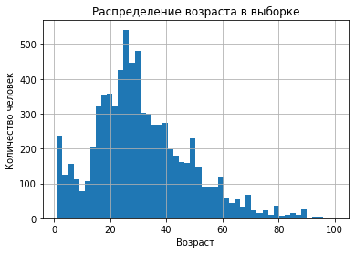
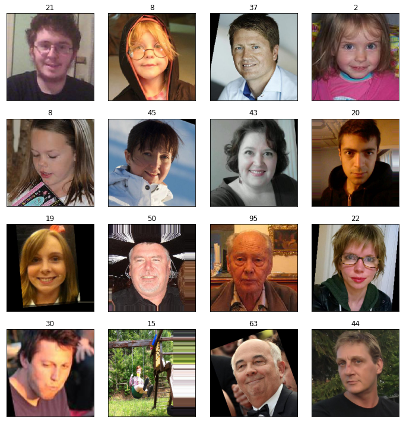

<div style="border:solid purple 2px; padding: 20px"> 

Привет, Дмитирий! 👋

Меня зовут Рустам Муртазин, и я буду делать ревью твоей работы. Давай будем общаться на **«ты»**. Если это неприемлемо, обязательно напиши мне в комментариях — мы перейдем на **«вы»**.

Я не хочу указывать тебе на совершенные тобою ошибки, а хочу поделиться своим опытом и помочь тебе стать настоящим профессионалом и сделать проект еще лучше.

Обрати внимание в первую очередь на те, что помечены <span style="color:red">красным цветом</span>. После их доработки проект будет принят. <span style="color:green">Зеленым цветом</span> отмечены удачные и элегантные решения, на которые можно опираться в будущих проектах. <span style="color:orange">Оранжевым цветом</span> выделено то, что в следующий раз можно сделать по-другому. Ты можешь учесть эти комментарии при выполнении будущих заданий или доработать проект сейчас (однако это не обязательно). Также в проекте могут быть небольшие «лайфхаки» по Python, не относящиеся к проекту, их я выделил фиолетовым цветом)

Давай работать над проектом в диалоге: если ты **что-то меняешь** в проекте по моим рекомендациям — **пиши об этом**. Выбери для своих комментариев какой-то заметный цвет, так мне будет легче отследить изменения. Пожалуйста, **не перемещай, не изменяй и не удаляй мои комментарии**. Всё это поможет выполнить повторную проверку твоего проекта оперативнее».

По проекту есть пару замечаний, но их не много, я думаю ты быстро справишься. Жду твою работу на повторное ревью :)

<div class="alert alert-success">
<h2> Комментарий ревьюера v2 ✔️ <a class="tocSkip"> </h2>

Замечания исправлены, а значит мы можем пойти дальше) CV очень интересная и широкая область, и если ты решишь стать экспертом в этой области, ты точно не останешься без работы и интересных задач) Успехов)

# Определение возраста покупателей

# Описание проекта


Сетевой супермаркет «Хлеб-Соль» внедряет систему компьютерного зрения для обработки фотографий покупателей. Фотофиксация в прикассовой зоне поможет определять возраст клиентов, чтобы:
Анализировать покупки и предлагать товары, которые могут заинтересовать покупателей этой возрастной группы;
Контролировать добросовестность кассиров при продаже алкоголя.
Постройте модель, которая по фотографии определит приблизительный возраст человека. В вашем распоряжении набор фотографий людей с указанием возраста.

## Исследовательский анализ данных


```python
import pandas as pd
from tensorflow.keras import Sequential
from tensorflow.keras.layers import Conv2D, Flatten, Dense, GlobalAveragePooling2D
import matplotlib.pyplot as plt
import numpy as np
from tensorflow.keras.applications.resnet import ResNet50
from tensorflow.keras.preprocessing.image import ImageDataGenerator
from tensorflow.keras.optimizers import Adam
```

<div style="border:solid purple 5px; padding: 20px"> 
<h2 align="center"> Рубрика «Питонячий лайфхакер» <a class="tocSkip"> </h2>

<h3> Широкоформатный Jupyter <a class="tocSkip"> </h3>

Расширяем границы, или как сделать работу более комфортной (не всем нравится 😄)

    from IPython.core.display import display, HTML
    display(HTML("<style>.container { width:90% !important; }</style>"))


```python
labels = pd.read_csv('/datasets/faces/labels.csv')
train_datagen = ImageDataGenerator(rescale=1/255)
train_gen_flow = train_datagen.flow_from_dataframe(
        dataframe=labels,
        directory='/datasets/faces/final_files/',
        x_col='file_name',
        y_col='real_age',
        target_size=(224, 224),
        batch_size=32,
        class_mode='raw',
        seed=12345)
```

    Found 7591 validated image filenames.


<div class="alert alert-success">
<h2> Комментарий ревьюера ✔️ <a class="tocSkip"> </h2>

Надеюсь, ты понимаешь значения параметров, которые ты передаешь методу, если нет, то можно почитать [официальную документацию](https://www.tensorflow.org/api_docs/python/tf/keras/preprocessing/image/ImageDataGenerator) - там все расписано)


```python
labels.shape
```


    (7591, 2)


```python
labels.head()
```


<div>
<style scoped>
    .dataframe tbody tr th:only-of-type {
        vertical-align: middle;
    }

    .dataframe tbody tr th {
        vertical-align: top;
    }

    .dataframe thead th {
        text-align: right;
    }
</style>
<table border="1" class="dataframe">
  <thead>
    <tr style="text-align: right;">
      <th></th>
      <th>file_name</th>
      <th>real_age</th>
    </tr>
  </thead>
  <tbody>
    <tr>
      <th>0</th>
      <td>000000.jpg</td>
      <td>4</td>
    </tr>
    <tr>
      <th>1</th>
      <td>000001.jpg</td>
      <td>18</td>
    </tr>
    <tr>
      <th>2</th>
      <td>000002.jpg</td>
      <td>80</td>
    </tr>
    <tr>
      <th>3</th>
      <td>000003.jpg</td>
      <td>50</td>
    </tr>
    <tr>
      <th>4</th>
      <td>000004.jpg</td>
      <td>17</td>
    </tr>
  </tbody>
</table>
</div>


```python
labels.info()
```

    <class 'pandas.core.frame.DataFrame'>
    RangeIndex: 7591 entries, 0 to 7590
    Data columns (total 2 columns):
     #   Column     Non-Null Count  Dtype 
    ---  ------     --------------  ----- 
     0   file_name  7591 non-null   object
     1   real_age   7591 non-null   int64 
    dtypes: int64(1), object(1)
    memory usage: 118.7+ KB


```python
labels.hist(bins=50)
plt.title('Распределение возраста в выборке')
plt.xlabel('Возраст')
plt.ylabel('Количество человек')
plt.show()
```


    

    


На гистограмме видим, что большая часть фото принадлежит людям от 20 до 40 лет (пики приходятся на 25-30 лет), соответственно, и точность у модели в этом дипазоне будет выше.

<div class="alert alert-success">
<h2> Комментарий ревьюера ✔️ <a class="tocSkip"> </h2>

Кстати, если тебе поднадоел стандартный `matplotlib`, попробуй пострить графики с помощью [plotly](https://plotly.github.io/plotly.py-docs/generated/plotly.express.histogram.html)


```python
features, target = next(train_gen_flow)

fig = plt.figure(figsize=(10,10))
for i in range(16):
    fig.add_subplot(4, 4, i+1)
    plt.imshow(features[i])
    plt.title(target[i])
    plt.xticks([])
    plt.yticks([])
    plt.tight_layout()
```


    

    


Всего имеется чуть более 7500 снимков размера 224*224. Фотографии в целом хорошего качества, однако встречаются и черно-белые изображения.

<div class="alert alert-warning">
<h2> Комментарий ревьюера ⚠️ <a class="tocSkip"> </h2>

Я бы советовал дополнительно в заголовке выводить возраст, т.е таргет изображения - это позволит предварительно оценить правильность разметки

<div class="alert alert-info" style="border-radius: 10px; box-shadow: 2px 2px 2px; border: 1px solid; padding: 10px "> 
<b>Комментарий студента</b> 
    
Добавил
</div> 

<div class="alert alert-warning">
<h2> Комментарий ревьюера ⚠️ <a class="tocSkip"> </h2>

И один нижний правый квадратик пустой остался, почему бы его не заполнить также изображением?

<div class="alert alert-info" style="border-radius: 10px; box-shadow: 2px 2px 2px; border: 1px solid; padding: 10px "> 
<b>Комментарий студента</b> 
    
Вывел 16 изображений
</div>             

<div class="alert alert-danger">
<h2> Комментарий ревьюера ❌ <a class="tocSkip"> </h2>

Здесь не хватает промежуточного вывода касаемо качества наших данных, причем как распределения, так и фотографий. 

<div class="alert alert-info" style="border-radius: 10px; box-shadow: 2px 2px 2px; border: 1px solid; padding: 10px "> 
<b>Комментарий студента</b> 
    
Добавил выводы под графиком и фото
</div>   

<div class="alert alert-warning">
<h2> Комментарий ревьюера v2 ⚠️ <a class="tocSkip"> </h2>

Я бы более широко расписал особенности, отметил бы бимодальность распределения, что может говорить о разных источниках, возможно. Плюс наблюдаются некоторые отдельные пики - это, возможно, результаты округления. А по поводу самих фотографий, я бы отметил, что все фотографии выровнены, что довольно хорошо для наших моделей

## Обучение модели

Перенесите сюда код обучения модели и её результат вывода на экран.


(Код в этом разделе запускается в отдельном GPU-тренажёре, поэтому оформлен не как ячейка с кодом, а как код в текстовой ячейке)

<div style="border:solid purple 5px; padding: 20px"> 
<h2 align="center"> Рубрика «Питонячий лайфхакер» <a class="tocSkip"> </h2>

<h3> Модуль itertools <a class="tocSkip"> </h3>

Этот модуль стандартизирует основной набор быстрых, эффективных по памяти инструментов, которые полезны сами по себе или в сочетании. Вместе они образуют `iterator algebra` возможность создавать лаконичные и эффективные специализированные инструменты на чистом Python. Прелесть заключается в том, что модуль `itertools` доступен в стандартной библиотеке Python.

Ниже несколько примеров, котолрыми часто пользуюсь я

```python
import itertools
print(list(itertools.product("ABC", [1, 2])))
print(list(itertools.permutations([3, "Python"], 2)))
```

Чтобы более делальнее изучить модуль ты можешь почитать

1. [Статья на habr "Itertools в Python"](https://habr.com/ru/company/otus/blog/529356/)
2. [Модуль Itertools в Python на примерах](https://pythonpip.ru/osnovy/itertools)

def load_train(path):
    labels = pd.read_csv(path + 'labels.csv')
    
    train_datagen = ImageDataGenerator(validation_split=0.25, rescale=1./255, horizontal_flip=True)
    
    train_gen_flow = train_datagen.flow_from_dataframe(
        dataframe=labels,
        directory=path + 'final_files/',
        x_col='file_name',
        y_col='real_age',
        target_size=(224, 224),
        batch_size=16,
        class_mode='raw',
        subset='training',
        seed=12345)

    return train_gen_flow
    
         

def load_test(path):
    labels = pd.read_csv(path + 'labels.csv')
                                                           
    test_datagen = ImageDataGenerator(validation_split=0.25, rescale=1/255)
                                                           
    test_gen_flow = test_datagen.flow_from_dataframe(
        dataframe=labels,
        directory=path + 'final_files/',
        x_col='file_name',
        y_col='real_age',
        target_size=(224, 224),
        batch_size=16,
        class_mode='raw',
        subset='validation',
        seed=12345)

    return test_gen_flow


def create_model(input_shape):
    backbone = ResNet50(input_shape=input_shape,
                    weights='imagenet', 
                    include_top=False)
        
    model = Sequential()
    model.add(backbone)
    model.add(GlobalAveragePooling2D())
    model.add(Dense(1, activation='relu'))
    optimizer = Adam(lr=0.0001)
    model.compile(loss='mean_squared_error', metrics=['mae'], optimizer=optimizer)

    return model


def train_model(model, train_data, test_data, batch_size=None, epochs=15,
                steps_per_epoch=None, validation_steps=None):

    model.fit(train_data,
              validation_data=test_data,
              batch_size=batch_size, 
              epochs=epochs,
              steps_per_epoch=steps_per_epoch,
              validation_steps=validation_steps,
              verbose=2)

    return model


    


<div class="alert alert-success">
<h2> Комментарий ревьюера ✔️ <a class="tocSkip"> </h2>

Здесь все стандартно и корректно 👍

```

# < скопируйте результат вывода на экран сюда >
# < длинные строки со скачиванием модели можно удалить >

```

<div class="alert alert-warning">
<h2> Комментарий ревьюера ⚠️ <a class="tocSkip"> </h2>

Я бы поместил логи в маркдаун, как-то так 👇
    

```
 Train for 356 steps, validate for 119 steps
Epoch 1/15
2023-09-03 06:01:10.914718: I tensorflow/stream_executor/platform/default/dso_loader.cc:44] Successfully opened dynamic library libcublas.so.10
2023-09-03 06:01:11.324467: I tensorflow/stream_executor/platform/default/dso_loader.cc:44] Successfully opened dynamic library libcudnn.so.7
356/356 - 70s - loss: 201.2985 - mae: 10.2514 - val_loss: 649.7597 - val_mae: 20.3409
Epoch 2/15
356/356 - 53s - loss: 82.5849 - mae: 6.9346 - val_loss: 140.6518 - val_mae: 8.8843
Epoch 3/15
356/356 - 57s - loss: 57.8470 - mae: 5.8211 - val_loss: 80.1819 - val_mae: 6.6875
Epoch 4/15
356/356 - 48s - loss: 40.9841 - mae: 4.9538 - val_loss: 96.3579 - val_mae: 7.6437
Epoch 5/15
356/356 - 49s - loss: 32.5094 - mae: 4.3420 - val_loss: 68.5298 - val_mae: 6.1538
Epoch 6/15
356/356 - 57s - loss: 27.4685 - mae: 3.9902 - val_loss: 74.4213 - val_mae: 6.4524
Epoch 7/15
356/356 - 53s - loss: 22.3478 - mae: 3.5784 - val_loss: 67.2534 - val_mae: 6.1833
Epoch 8/15
356/356 - 44s - loss: 17.3483 - mae: 3.1508 - val_loss: 66.3183 - val_mae: 6.2294
Epoch 9/15
356/356 - 57s - loss: 14.0614 - mae: 2.8367 - val_loss: 63.4768 - val_mae: 5.8864
Epoch 10/15
356/356 - 57s - loss: 13.0804 - mae: 2.7540 - val_loss: 81.9567 - val_mae: 6.9749
Epoch 11/15
356/356 - 41s - loss: 12.3619 - mae: 2.6781 - val_loss: 87.4584 - val_mae: 7.1715
Epoch 12/15
356/356 - 41s - loss: 12.2255 - mae: 2.6575 - val_loss: 65.4839 - val_mae: 6.1685
Epoch 13/15
356/356 - 38s - loss: 12.0873 - mae: 2.6562 - val_loss: 62.3622 - val_mae: 5.8841
Epoch 14/15
356/356 - 38s - loss: 11.1680 - mae: 2.5404 - val_loss: 66.5377 - val_mae: 5.9507
Epoch 15/15
356/356 - 40s - loss: 10.8475 - mae: 2.4999 - val_loss: 63.6275 - val_mae: 5.9041
WARNING:tensorflow:sample_weight modes were coerced from
  ...
    to  
  ['...']
119/119 - 10s - loss: 63.6275 - mae: 5.9041   
Логи
```    

<div class="alert alert-warning">
<h2> Комментарий ревьюера ⚠️ <a class="tocSkip"> </h2>

И я бы оставил только логи процесса обучения, остальная информация нам не важна (здесь)

<div class="alert alert-info" style="border-radius: 10px; box-shadow: 2px 2px 2px; border: 1px solid; padding: 10px "> 
<b>Комментарий студента</b> 
    
Подкорректировал
</div>  

## Анализ обученной модели

Вывод: Итак, в нашем распоряжении есть датасет с 7591 фотографией, и мы использовали сверточную нейросеть на основе ResNet50. В результате удалось добиться поставленной цели, а именно: MAE = 5.9, что не больше требуемых 8. Таким образом, погрешность составляет 6 лет. Соответственно, модель пригодна для анализа и предложения товаров, которые могут заинтересовать покупателей определенной возрастной группы. Но вряд ли можно говорить о том, что модель подойдет для контроля добросовестности кассиров при продаже алкоголя.

<div class="alert alert-warning">
<h2> Комментарий ревьюера ⚠️ <a class="tocSkip"> </h2>

Я бы расписал, каким образом мы можем улучшить наш результат
    

<div class="alert alert-success">
<h2> Комментарий ревьюера ✔️ <a class="tocSkip"> </h2>

Вот парочка интересных статей (2023 года) на тему CV:
    
- [В этой одежде системы распознавания будут считать вас животным](https://habr.com/ru/articles/719368/)
- [Kandinsky 2.2 — новый шаг в направлении фотореализма](https://habr.com/ru/companies/sberbank/articles/747446/)
- [Как ИИ работает даже в зоне взрывных работ](https://habr.com/ru/companies/nlmk/articles/706022/)
- [Как я занял 13 место из 3500+ участников и стал Kaggle Competition Master](https://habr.com/ru/companies/alfa/articles/716116/)

## Чек-лист

- [x]  Jupyter Notebook открыт
- [ ]  Весь код выполняется без ошибок
- [ ]  Ячейки с кодом расположены в порядке исполнения
- [ ]  Исследовательский анализ данных выполнен
- [ ]  Результаты исследовательского анализа данных перенесены в финальную тетрадь
- [ ]  MAE модели не больше 8
- [ ]  Код обучения модели скопирован в финальную тетрадь
- [ ]  Результат вывода модели на экран перенесён в финальную тетрадь
- [ ]  По итогам обучения модели сделаны выводы
