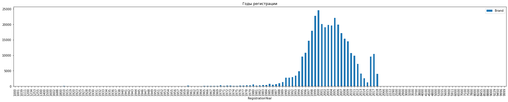
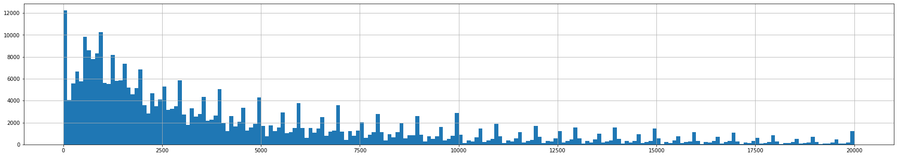
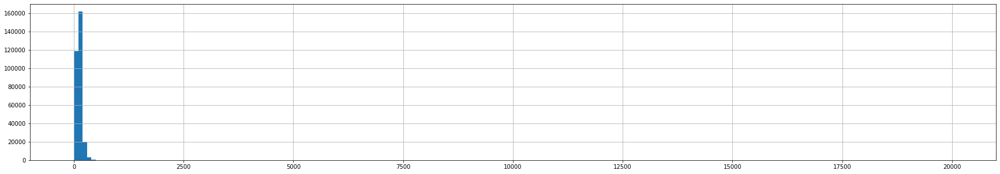

# Определение стоимости автомобилей

Сервис по продаже автомобилей с пробегом «Не бит, не крашен» разрабатывает приложение для привлечения новых клиентов. В нём можно быстро узнать рыночную стоимость своего автомобиля. В вашем распоряжении исторические данные: технические характеристики, комплектации и цены автомобилей. Вам нужно построить модель для определения стоимости. 

Заказчику важны:

- качество предсказания;
- скорость предсказания;
- время обучения.

## Подготовка данных


```python
pip install --upgrade jupyter --user
```

    Requirement already satisfied: jupyter in /opt/conda/lib/python3.9/site-packages (1.0.0)
    Requirement already satisfied: qtconsole in /opt/conda/lib/python3.9/site-packages (from jupyter) (5.3.2)
    Requirement already satisfied: nbconvert in /opt/conda/lib/python3.9/site-packages (from jupyter) (6.1.0)
    Requirement already satisfied: ipywidgets in /opt/conda/lib/python3.9/site-packages (from jupyter) (7.6.3)
    Requirement already satisfied: notebook in /opt/conda/lib/python3.9/site-packages (from jupyter) (6.4.0)
    Requirement already satisfied: ipykernel in /opt/conda/lib/python3.9/site-packages (from jupyter) (6.0.1)
    Requirement already satisfied: jupyter-console in /opt/conda/lib/python3.9/site-packages (from jupyter) (6.4.2)
    Requirement already satisfied: traitlets>=4.1.0 in /opt/conda/lib/python3.9/site-packages (from ipykernel->jupyter) (5.0.5)
    Requirement already satisfied: ipython>=7.23.1 in /opt/conda/lib/python3.9/site-packages (from ipykernel->jupyter) (7.25.0)
    Requirement already satisfied: debugpy>=1.0.0 in /opt/conda/lib/python3.9/site-packages (from ipykernel->jupyter) (1.3.0)
    Requirement already satisfied: jupyter-client in /opt/conda/lib/python3.9/site-packages (from ipykernel->jupyter) (6.1.12)
    Requirement already satisfied: tornado>=4.2 in /opt/conda/lib/python3.9/site-packages (from ipykernel->jupyter) (6.1)
    Requirement already satisfied: decorator in /opt/conda/lib/python3.9/site-packages (from ipython>=7.23.1->ipykernel->jupyter) (5.0.9)
    Requirement already satisfied: setuptools>=18.5 in /opt/conda/lib/python3.9/site-packages (from ipython>=7.23.1->ipykernel->jupyter) (49.6.0.post20210108)
    Requirement already satisfied: pexpect>4.3 in /opt/conda/lib/python3.9/site-packages (from ipython>=7.23.1->ipykernel->jupyter) (4.8.0)
    Requirement already satisfied: pickleshare in /opt/conda/lib/python3.9/site-packages (from ipython>=7.23.1->ipykernel->jupyter) (0.7.5)
    Requirement already satisfied: prompt-toolkit!=3.0.0,!=3.0.1,<3.1.0,>=2.0.0 in /opt/conda/lib/python3.9/site-packages (from ipython>=7.23.1->ipykernel->jupyter) (3.0.19)
    Requirement already satisfied: pygments in /opt/conda/lib/python3.9/site-packages (from ipython>=7.23.1->ipykernel->jupyter) (2.9.0)
    Requirement already satisfied: backcall in /opt/conda/lib/python3.9/site-packages (from ipython>=7.23.1->ipykernel->jupyter) (0.2.0)
    Requirement already satisfied: matplotlib-inline in /opt/conda/lib/python3.9/site-packages (from ipython>=7.23.1->ipykernel->jupyter) (0.1.2)
    Requirement already satisfied: jedi>=0.16 in /opt/conda/lib/python3.9/site-packages (from ipython>=7.23.1->ipykernel->jupyter) (0.18.0)
    Requirement already satisfied: parso<0.9.0,>=0.8.0 in /opt/conda/lib/python3.9/site-packages (from jedi>=0.16->ipython>=7.23.1->ipykernel->jupyter) (0.8.2)
    Requirement already satisfied: ptyprocess>=0.5 in /opt/conda/lib/python3.9/site-packages (from pexpect>4.3->ipython>=7.23.1->ipykernel->jupyter) (0.7.0)
    Requirement already satisfied: wcwidth in /opt/conda/lib/python3.9/site-packages (from prompt-toolkit!=3.0.0,!=3.0.1,<3.1.0,>=2.0.0->ipython>=7.23.1->ipykernel->jupyter) (0.2.5)
    Requirement already satisfied: ipython-genutils in /opt/conda/lib/python3.9/site-packages (from traitlets>=4.1.0->ipykernel->jupyter) (0.2.0)
    Requirement already satisfied: nbformat>=4.2.0 in /opt/conda/lib/python3.9/site-packages (from ipywidgets->jupyter) (5.1.3)
    Requirement already satisfied: jupyterlab-widgets>=1.0.0 in /opt/conda/lib/python3.9/site-packages (from ipywidgets->jupyter) (3.0.2)
    Requirement already satisfied: widgetsnbextension~=3.5.0 in /opt/conda/lib/python3.9/site-packages (from ipywidgets->jupyter) (3.5.2)
    Requirement already satisfied: jupyter-core in /opt/conda/lib/python3.9/site-packages (from nbformat>=4.2.0->ipywidgets->jupyter) (4.7.1)
    Requirement already satisfied: jsonschema!=2.5.0,>=2.4 in /opt/conda/lib/python3.9/site-packages (from nbformat>=4.2.0->ipywidgets->jupyter) (3.2.0)
    Requirement already satisfied: six>=1.11.0 in /opt/conda/lib/python3.9/site-packages (from jsonschema!=2.5.0,>=2.4->nbformat>=4.2.0->ipywidgets->jupyter) (1.16.0)
    Requirement already satisfied: pyrsistent>=0.14.0 in /opt/conda/lib/python3.9/site-packages (from jsonschema!=2.5.0,>=2.4->nbformat>=4.2.0->ipywidgets->jupyter) (0.17.3)
    Requirement already satisfied: attrs>=17.4.0 in /opt/conda/lib/python3.9/site-packages (from jsonschema!=2.5.0,>=2.4->nbformat>=4.2.0->ipywidgets->jupyter) (21.2.0)
    Requirement already satisfied: pyzmq>=17 in /opt/conda/lib/python3.9/site-packages (from notebook->jupyter) (22.1.0)
    Requirement already satisfied: Send2Trash>=1.5.0 in /opt/conda/lib/python3.9/site-packages (from notebook->jupyter) (1.7.1)
    Requirement already satisfied: argon2-cffi in /opt/conda/lib/python3.9/site-packages (from notebook->jupyter) (20.1.0)
    Requirement already satisfied: prometheus-client in /opt/conda/lib/python3.9/site-packages (from notebook->jupyter) (0.11.0)
    Requirement already satisfied: jinja2 in /opt/conda/lib/python3.9/site-packages (from notebook->jupyter) (3.0.1)
    Requirement already satisfied: terminado>=0.8.3 in /opt/conda/lib/python3.9/site-packages (from notebook->jupyter) (0.10.1)
    Requirement already satisfied: python-dateutil>=2.1 in /opt/conda/lib/python3.9/site-packages (from jupyter-client->ipykernel->jupyter) (2.8.1)
    Requirement already satisfied: cffi>=1.0.0 in /opt/conda/lib/python3.9/site-packages (from argon2-cffi->notebook->jupyter) (1.14.5)
    Requirement already satisfied: pycparser in /opt/conda/lib/python3.9/site-packages (from cffi>=1.0.0->argon2-cffi->notebook->jupyter) (2.20)
    Requirement already satisfied: MarkupSafe>=2.0 in /opt/conda/lib/python3.9/site-packages (from jinja2->notebook->jupyter) (2.1.1)
    Requirement already satisfied: defusedxml in /opt/conda/lib/python3.9/site-packages (from nbconvert->jupyter) (0.7.1)
    Requirement already satisfied: entrypoints>=0.2.2 in /opt/conda/lib/python3.9/site-packages (from nbconvert->jupyter) (0.3)
    Requirement already satisfied: testpath in /opt/conda/lib/python3.9/site-packages (from nbconvert->jupyter) (0.5.0)
    Requirement already satisfied: bleach in /opt/conda/lib/python3.9/site-packages (from nbconvert->jupyter) (3.3.0)
    Requirement already satisfied: mistune<2,>=0.8.1 in /opt/conda/lib/python3.9/site-packages (from nbconvert->jupyter) (0.8.4)
    Requirement already satisfied: jupyterlab-pygments in /opt/conda/lib/python3.9/site-packages (from nbconvert->jupyter) (0.1.2)
    Requirement already satisfied: pandocfilters>=1.4.1 in /opt/conda/lib/python3.9/site-packages (from nbconvert->jupyter) (1.4.2)
    Requirement already satisfied: nbclient<0.6.0,>=0.5.0 in /opt/conda/lib/python3.9/site-packages (from nbconvert->jupyter) (0.5.3)
    Requirement already satisfied: async-generator in /opt/conda/lib/python3.9/site-packages (from nbclient<0.6.0,>=0.5.0->nbconvert->jupyter) (1.10)
    Requirement already satisfied: nest-asyncio in /opt/conda/lib/python3.9/site-packages (from nbclient<0.6.0,>=0.5.0->nbconvert->jupyter) (1.5.1)
    Requirement already satisfied: webencodings in /opt/conda/lib/python3.9/site-packages (from bleach->nbconvert->jupyter) (0.5.1)
    Requirement already satisfied: packaging in /opt/conda/lib/python3.9/site-packages (from bleach->nbconvert->jupyter) (21.3)
    Requirement already satisfied: pyparsing!=3.0.5,>=2.0.2 in /opt/conda/lib/python3.9/site-packages (from packaging->bleach->nbconvert->jupyter) (2.4.7)
    Requirement already satisfied: qtpy>=2.0.1 in /opt/conda/lib/python3.9/site-packages (from qtconsole->jupyter) (2.2.0)
    Note: you may need to restart the kernel to use updated packages.


```python
!pip install scikit-learn==1.1.3
```

    Requirement already satisfied: scikit-learn==1.1.3 in /opt/conda/lib/python3.9/site-packages (1.1.3)
    Requirement already satisfied: threadpoolctl>=2.0.0 in /opt/conda/lib/python3.9/site-packages (from scikit-learn==1.1.3) (3.1.0)
    Requirement already satisfied: numpy>=1.17.3 in /opt/conda/lib/python3.9/site-packages (from scikit-learn==1.1.3) (1.21.1)
    Requirement already satisfied: joblib>=1.0.0 in /opt/conda/lib/python3.9/site-packages (from scikit-learn==1.1.3) (1.1.0)
    Requirement already satisfied: scipy>=1.3.2 in /opt/conda/lib/python3.9/site-packages (from scikit-learn==1.1.3) (1.9.1)


```python
!pip install lightgbm
```

    Requirement already satisfied: lightgbm in /opt/conda/lib/python3.9/site-packages (3.3.1)
    Requirement already satisfied: scikit-learn!=0.22.0 in /opt/conda/lib/python3.9/site-packages (from lightgbm) (1.1.3)
    Requirement already satisfied: wheel in /opt/conda/lib/python3.9/site-packages (from lightgbm) (0.36.2)
    Requirement already satisfied: scipy in /opt/conda/lib/python3.9/site-packages (from lightgbm) (1.9.1)
    Requirement already satisfied: numpy in /opt/conda/lib/python3.9/site-packages (from lightgbm) (1.21.1)
    Requirement already satisfied: joblib>=1.0.0 in /opt/conda/lib/python3.9/site-packages (from scikit-learn!=0.22.0->lightgbm) (1.1.0)
    Requirement already satisfied: threadpoolctl>=2.0.0 in /opt/conda/lib/python3.9/site-packages (from scikit-learn!=0.22.0->lightgbm) (3.1.0)


```python
!pip install category-encoders
```

    Requirement already satisfied: category-encoders in /opt/conda/lib/python3.9/site-packages (2.6.1)
    Requirement already satisfied: patsy>=0.5.1 in /opt/conda/lib/python3.9/site-packages (from category-encoders) (0.5.2)
    Requirement already satisfied: numpy>=1.14.0 in /opt/conda/lib/python3.9/site-packages (from category-encoders) (1.21.1)
    Requirement already satisfied: statsmodels>=0.9.0 in /opt/conda/lib/python3.9/site-packages (from category-encoders) (0.13.2)
    Requirement already satisfied: scipy>=1.0.0 in /opt/conda/lib/python3.9/site-packages (from category-encoders) (1.9.1)
    Requirement already satisfied: scikit-learn>=0.20.0 in /opt/conda/lib/python3.9/site-packages (from category-encoders) (1.1.3)
    Requirement already satisfied: pandas>=1.0.5 in /opt/conda/lib/python3.9/site-packages (from category-encoders) (1.2.4)
    Requirement already satisfied: python-dateutil>=2.7.3 in /opt/conda/lib/python3.9/site-packages (from pandas>=1.0.5->category-encoders) (2.8.1)
    Requirement already satisfied: pytz>=2017.3 in /opt/conda/lib/python3.9/site-packages (from pandas>=1.0.5->category-encoders) (2021.1)
    Requirement already satisfied: six in /opt/conda/lib/python3.9/site-packages (from patsy>=0.5.1->category-encoders) (1.16.0)
    Requirement already satisfied: joblib>=1.0.0 in /opt/conda/lib/python3.9/site-packages (from scikit-learn>=0.20.0->category-encoders) (1.1.0)
    Requirement already satisfied: threadpoolctl>=2.0.0 in /opt/conda/lib/python3.9/site-packages (from scikit-learn>=0.20.0->category-encoders) (3.1.0)
    Requirement already satisfied: packaging>=21.3 in /opt/conda/lib/python3.9/site-packages (from statsmodels>=0.9.0->category-encoders) (21.3)
    Requirement already satisfied: pyparsing!=3.0.5,>=2.0.2 in /opt/conda/lib/python3.9/site-packages (from packaging>=21.3->statsmodels>=0.9.0->category-encoders) (2.4.7)


```python
import math
import numpy as np
import pandas as pd
import seaborn as sns
import matplotlib.pyplot as plt
from sklearn.model_selection import train_test_split
from sklearn.preprocessing import OrdinalEncoder
from sklearn.preprocessing import StandardScaler
from sklearn.metrics import mean_squared_error
import time
from sklearn.model_selection import cross_val_score
from sklearn.model_selection import GridSearchCV
from sklearn.linear_model import LinearRegression
from lightgbm import LGBMRegressor

from category_encoders import MEstimateEncoder
from sklearn.preprocessing import OneHotEncoder
import category_encoders as ce
```


```python
data = pd.read_csv('/datasets/autos.csv')
```


```python
data.info()
data.head()
```

    <class 'pandas.core.frame.DataFrame'>
    RangeIndex: 354369 entries, 0 to 354368
    Data columns (total 16 columns):
     #   Column             Non-Null Count   Dtype 
    ---  ------             --------------   ----- 
     0   DateCrawled        354369 non-null  object
     1   Price              354369 non-null  int64 
     2   VehicleType        316879 non-null  object
     3   RegistrationYear   354369 non-null  int64 
     4   Gearbox            334536 non-null  object
     5   Power              354369 non-null  int64 
     6   Model              334664 non-null  object
     7   Kilometer          354369 non-null  int64 
     8   RegistrationMonth  354369 non-null  int64 
     9   FuelType           321474 non-null  object
     10  Brand              354369 non-null  object
     11  Repaired           283215 non-null  object
     12  DateCreated        354369 non-null  object
     13  NumberOfPictures   354369 non-null  int64 
     14  PostalCode         354369 non-null  int64 
     15  LastSeen           354369 non-null  object
    dtypes: int64(7), object(9)
    memory usage: 43.3+ MB


<table border="1" class="dataframe">
  <thead>
    <tr style="text-align: right;">
      <th></th>
      <th>DateCrawled</th>
      <th>Price</th>
      <th>VehicleType</th>
      <th>RegistrationYear</th>
      <th>Gearbox</th>
      <th>Power</th>
      <th>Model</th>
      <th>Kilometer</th>
      <th>RegistrationMonth</th>
      <th>FuelType</th>
      <th>Brand</th>
      <th>Repaired</th>
      <th>DateCreated</th>
      <th>NumberOfPictures</th>
      <th>PostalCode</th>
      <th>LastSeen</th>
    </tr>
  </thead>
  <tbody>
    <tr>
      <th>0</th>
      <td>2016-03-24 11:52:17</td>
      <td>480</td>
      <td>NaN</td>
      <td>1993</td>
      <td>manual</td>
      <td>0</td>
      <td>golf</td>
      <td>150000</td>
      <td>0</td>
      <td>petrol</td>
      <td>volkswagen</td>
      <td>NaN</td>
      <td>2016-03-24 00:00:00</td>
      <td>0</td>
      <td>70435</td>
      <td>2016-04-07 03:16:57</td>
    </tr>
    <tr>
      <th>1</th>
      <td>2016-03-24 10:58:45</td>
      <td>18300</td>
      <td>coupe</td>
      <td>2011</td>
      <td>manual</td>
      <td>190</td>
      <td>NaN</td>
      <td>125000</td>
      <td>5</td>
      <td>gasoline</td>
      <td>audi</td>
      <td>yes</td>
      <td>2016-03-24 00:00:00</td>
      <td>0</td>
      <td>66954</td>
      <td>2016-04-07 01:46:50</td>
    </tr>
    <tr>
      <th>2</th>
      <td>2016-03-14 12:52:21</td>
      <td>9800</td>
      <td>suv</td>
      <td>2004</td>
      <td>auto</td>
      <td>163</td>
      <td>grand</td>
      <td>125000</td>
      <td>8</td>
      <td>gasoline</td>
      <td>jeep</td>
      <td>NaN</td>
      <td>2016-03-14 00:00:00</td>
      <td>0</td>
      <td>90480</td>
      <td>2016-04-05 12:47:46</td>
    </tr>
    <tr>
      <th>3</th>
      <td>2016-03-17 16:54:04</td>
      <td>1500</td>
      <td>small</td>
      <td>2001</td>
      <td>manual</td>
      <td>75</td>
      <td>golf</td>
      <td>150000</td>
      <td>6</td>
      <td>petrol</td>
      <td>volkswagen</td>
      <td>no</td>
      <td>2016-03-17 00:00:00</td>
      <td>0</td>
      <td>91074</td>
      <td>2016-03-17 17:40:17</td>
    </tr>
    <tr>
      <th>4</th>
      <td>2016-03-31 17:25:20</td>
      <td>3600</td>
      <td>small</td>
      <td>2008</td>
      <td>manual</td>
      <td>69</td>
      <td>fabia</td>
      <td>90000</td>
      <td>7</td>
      <td>gasoline</td>
      <td>skoda</td>
      <td>no</td>
      <td>2016-03-31 00:00:00</td>
      <td>0</td>
      <td>60437</td>
      <td>2016-04-06 10:17:21</td>
    </tr>
  </tbody>
</table>
</div>


```python
data.describe()
```


<table border="1" class="dataframe">
  <thead>
    <tr style="text-align: right;">
      <th></th>
      <th>Price</th>
      <th>RegistrationYear</th>
      <th>Power</th>
      <th>Kilometer</th>
      <th>RegistrationMonth</th>
      <th>NumberOfPictures</th>
      <th>PostalCode</th>
    </tr>
  </thead>
  <tbody>
    <tr>
      <th>count</th>
      <td>354369.000000</td>
      <td>354369.000000</td>
      <td>354369.000000</td>
      <td>354369.000000</td>
      <td>354369.000000</td>
      <td>354369.0</td>
      <td>354369.000000</td>
    </tr>
    <tr>
      <th>mean</th>
      <td>4416.656776</td>
      <td>2004.234448</td>
      <td>110.094337</td>
      <td>128211.172535</td>
      <td>5.714645</td>
      <td>0.0</td>
      <td>50508.689087</td>
    </tr>
    <tr>
      <th>std</th>
      <td>4514.158514</td>
      <td>90.227958</td>
      <td>189.850405</td>
      <td>37905.341530</td>
      <td>3.726421</td>
      <td>0.0</td>
      <td>25783.096248</td>
    </tr>
    <tr>
      <th>min</th>
      <td>0.000000</td>
      <td>1000.000000</td>
      <td>0.000000</td>
      <td>5000.000000</td>
      <td>0.000000</td>
      <td>0.0</td>
      <td>1067.000000</td>
    </tr>
    <tr>
      <th>25%</th>
      <td>1050.000000</td>
      <td>1999.000000</td>
      <td>69.000000</td>
      <td>125000.000000</td>
      <td>3.000000</td>
      <td>0.0</td>
      <td>30165.000000</td>
    </tr>
    <tr>
      <th>50%</th>
      <td>2700.000000</td>
      <td>2003.000000</td>
      <td>105.000000</td>
      <td>150000.000000</td>
      <td>6.000000</td>
      <td>0.0</td>
      <td>49413.000000</td>
    </tr>
    <tr>
      <th>75%</th>
      <td>6400.000000</td>
      <td>2008.000000</td>
      <td>143.000000</td>
      <td>150000.000000</td>
      <td>9.000000</td>
      <td>0.0</td>
      <td>71083.000000</td>
    </tr>
    <tr>
      <th>max</th>
      <td>20000.000000</td>
      <td>9999.000000</td>
      <td>20000.000000</td>
      <td>150000.000000</td>
      <td>12.000000</td>
      <td>0.0</td>
      <td>99998.000000</td>
    </tr>
  </tbody>
</table>
</div>


```python
data.duplicated().sum()
```


    4


```python
data.drop_duplicates(inplace=True)
```


```python
data.isna().sum()
```


    DateCrawled              0
    Price                    0
    VehicleType          37490
    RegistrationYear         0
    Gearbox              19833
    Power                    0
    Model                19705
    Kilometer                0
    RegistrationMonth        0
    FuelType             32895
    Brand                    0
    Repaired             71154
    DateCreated              0
    NumberOfPictures         0
    PostalCode               0
    LastSeen                 0
    dtype: int64


```python
data['DateCrawled'].max()
```


    '2016-04-07 14:36:58'


```python
data.pivot_table(index='RegistrationYear', values='Brand', aggfunc='count').plot.bar(figsize = (30,5))
plt.title('Годы регистрации')
plt.show()
```


    

    


```python
data['RegistrationYear'].unique()
```


    array([1993, 2011, 2004, 2001, 2008, 1995, 1980, 2014, 1998, 2005, 1910,
           2016, 2007, 2009, 2002, 2018, 1997, 1990, 2017, 1981, 2003, 1994,
           1991, 1984, 2006, 1999, 2012, 2010, 2000, 1992, 2013, 1996, 1985,
           1989, 2015, 1982, 1976, 1983, 1973, 1111, 1969, 1971, 1987, 1986,
           1988, 1970, 1965, 1945, 1925, 1974, 1979, 1955, 1978, 1972, 1968,
           1977, 1961, 1960, 1966, 1975, 1963, 1964, 5000, 1954, 1958, 1967,
           1959, 9999, 1956, 3200, 1000, 1941, 8888, 1500, 2200, 4100, 1962,
           1929, 1957, 1940, 3000, 2066, 1949, 2019, 1937, 1951, 1800, 1953,
           1234, 8000, 5300, 9000, 2900, 6000, 5900, 5911, 1933, 1400, 1950,
           4000, 1948, 1952, 1200, 8500, 1932, 1255, 3700, 3800, 4800, 1942,
           7000, 1935, 1936, 6500, 1923, 2290, 2500, 1930, 1001, 9450, 1944,
           1943, 1934, 1938, 1688, 2800, 1253, 1928, 1919, 5555, 5600, 1600,
           2222, 1039, 9996, 1300, 8455, 1931, 1915, 4500, 1920, 1602, 7800,
           9229, 1947, 1927, 7100, 8200, 1946, 7500, 3500])


```python
data['RegistrationYear'].value_counts()
```


    2000    24490
    1999    22727
    2005    22109
    2001    20123
    2006    19900
            ...  
    4100        1
    1200        1
    5300        1
    8888        1
    2290        1
    Name: RegistrationYear, Length: 151, dtype: int64


```python
data = data[(data['RegistrationYear'] >= 1970) & (data['RegistrationYear'] <= 2016)]
```


```python
data['Price'].hist(bins=200, figsize=(30,5))
```


    <AxesSubplot:>


    

    


```python
#data = data[(data['Price'] >= 500) & (data['Price'] <= 14500)]
```


```python
data = data[data['Price'] >= 500]
```


```python
data['Power'].value_counts()
```


    0        25155
    75       19643
    150      13434
    140      12213
    60       12047
             ...  
    1082         1
    1079         1
    13616        1
    2729         1
    6512         1
    Name: Power, Length: 647, dtype: int64


```python
data['Power'].hist(bins=200, figsize=(30,5))
```


    <AxesSubplot:>


    

    


```python
data = data[(data['Power'] > 0) & (data['Power'] <= 1000)]
```


Удалим неинформативные признаки: даты, индекс и количество фотографий никак не влияют на цену

```python

data.drop(['DateCrawled', 'DateCreated', 'NumberOfPictures','PostalCode', 'LastSeen', 'RegistrationMonth'], axis=1, inplace=True)
```


```python
data['VehicleType'].value_counts()
```


    sedan          79645
    small          62541
    wagon          56909
    bus            25847
    convertible    18466
    coupe          13859
    suv            10856
    other           2251
    Name: VehicleType, dtype: int64


```python
data['Gearbox'].value_counts()
```


    manual    216620
    auto       57729
    Name: Gearbox, dtype: int64


```python
data['Model'].value_counts()
```


    golf                  23159
    other                 19006
    3er                   16877
    polo                   9277
    a4                     8576
                          ...  
    i3                        4
    samara                    3
    serie_3                   3
    rangerover                2
    range_rover_evoque        2
    Name: Model, Length: 249, dtype: int64


```python
data['FuelType'].value_counts()
```


    petrol      173645
    gasoline     87088
    lpg           4589
    cng            466
    hybrid         200
    other           75
    electric        73
    Name: FuelType, dtype: int64


```python
data['Repaired'].value_counts()
```


    no     219079
    yes     23068
    Name: Repaired, dtype: int64


```python
data['VehicleType'] = data['VehicleType'].fillna('unknown')
```


```python
data['Model'] = data['Model'].fillna('unknown')
```


```python
data['FuelType'] = data['FuelType'].fillna('unknown')
```


```python
data['Repaired'] = data['Repaired'].fillna('unknown')
```


заменим NaN на 'manual':

```python

data.fillna({'gearbox':'manual'}, inplace=True)
```


```python
data.loc[(data['Gearbox'] == 'manual'), 'Gearbox'] = 1   
data.loc[(data['Gearbox'] == 'auto'), 'Gearbox'] = 0
```


```python
data['Gearbox'] = data.groupby('Model')['Gearbox'].apply(lambda x: x.fillna(x.mode().values[0]))
```


```python
data.isna().sum()
```


    Price               0
    VehicleType         0
    RegistrationYear    0
    Gearbox             0
    Power               0
    Model               0
    Kilometer           0
    FuelType            0
    Brand               0
    Repaired            0
    dtype: int64


```python
data
```


<table border="1" class="dataframe">
  <thead>
    <tr style="text-align: right;">
      <th></th>
      <th>Price</th>
      <th>VehicleType</th>
      <th>RegistrationYear</th>
      <th>Gearbox</th>
      <th>Power</th>
      <th>Model</th>
      <th>Kilometer</th>
      <th>FuelType</th>
      <th>Brand</th>
      <th>Repaired</th>
    </tr>
  </thead>
  <tbody>
    <tr>
      <th>1</th>
      <td>18300</td>
      <td>coupe</td>
      <td>2011</td>
      <td>1</td>
      <td>190</td>
      <td>unknown</td>
      <td>125000</td>
      <td>gasoline</td>
      <td>audi</td>
      <td>yes</td>
    </tr>
    <tr>
      <th>2</th>
      <td>9800</td>
      <td>suv</td>
      <td>2004</td>
      <td>0</td>
      <td>163</td>
      <td>grand</td>
      <td>125000</td>
      <td>gasoline</td>
      <td>jeep</td>
      <td>unknown</td>
    </tr>
    <tr>
      <th>3</th>
      <td>1500</td>
      <td>small</td>
      <td>2001</td>
      <td>1</td>
      <td>75</td>
      <td>golf</td>
      <td>150000</td>
      <td>petrol</td>
      <td>volkswagen</td>
      <td>no</td>
    </tr>
    <tr>
      <th>4</th>
      <td>3600</td>
      <td>small</td>
      <td>2008</td>
      <td>1</td>
      <td>69</td>
      <td>fabia</td>
      <td>90000</td>
      <td>gasoline</td>
      <td>skoda</td>
      <td>no</td>
    </tr>
    <tr>
      <th>5</th>
      <td>650</td>
      <td>sedan</td>
      <td>1995</td>
      <td>1</td>
      <td>102</td>
      <td>3er</td>
      <td>150000</td>
      <td>petrol</td>
      <td>bmw</td>
      <td>yes</td>
    </tr>
    <tr>
      <th>...</th>
      <td>...</td>
      <td>...</td>
      <td>...</td>
      <td>...</td>
      <td>...</td>
      <td>...</td>
      <td>...</td>
      <td>...</td>
      <td>...</td>
      <td>...</td>
    </tr>
    <tr>
      <th>354361</th>
      <td>5250</td>
      <td>unknown</td>
      <td>2016</td>
      <td>0</td>
      <td>150</td>
      <td>159</td>
      <td>150000</td>
      <td>unknown</td>
      <td>alfa_romeo</td>
      <td>no</td>
    </tr>
    <tr>
      <th>354362</th>
      <td>3200</td>
      <td>sedan</td>
      <td>2004</td>
      <td>1</td>
      <td>225</td>
      <td>leon</td>
      <td>150000</td>
      <td>petrol</td>
      <td>seat</td>
      <td>yes</td>
    </tr>
    <tr>
      <th>354366</th>
      <td>1199</td>
      <td>convertible</td>
      <td>2000</td>
      <td>0</td>
      <td>101</td>
      <td>fortwo</td>
      <td>125000</td>
      <td>petrol</td>
      <td>smart</td>
      <td>no</td>
    </tr>
    <tr>
      <th>354367</th>
      <td>9200</td>
      <td>bus</td>
      <td>1996</td>
      <td>1</td>
      <td>102</td>
      <td>transporter</td>
      <td>150000</td>
      <td>gasoline</td>
      <td>volkswagen</td>
      <td>no</td>
    </tr>
    <tr>
      <th>354368</th>
      <td>3400</td>
      <td>wagon</td>
      <td>2002</td>
      <td>1</td>
      <td>100</td>
      <td>golf</td>
      <td>150000</td>
      <td>gasoline</td>
      <td>volkswagen</td>
      <td>unknown</td>
    </tr>
  </tbody>
</table>
<p>278834 rows × 10 columns</p>
</div>


## Обучение моделей


```python
features_orig = data.drop(['Price'], axis=1)
target = data['Price']
```


```python
features_train, features_test, target_train, target_test = train_test_split(features_orig,
                                                                            target, 
                                                                            test_size=0.25,
                                                                            random_state=12345)
```


```python
categorical_features = ['VehicleType', 'Gearbox', 'FuelType', 'Repaired']
one_hot_encoder = OneHotEncoder(sparse=False)

Применяем OneHotEncoder к категориальным признакам

one_hot_encoded_features_train = one_hot_encoder.fit_transform(features_train[categorical_features])
one_hot_encoded_features_test = one_hot_encoder.transform(features_test[categorical_features])

```


```python
categorical_features = ['Brand', 'Model']
ME_encoder = ce.MEstimateEncoder(cols=categorical_features)

Применяем MEstimateEncoder к категориальным признакам

ME_encoded_features_train = ME_encoder.fit_transform(features_train[categorical_features], target_train)
ME_encoded_features_test = ME_encoder.transform(features_test[categorical_features])
```

Создаем датафрейм с закодированными признаками

```python

encoded_features_train = np.concatenate((one_hot_encoded_features_train, ME_encoded_features_train), axis=1)
encoded_features_test = np.concatenate((one_hot_encoded_features_test, ME_encoded_features_test), axis=1)
```


```python

encoder = OrdinalEncoder()

features_train_oe = features_train[['VehicleType','FuelType','Brand','Model']]
features_train_oe = pd.DataFrame(encoder.fit_transform(features_train_oe),
                                 columns=features_train_oe.columns,
                                 index=features_train_oe.index)

features_test_oe = features_test[['VehicleType','FuelType','Brand','Model']]
features_test_oe = pd.DataFrame(encoder.transform(features_test_oe),
                                columns=features_test_oe.columns,
                                index=features_test_oe.index)

target_train_oe = target_train.copy()
target_test_oe = target_test.copy()
```


LinearRegression OHE


```python
numeric = ['RegistrationYear', 'Power', 'Kilometer']
```


```python
scaler = StandardScaler()
features_train[numeric] = scaler.fit_transform(features_train[numeric])
features_test[numeric] = scaler.transform(features_test[numeric])
```


```python
features_train = np.concatenate((features_train[numeric], encoded_features_train), axis=1)
```


```python
features_test = np.concatenate((features_test[numeric], encoded_features_test), axis=1)
```


```python
%%time
model_lr = LinearRegression()
model_lr.fit(features_train, target_train)
```

    CPU times: user 414 ms, sys: 214 ms, total: 628 ms
    Wall time: 611 ms


```python
%%time
target_predict = model_lr.predict(features_train)
```

    CPU times: user 28.1 ms, sys: 24.1 ms, total: 52.2 ms
    Wall time: 83.8 ms


```python
rmse_lr_ohe = mean_squared_error(target_train, target_predict) ** 0.5
rmse_lr_ohe
```


    2675.372791334499


Кроссвалидация OHE


```python
%%time
model_lr = LinearRegression()
cvs_rmse_lr = (cross_val_score(model_lr,
                               features_train,
                               target_train,
                               cv=5,
                               scoring='neg_mean_squared_error').mean() * -1) ** 0.5
cvs_rmse_lr
```

    CPU times: user 2.02 s, sys: 1.52 s, total: 3.54 s
    Wall time: 3.51 s


    2675.9642562339423


LGBMRegressor OHE


```python
%%time
model_lgbmr = LGBMRegressor() 
parameters = [{'num_leaves':[25,50], 'learning_rate':[0.3, 0.5], 'random_state':[12345], 'n_jobs':[-1]}]

clf = GridSearchCV(model_lgbmr, parameters, scoring='neg_mean_squared_error')
clf.fit(features_train, target_train)

print(clf.best_params_)

mts = clf.cv_results_['mean_test_score']


rmse_lgbmr = (max(mts) * -1) ** 0.5
rmse_lgbmr
```

    {'learning_rate': 0.3, 'n_jobs': -1, 'num_leaves': 50, 'random_state': 12345}
    CPU times: user 1min 17s, sys: 998 ms, total: 1min 18s
    Wall time: 1min 19s


    1563.1782952619537


```python
%%time
model_lgbmr = LGBMRegressor(learning_rate=0.3, num_leaves=50, random_state=12345)
model_lgbmr.fit(features_train, target_train)
```

    CPU times: user 4.04 s, sys: 66.5 ms, total: 4.11 s
    Wall time: 4.19 s


```python
%%time
target_predict = model_lgbmr.predict(features_test)
```

    CPU times: user 395 ms, sys: 7.9 ms, total: 403 ms
    Wall time: 388 ms


```python
rmse_lgbmr_ohe = mean_squared_error(target_test, target_predict) ** 0.5
rmse_lgbmr_ohe
```


    1554.085398383696


LGBMRegressor OE


```python
%%time
model_lgbmr = LGBMRegressor() 
parameters = [{'num_leaves':[25,50], 'learning_rate':[0.3,0.5], 'random_state':[12345], 'n_jobs':[-1]}]

clf = GridSearchCV(model_lgbmr, parameters, scoring='neg_mean_squared_error')
clf.fit(features_train_oe, target_train_oe)

print(clf.best_params_)

mts = clf.cv_results_['mean_test_score']

rmse_lgbmr = (max(mts) * -1) ** 0.5
rmse_lgbmr
```

    {'learning_rate': 0.5, 'n_jobs': -1, 'num_leaves': 50, 'random_state': 12345}
    CPU times: user 1min 20s, sys: 1.36 s, total: 1min 21s
    Wall time: 1min 22s


    3624.4089842451895


```python
%%time
model = LGBMRegressor(learning_rate=0.3, num_leaves=50, random_state=12345)
model.fit(features_train_oe, target_train_oe)
```

    CPU times: user 4.33 s, sys: 98.3 ms, total: 4.43 s
    Wall time: 4.48 s


```python
%time
target_predict = model.predict(features_test_oe)
```

    CPU times: user 4 µs, sys: 0 ns, total: 4 µs
    Wall time: 7.15 µs


```python
rmse_lgbmr_oe = mean_squared_error(target_test, target_predict) ** 0.5
rmse_lgbmr_oe
```


    3591.2187580115656


## Анализ моделей

Лучше показала себя модель LGBMRegressor


```python
%%time
model_lgbmr = LGBMRegressor(learning_rate=0.3, num_leaves=50, random_state=12345)
model_lgbmr.fit(features_train, target_train)
```

    CPU times: user 4.06 s, sys: 33 ms, total: 4.09 s
    Wall time: 4.07 s


```python
%%time
target_predict_ohe = model_lgbmr.predict(features_test)
```

    CPU times: user 411 ms, sys: 5.81 ms, total: 417 ms
    Wall time: 514 ms


```python
best_rmse_lgbmr_ohe = mean_squared_error(target_test, target_predict_ohe) ** 0.5
best_rmse_lgbmr_ohe
```


    1554.085398383696


Вывод: Перед нами была поставлена задача построения модели для определения стоимости автомобиля. Была проведена предобработка данных, лишние данные были удалены. Проанализированы две модели: LGBMRegressor и LinearRegression. Лучший показатель RMSE = 1554 дает нам LGBMRegressor, так что можно рекомендовать использовать именно ее.


