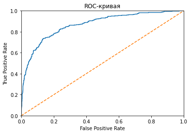

```python

```

<h1>Содержание<span class="tocSkip"></span></h1>
<div class="toc"><ul class="toc-item"><li><span><a href="#Подготовка-данных" data-toc-modified-id="Подготовка-данных-1"><span class="toc-item-num">1&nbsp;&nbsp;</span>Подготовка данных</a></span></li><li><span><a href="#Исследование-задачи" data-toc-modified-id="Исследование-задачи-2"><span class="toc-item-num">2&nbsp;&nbsp;</span>Исследование задачи</a></span></li><li><span><a href="#Борьба-с-дисбалансом" data-toc-modified-id="Борьба-с-дисбалансом-3"><span class="toc-item-num">3&nbsp;&nbsp;</span>Борьба с дисбалансом</a></span></li><li><span><a href="#Тестирование-модели" data-toc-modified-id="Тестирование-модели-4"><span class="toc-item-num">4&nbsp;&nbsp;</span>Тестирование модели</a></span></li><li><span><a href="#Чек-лист-готовности-проекта" data-toc-modified-id="Чек-лист-готовности-проекта-5"><span class="toc-item-num">5&nbsp;&nbsp;</span>Чек-лист готовности проекта</a></span></li></ul></div>

# Отток клиентов

Из «Бета-Банка» стали уходить клиенты. Каждый месяц. Немного, но заметно. Банковские маркетологи посчитали: сохранять текущих клиентов дешевле, чем привлекать новых.

Нужно спрогнозировать, уйдёт клиент из банка в ближайшее время или нет. Вам предоставлены исторические данные о поведении клиентов и расторжении договоров с банком. 

Постройте модель с предельно большим значением *F1*-меры. Чтобы сдать проект успешно, нужно довести метрику до 0.59. Проверьте *F1*-меру на тестовой выборке самостоятельно.

Дополнительно измеряйте *AUC-ROC*, сравнивайте её значение с *F1*-мерой.

Источник данных: [https://www.kaggle.com/barelydedicated/bank-customer-churn-modeling](https://www.kaggle.com/barelydedicated/bank-customer-churn-modeling)

## Подготовка данных


```python
import pandas as pd
from sklearn.tree import DecisionTreeClassifier
from sklearn.ensemble import RandomForestClassifier
from sklearn.linear_model import LogisticRegression
from sklearn.metrics import accuracy_score
from sklearn.model_selection import train_test_split
from sklearn.metrics import f1_score
from sklearn.preprocessing import StandardScaler
from tqdm import tqdm
import matplotlib.pyplot as plt
from sklearn.metrics import roc_curve
from sklearn.metrics import roc_auc_score
from sklearn.utils import shuffle
```


```python
data = pd.read_csv('/datasets/Churn.csv')
data.info()
```

    <class 'pandas.core.frame.DataFrame'>
    RangeIndex: 10000 entries, 0 to 9999
    Data columns (total 14 columns):
     #   Column           Non-Null Count  Dtype  
    ---  ------           --------------  -----  
     0   RowNumber        10000 non-null  int64  
     1   CustomerId       10000 non-null  int64  
     2   Surname          10000 non-null  object 
     3   CreditScore      10000 non-null  int64  
     4   Geography        10000 non-null  object 
     5   Gender           10000 non-null  object 
     6   Age              10000 non-null  int64  
     7   Tenure           9091 non-null   float64
     8   Balance          10000 non-null  float64
     9   NumOfProducts    10000 non-null  int64  
     10  HasCrCard        10000 non-null  int64  
     11  IsActiveMember   10000 non-null  int64  
     12  EstimatedSalary  10000 non-null  float64
     13  Exited           10000 non-null  int64  
    dtypes: float64(3), int64(8), object(3)
    memory usage: 1.1+ MB


```python
data.head()
```


<table border="1" class="dataframe">
  <thead>
    <tr style="text-align: right;">
      <th></th>
      <th>RowNumber</th>
      <th>CustomerId</th>
      <th>Surname</th>
      <th>CreditScore</th>
      <th>Geography</th>
      <th>Gender</th>
      <th>Age</th>
      <th>Tenure</th>
      <th>Balance</th>
      <th>NumOfProducts</th>
      <th>HasCrCard</th>
      <th>IsActiveMember</th>
      <th>EstimatedSalary</th>
      <th>Exited</th>
    </tr>
  </thead>
  <tbody>
    <tr>
      <th>0</th>
      <td>1</td>
      <td>15634602</td>
      <td>Hargrave</td>
      <td>619</td>
      <td>France</td>
      <td>Female</td>
      <td>42</td>
      <td>2.0</td>
      <td>0.00</td>
      <td>1</td>
      <td>1</td>
      <td>1</td>
      <td>101348.88</td>
      <td>1</td>
    </tr>
    <tr>
      <th>1</th>
      <td>2</td>
      <td>15647311</td>
      <td>Hill</td>
      <td>608</td>
      <td>Spain</td>
      <td>Female</td>
      <td>41</td>
      <td>1.0</td>
      <td>83807.86</td>
      <td>1</td>
      <td>0</td>
      <td>1</td>
      <td>112542.58</td>
      <td>0</td>
    </tr>
    <tr>
      <th>2</th>
      <td>3</td>
      <td>15619304</td>
      <td>Onio</td>
      <td>502</td>
      <td>France</td>
      <td>Female</td>
      <td>42</td>
      <td>8.0</td>
      <td>159660.80</td>
      <td>3</td>
      <td>1</td>
      <td>0</td>
      <td>113931.57</td>
      <td>1</td>
    </tr>
    <tr>
      <th>3</th>
      <td>4</td>
      <td>15701354</td>
      <td>Boni</td>
      <td>699</td>
      <td>France</td>
      <td>Female</td>
      <td>39</td>
      <td>1.0</td>
      <td>0.00</td>
      <td>2</td>
      <td>0</td>
      <td>0</td>
      <td>93826.63</td>
      <td>0</td>
    </tr>
    <tr>
      <th>4</th>
      <td>5</td>
      <td>15737888</td>
      <td>Mitchell</td>
      <td>850</td>
      <td>Spain</td>
      <td>Female</td>
      <td>43</td>
      <td>2.0</td>
      <td>125510.82</td>
      <td>1</td>
      <td>1</td>
      <td>1</td>
      <td>79084.10</td>
      <td>0</td>
    </tr>
  </tbody>
</table>
</div>


```python
data.duplicated().sum()
```


    0


Явных дубликатов нет


```python
data = data.dropna()
```

Удалим пропуски, так так их меньше 10%


```python
data.isna().sum()
```


    RowNumber          0
    CustomerId         0
    Surname            0
    CreditScore        0
    Geography          0
    Gender             0
    Age                0
    Tenure             0
    Balance            0
    NumOfProducts      0
    HasCrCard          0
    IsActiveMember     0
    EstimatedSalary    0
    Exited             0
    dtype: int64


Применим OHE к столбцам Geography и Gender


```python
data['Geography'].unique()
```


    array(['France', 'Spain', 'Germany'], dtype=object)


```python
data['Gender'].unique()
```


    array(['Female', 'Male'], dtype=object)


```python
data = pd.get_dummies(data, columns=['Geography', 'Gender'], drop_first=True)
```

<div class="alert alert-warning">
<b>Комментарий 👉</b>

Сейчас в теории тренажера вам предлагается использовать get_dummies(), однако это приведёт к сложностям в будущих спринтах. Поэтому здесь я бы рекомендовал тебе использовать класс OneHotEncoder из sklearn (https://scikit-learn.org/stable/modules/generated/sklearn.preprocessing.OneHotEncoder.html).
        
Get_dummies подходит больше для анализа данных, а для машинного обучения более предпочтителен OneHotEncoding, т.к. он позволяет избежать ряд ошибок при обучении моделей, в том числе может работать с неизвестными ранее уровнями категорий, которых не было изначально (например, если появится еще одна страна, скажем Italy). Get_dummies с неизвестными категориями "из коробки" не работает, но есть лайфхак описанный здесь: https://pythonsimplified.com/difference-between-onehotencoder-and-get_dummies/ (*Though get_dummies can’t handle unknown categories natively, you could get around this inconsistency by applying the below technique. You will have to save the columns of the train set and load it during prediction on test set. Then you need to apply reindex and after filling the missing values will get you the same features as the train set*)
        
Пандасовский Get_dummies не имеет методов fit и transform, поэтому кодируем категории на полном датафрейме (ДО разбиения на выборки ... так мы кстати обходим и проблему "неизвестных/новых категорий"), затем "режем" данные на выборки.

НАСТОЯТЕЛЬНАЯ РЕКОМЕНДАЦИЯ в будущих проектах: используем OneHotEncoder из sklearn! Вот статья на тему: https://datagy.io/sklearn-one-hot-encode/

p.s. (ещё один внешний источник): Самая большая ошибка, которую совершает большинство людей, заключается в том, что они не различают порядковые и номинальные переменные. Поэтому, если мы используем ту же функцию map() или LabelEncoder с номинальными переменными, модель будет думать, что между номинальными значениями существует какая-то связь, например, в нашей таблице есть 3 города: Москва, Санкт-Петербург, Киев, закодируем города через LabelEncoder(), допустим новые значения: 1, 2, 3 соответственно. В этом случае данный метод сильно упрощает данные, фактически проецируя категориальный признак на вещественную прямую. Весь смысл категориальности теряется. Более того, появляются ложные интерпретации, исходя из кодировки Москва + Санкт-Петербург = Киев, но это не характеризует наши данные, а скорее отображает особенности выбранной нами кодировки, что может запутать в последствии модель. Существует метод, который способен решить эту проблему - это one-hot-encoding.
</div>

<div class="alert alert-success">
<b>ОТЛИЧНО! 👍</b>

Молодец, что сейчас ты не забываешь про dummy-ловушку.
</div>


```python
#numeric = ['CreditScore', 'Balance', 'EstimatedSalary']

#scaler = StandardScaler()
#scaler.fit(data[numeric])

#data[numeric] = scaler.transform(data[numeric])
```

<div class="alert alert-danger">
<b>Необходимо исправить ❌</b>

Здесь у тебя ошибка. Масштабирование на какой выборке должно "обучаться" а затем для каких выборок применяться?
</div>

<div style="background: #B0E0E6; padding: 5px; border: 1px solid SteelBlue; border-radius: 5px;">
    <font color='4682B4'><u><b>КОММЕНТАРИЙ СТУДЕНТА</b></u></font>
    <br />
    <font color='4682B4'>Исправлено, см после разделения на выборки</font>
</div>

<div class="alert alert-success">
<b>ОТЛИЧНО! 👍</b>

Данные загружены, отлично.

Хорошо, что применяешь метод .head()/.sample() таким образом в память не будет загружен весь датасет, объем которого может быть огромным.

Методы .info, .describe, .value_counts(), .unique() как правило часто встречаются и обязательны к применению в задачах по исследованию данных, ведь с их помощью можно получить первые инсайты. 

Итак, мы провели предварительный анализ данных, проверили данные на наличие пропусков и затем обработали их (аргументированно заполнили / удалили / оставили как есть). Теперь можно приступать собственно к анализу данных и ответам на вопросы проекта.</div>

<div class="alert alert-warning">
<b>Комментарий 👉</b>

Несколько моментов "на будущее" (сейчас забегаю чуть вперед, но будущем это будет важно) которые я хотел озвучить перед переходом к собственно исследованию:
    
- СДЕЛАНО_МОЛОДЕЦ имеет смысл критично посмотреть на данные с точки зрения наличия пропусков в признаках (вопрос: все ли ml-модели "любят" пропуски?) и обработать или удалить их 
    
- имеет смысл явно обозначить какую задачу мы будем решать: с учителем / без учителя, классификации / регрессии ...
    
- в моделях бинарной классификации имеет смысл смотреть на баланс классов. Два взгляда (с разных сторон) на эту проблему тут: https://alexanderdyakonov.wordpress.com/2021/05/27/imbalance/ и https://habr.com/ru/post/349078/
    
- имеет смысл смотреть на корреляцию признаков. При высокой их степени коррелированности возникает проблема  мультиколлиниарность признаков. Проблема "мультиколлинеарности" это и про переобучение модели и про её интерпретируемость и про сложность модели (содержание в модели избыточного количества переменных). В чем негативный эффект сложной модели? Вот в чем: усложняется интерпретация параметров, оценки параметров ненадежны – получаются большие стандартные ошибки, которые меняются с изменением объема наблюдений, что делает модель регрессии непригодной для прогнозирования.
    
А теперь давай про интерпретируемость. Согласись - это важно, чтобы результат, который выдает модель можно было бы понять и объяснить с точки зрения предметной области. В случае включения в модель коллинеарных признаков может случиться так, что коэффициенты (да, проблема присуща моделям линейным ... регрессия среди них!) могут менять знаки и попытка объяснения предметной области с помощью этих коэффициентов будет противоречить здравому смыслу.
    
Вот классная статья. Простым языком, на примере показана проблема. А также, что важно - разобраны варианты как её (проблему) победить. Статья: https://habr.com/ru/company/akbarsdigital/blog/592493/ 
</div>

## Исследование задачи

Исследуйте баланс классов, обучите модель без учёта дисбаланса. Кратко опишите выводы


```python
data['Exited'].value_counts() #баланс классов
```


    0    7237
    1    1854
    Name: Exited, dtype: int64


<div class="alert alert-success">
<b>ОТЛИЧНО! 👍</b>

Отлично, молодец что обращаешь внимание на баланс классов в данных. 
</div>


```python
class_frequency = data['Exited'].value_counts(normalize=True)
print(class_frequency)
class_frequency.plot(kind='bar')
```

    0    0.796062
    1    0.203938
    Name: Exited, dtype: float64


    <AxesSubplot:>


    

    


Соотношение - 80/20. Наблюдается дисбаланс.

Разделим исходные данные на обучающую и тестовую выборки, а потом на обучающую, валидационную и тестовую выборки(3:1:1)


```python
features = data.drop(['Exited', 'Surname', 'CustomerId', 'RowNumber'], axis=1)
target = data['Exited']

features_train, features_test, target_train, target_test = train_test_split(
    features, target, test_size=0.4, random_state=12345)

features_valid, features_test, target_valid, target_test = train_test_split(
    features_test, target_test, test_size=0.5, random_state=12345)


```

Применим масштабирование к столбцам CreditScore, Balance, EstimatedSalary


```python
numeric = ['CreditScore', 'Balance', 'EstimatedSalary']

scaler = StandardScaler()
scaler.fit(features_train[numeric])

features_train[numeric] = scaler.transform(features_train[numeric])
features_valid[numeric] = scaler.transform(features_valid[numeric])
features_test[numeric] = scaler.transform(features_test[numeric])

pd.options.mode.chained_assignment = None
```

<div class="alert alert-success">
<b>КОММЕНТАРИЙ V2</b>


Здесь всё верно. Масштабирование "обучается" на тренировочной выборке, а затем РЕЗУЛЬТАТ (обычно это scaler) последовательно применяется и к тренировочной и к валидационной и к тестовой выборкам.

Для чего нужно масштабировать признаки перед подачей в линейную модель машинного обучения (например в линейную регрессию)? Нам нужно минимизировать функцию потерь методом градиентного спуска. В случае разных масштабов признаков (например, год рождения и количество детей) её линии уровня будут иметь вид вытянутых эллипсов. Тогда вектор антиградиента и направление от текущей точки к минимуму функции потерь могут не совпадать, мы можем уйти далеко и не в ту сторону, и, в зависимости от шага градиентного спуска, либо придётся сделать больше итераций, либо вообще не будет сходимости. Если же признаки отмасштабированы, то линии уровня похожи на окружности. И проблема несовпадения антиградиента и направления к минимуму не так выражена.
</div>

<div class="alert alert-success">
<b>КОММЕНТАРИЙ V2</b>

Последовательность команд (это **псевдокод**): 
    
    1. scaler.fit(X_train) 
    2. X_train_st = scaler.transform(X_train) 
    
можно было записать одной:
    
    X_train_st = scaler.fit_transform(X_train)

p.s. но это **только** для тренировочной выборки!    
</div>

<div style="background: #B0E0E6; padding: 5px; border: 1px solid SteelBlue; border-radius: 5px;">
    <font color='4682B4'><u><b>КОММЕНТАРИЙ СТУДЕНТА</b></u></font>
    <br />
    <font color='4682B4'>Вроде применил pd.options.mode.chained_assignment = None. Не понимаю, почему вылезает SettingWithCopyWarning.</font>
</div>

<div class="alert alert-success">
<b>КОММЕНТАРИЙ V2</b>

Изменени опцию ПЕРЕД выполнением кода, который генерит предупреждение, потом жди что что-то поменяется.
</div>

<div class="alert alert-success">
<b>ОТЛИЧНО! 👍</b>

Здесь отлично. Всё так, эти столбцы можно "безболезненно" из нашего датафрейма удалить. Действительно, ведь **RowNumber** - дублирует индекс строки, начинает счет с единицы, **CustomerId** - уникальный идентификатор клиента, он не дает дополнительной полезной информации, **Surname** - фамилия - тоже идентификатор для определенного человека, но может повторятся, так как фамилии не уникальны, тоже бесполезен для исследования.
</div>

<div class="alert alert-success">
<b>ОТЛИЧНО! 👍</b>

1. Здесь хорошо, происходит фиксация random_state. Воспроизводимость результатов разбиения выборки на обучающую (тренировочную) / тестовую / валидационную мы обеспечили, значит при всех последующих запусках нашего кода подвыборки будут идентичными.
    
2. Доли размеров train/test/valid 3:1:1 - хорошо.
</div>

<div class="alert alert-warning">
<b>Комментарий 👉</b>

Присмотрись к параметру stratify у функции train_test_split. Его использование позволит сохранить баланс меток классов 1/0 ("уйдет"/"не уйдет") во всех 3х выборках (этот момент важен **особенно** в случае сильного дисбаланса классов в данных). Но конечно stratify это "не про" решение проблемы именно дисбаланса классов именно в данных.
</div>

Проконтролируем разбиение


```python
print(features_train.shape)
print(target_train.shape)
```

    (5454, 11)
    (5454,)


```python
print(features_valid.shape)
print(target_valid.shape)

print(features_test.shape)
print(target_test.shape)
```

    (1818, 11)
    (1818,)
    (1819, 11)
    (1819,)


<div class="alert alert-success">
<b>ОТЛИЧНО! 👍</b>

Молодец, что после разбиения данных на выборки смотришь на их размеры и размерности. Метод shape для этого - идеальный помощник. "Цифры" по выборкам показывают верно ли мы произвели "разделение" данных.

p.s. так (**псевдокод**): X_train.shape[0] – «покажет» количество строк в тренировочной выборке, а X_train.shape[1] - количество столбцов в ней же. Ну а X_train.shape – выведет размерность train'а в виде кортежа с 2мя значениями (первое число – количество строк, второе – столбцов).</div>

<div class="alert alert-warning">
<b>Комментарий 👉</b>

Исключительно как вариант, а также воспользоваться советом со Стэковерфлоу: https://stackoverflow.com/questions/38250710/how-to-split-data-into-3-sets-train-validation-and-test/38251213#38251213

	train, valid, test = np.split(df.sample(frac=1, random_state=821), [int(.6*len(df)), int(.8*len(df))])

Также, разбивать данные можно и автоматизировано, используя библиотеку fast_ml (см. скрин). К этому скрину один комментарий – не факт, что эта библиотека fast_ml развернута здесь, на Хабе, НО дома, своей локальной машине, с установленной средой (например Анакондой: https://www.anaconda.com/products/distribution) ты вполне можешь этим вариантом пользоваться (после установки **!pip install fast_ml**):
</div>


DecisionTreeClassifier


```python
best_model_dt = None
best_result_dt = 0
for depth in range(1, 11):
    model_dt = DecisionTreeClassifier(random_state=12345, max_depth=depth)
    model_dt.fit(features_train, target_train)
    predictions_valid_dt = model_dt.predict(features_valid)
    result_dt = f1_score(target_valid, predictions_valid_dt)
    if result_dt > best_result_dt:
        best_model_dt = model_dt
        best_depth_dt = depth
        best_result_dt = result_dt

print(best_model_dt) 
print('f1:', result_dt)
```

    DecisionTreeClassifier(max_depth=7, random_state=12345)
    f1: 0.5130568356374808


<div class="alert alert-warning">
<b>Комментарий 👉</b>

Рекомендую перебрать в цикле 2-3 гиперпараметра. Одного, как для "дерева", так и "леса" мало - точность наверняка будет низкой. В итоге получишь сразу два плюса: потренируешся работать с несколькими гиперпараметрами одновременно и получишь более высокую точность моделей!
</div>

<div class="alert alert-success">
<b>ОТЛИЧНО! 👍</b>

Итак, к этому моменту мы знаем следующие факты о наших данных:

1. данные несбалансированны (записей с классом == 0 в 4 раза больше чем даных с классом == 1).

2. согласно ТЗ Заказчика нам требуется выполнить условие, что f1-мера должна быть больше 0.59

3. из теории в Тренажере мы знаем, что метрика **accuracy_score НЕ ПОКАЗАТЕЛЬНА** для оценки моделей (в задаче классификации) построенных на данных с дисбалансом классов.

Ну и здесь ты молодец, что считаешь что-то из набора (полнота / точность / f1-мера / roc-auc).  
    
p.s. можно ещё матрицу ошибок (confusion matrix) построить.
</div>

RandomForestClassifier


```python
best_model_rf = None
best_result_rf = 0
best_est_rf = 0
best_depth_rf = 0
for est in tqdm(range(1, 11)):
    for depth in range(1, 11):
        model_rf = RandomForestClassifier(random_state=12345, n_estimators=est, max_depth=depth)
        model_rf.fit(features_train, target_train)
        predictions_valid_rf = model_rf.predict(features_valid)
        result_rf = f1_score(predictions_valid_rf, target_valid)
        if result_rf > best_result_rf:
            best_model_rf = model_rf
            best_result_rf = result_rf
            best_est_rf = est
            best_depth_rf = depth
            
print(best_model_rf)
print('f1:', result_rf)
```

    100%|██████████| 10/10 [00:02<00:00,  4.05it/s]

    RandomForestClassifier(max_depth=4, n_estimators=1, random_state=12345)
    f1: 0.5551839464882943


    


LogisticRegression


```python
model_lr = LogisticRegression(random_state=12345, solver='liblinear')
model_lr.fit(features_train, target_train)
predictions_valid_lr = model_lr.predict(features_valid)

print("f1:", f1_score(target_valid, predictions_valid_lr))
```

    f1: 0.3046092184368738


Наивысший показатель f1 у модели RandomForestClassifier.

<div class="alert alert-warning">
<b>Комментарий 👉</b>

Отрицательный результат (требуемое качество согласно ТЗ: f1 > 0.59 не достигнуто) - тоже результат.
    
Дмитрий, я не буду комментировать далее рутинные (и практически одинаковые, за исключением меняющихся названий моделей, действия). Если только ошибку увижу - тогда напишу. А так, смотрю за ходом исследования + возможно где-то свои мысли/советы/рекомендации укажу.    
</div>

## Борьба с дисбалансом

Улучшите качество модели, учитывая дисбаланс классов. Обучите разные модели и найдите лучшую. Кратко опишите выводы.

Применим взвешивание классов

<div class="alert alert-warning">
<b>Комментарий 👉</b>

Отметь такой момент (сейчас этого недостатка в твоей реализации нет ... я просто рассуждаю): совмещать up(down)sampling и class_weight нельзя.

Взвешивание работает таким образом, что даёт дополнительный вес значимости малопредставленным объектам, жертвуя точностью предсказывания многопредставленного класса в пользу точности предсказывания малопредставленного. Увеличение (уменьшение) выборки делает по сути то же самое (дублирование выборки дает больший вес дублируемому классу). Таким образом, использование сразу двух методов балансирование привело бы новому дисбалансу, поэтому использовать такие методы нужно взаимоисключающе.
</div>

DecisionTreeClassifier


```python
best_model_dt = None
best_result_dt = 0
for depth in range(1, 11):
    model_dt = DecisionTreeClassifier(random_state=12345, max_depth=depth, class_weight='balanced')
    model_dt.fit(features_train, target_train)
    predictions_valid_dt = model_dt.predict(features_valid)
    result_dt = f1_score(target_valid, predictions_valid_dt)
    if result_dt > best_result_dt:
        best_model_dt = model_dt
        best_depth = depth
        best_result_dt = result_dt
        
print(best_model_dt)
print('f1:', result_dt)
```

    DecisionTreeClassifier(class_weight='balanced', max_depth=5, random_state=12345)
    f1: 0.5164113785557987


RandomForestClassifier


```python
best_model_rf = None
best_result_rf = 0
best_est_rf = 0
best_depth_rf = 0
for est in tqdm(range(1, 11)):
    for depth in range(1, 11):
        model_rf = RandomForestClassifier(random_state=12345, n_estimators=est, max_depth=depth, class_weight='balanced')
        model_rf.fit(features_train, target_train)
        predictions_valid_rf = model_rf.predict(features_valid)
        result_rf = f1_score(predictions_valid_rf, target_valid)
        if result_rf > best_result_rf:
            best_model_rf = model_rf
            best_result_rf = result_rf
            best_est_rf = est
            best_depth_rf = depth
            
print(best_model_rf)
print('f1:', result_rf)

```

    100%|██████████| 10/10 [00:02<00:00,  4.01it/s]

    RandomForestClassifier(class_weight='balanced', max_depth=9, n_estimators=10,
                           random_state=12345)
    f1: 0.5840707964601769


    


LogisticRegression


```python
model_lr = LogisticRegression(random_state=12345, solver='liblinear', class_weight='balanced')
model_lr.fit(features_train, target_train)
predictions_valid_lr = model_lr.predict(features_valid)

print("f1:", f1_score(target_valid, predictions_valid_lr))
```

    f1: 0.5101289134438306


Сделаем увеличение выборки

<div class="alert alert-warning">
<b>Комментарий 👉</b>

Отметь 2 таких момента (сейчас этих недостатков в твоей реализации нет ... я просто рассуждаю): если бы использовали "копирование и размножение" выборки с классом == 1 (выравнивали классы), а после этого, следующим шагом использовали бы кросс-валидацию (на уже сэмплированных данных) то могли бы получить результат очень "оптимистичный", который на тестовых данных (если бы у нас была отложенная выборка) или на новых данных (которые модель ещё не видела), т.е results are overly optimistic and do not generalize to new data well. Ссылка на статью (с кодом): https://kiwidamien.github.io/how-to-do-cross-validation-when-upsampling-data.html 
    
И второе требование к "размножению" данных (повторюсь - это по моим наблюдениям за проектами этого типа ... у тебя в проекте подобной проблемы нет, МОЛОДЕЦ!): upsampling мы должны делать **исключительно** на тренировочной выборке! На валидационной и/или тестовой выборки НЕ делаем!
</div>

DecisionTreeClassifier


```python
def upsample(features, target, repeat):
    features_zeros = features[target == 0]
    features_ones = features[target == 1]
    target_zeros = target[target == 0]
    target_ones = target[target == 1]

    features_upsampled = pd.concat([features_zeros] + [features_ones] * repeat)
    target_upsampled = pd.concat([target_zeros] + [target_ones] * repeat)
    
    features_upsampled, target_upsampled = shuffle(
        features_upsampled, target_upsampled, random_state=12345)
    
    return features_upsampled, target_upsampled

features_upsampled, target_upsampled = upsample(features_train, target_train, 4)

model_dt = DecisionTreeClassifier(random_state=12345, max_depth=depth)
model_dt.fit(features_upsampled, target_upsampled)
predictions_valid_dt = model_dt.predict(features_valid)

print("f1:", f1_score(target_valid, predictions_valid_dt))
```

    f1: 0.5059978189749182


<div class="alert alert-success">
<b>ОТЛИЧНО! 👍</b>

Отлично! Красивая функция. Ну и здорово что ты понимаешь, что применение функций упрощает код, делает его структурированным, простым для понимания и упрощает его дальнейшее переиспользование (принцип DRY (Don’t Repeat Yourself / Не повторяйся) – в действии). Дополнительно о DRY можно почитать здесь: https://habr.com/ru/company/itelma/blog/546372</div>

<div class="alert alert-warning">
<b>Комментарий 👉</b>

Очень частая ошибка в проектах (но в твоем случае всё верно, молодец) - коллеги в качестве коэффициента берут значение 10. То есть, они смотрят на дисбаланс классов, но при этом берут не то значение, которое позволит выборки "выровнять", а ещё больше разбалансирует их ... только в другую сторону.  

Ну и при даунсамплинге, часто вместо 0.25 используют значение 0.1
</div>

RandomForestClassifier


```python
def upsample(features, target, repeat):
    features_zeros = features[target == 0]
    features_ones = features[target == 1]
    target_zeros = target[target == 0]
    target_ones = target[target == 1]

    features_upsampled = pd.concat([features_zeros] + [features_ones] * repeat)
    target_upsampled = pd.concat([target_zeros] + [target_ones] * repeat)
    
    features_upsampled, target_upsampled = shuffle(
        features_upsampled, target_upsampled, random_state=12345)
    
    return features_upsampled, target_upsampled

features_upsampled, target_upsampled = upsample(features_train, target_train, 4)

model_rf = RandomForestClassifier(random_state=12345, n_estimators=est, max_depth=depth)
model_rf.fit(features_upsampled, target_upsampled)
predictions_valid_rf = model_rf.predict(features_valid)

print("f1:", f1_score(target_valid, predictions_valid_rf))
```

    f1: 0.5952380952380951


<div class="alert alert-warning">
<b>Комментарий 👉</b>

А зачем определяешь функцию 3 раза? Функция на то и есть, чтобы будучи определенной 1 раз - могла вызываться (в том числе и с разными параметрами) много раз.
</div>

LogisticRegression


```python
def upsample(features, target, repeat):
    features_zeros = features[target == 0]
    features_ones = features[target == 1]
    target_zeros = target[target == 0]
    target_ones = target[target == 1]

    features_upsampled = pd.concat([features_zeros] + [features_ones] * repeat)
    target_upsampled = pd.concat([target_zeros] + [target_ones] * repeat)
    
    features_upsampled, target_upsampled = shuffle(
        features_upsampled, target_upsampled, random_state=12345)
    
    return features_upsampled, target_upsampled

features_upsampled, target_upsampled = upsample(features_train, target_train, 4)

model_lr = LogisticRegression(random_state=12345, solver='liblinear')
model_lr.fit(features_upsampled, target_upsampled)
predicted_valid = model_lr.predict(features_valid)

print("f1:", f1_score(target_valid, predicted_valid))
```

    f1: 0.5072463768115941


По результатам апсэмплинга также лучший показатель f1 у модели RandomForestClassifier. На ней и проведем финальное тестирование.

<div class="alert alert-success">
<b>ОТЛИЧНО! 👍</b>

Здесь отлично: подобрали для всех наших моделей лучшие гиперпараметры (в данном случае - максимизирующие f1-меру и(?) AUC ("площадь"). Также здесь мы ещё и определили САМУЮ лучшую модель. На валидации ею оказалась модель "случайного леса". 

После того, как гиперпараметры на валидации подобраны - тестируем модели на тестовых данных. По результатам тестирования на тесте (сорри за тавталогию) выбираем модель, которую сможем передать в продакшн. 
</div>

<div class="alert alert-warning">
<b>Комментарий 👉</b>

Рекомендация: как ещё одна возможная альтернатива - использовать SMOTE (статьи: https://imbalanced-learn.org/stable/references/generated/imblearn.over_sampling.SMOTE.html или https://habr.com/ru/articles/461285/) для увеличения выборки и RandomUnderSampler (статья: https://imbalanced-learn.org/stable/references/generated/imblearn.under_sampling.RandomUnderSampler.html) либо вместо (либо в дополнении) к функциям из тренажера.
</div>

## Тестирование модели

Проведите финальное тестирование.


```python
model_best = RandomForestClassifier(
    random_state=12345, max_depth = 9, n_estimators = 10, class_weight='balanced')

model_best.fit(features_train, target_train) 
predictions = model_best.predict(features_test)
result = f1_score(target_test, predictions)

print("f1 лучшей модели на тестовой выборке:", result)
```

    f1 лучшей модели на тестовой выборке: 0.5936675461741425


<div class="alert alert-danger">
<b>Необходимо исправить ❌</b>

На какой выборке тестируешь модель? А на какой надо это делать?
</div>

<div style="background: #B0E0E6; padding: 5px; border: 1px solid SteelBlue; border-radius: 5px;">
    <font color='4682B4'><u><b>КОММЕНТАРИЙ СТУДЕНТА</b></u></font>
    <br />
    <font color='4682B4'>Исправлено</font>
</div>

<div class="alert alert-success">
<b>КОММЕНТАРИЙ V2</b>

+
</div>

Значение f1 превышает требуемые 0.59


```python
probabilities_valid = model_best.predict_proba(features_valid)
probabilities_one_valid = probabilities_valid[:, 1]

fpr, tpr, thresholds = roc_curve(target_valid, probabilities_one_valid)

plt.figure()

plt.plot(fpr, tpr)

plt.plot([0, 1], [0, 1], linestyle='--')

plt.xlim([0.0, 1.0])
plt.ylim([0.0, 1.0])

plt.xlabel('False Positive Rate')
plt.ylabel('True Positive Rate')

plt.title('ROC-кривая')
plt.show()

auc_roc = roc_auc_score(target_valid, probabilities_one_valid)
print('auc_roc:', auc_roc)
```


    

    


    auc_roc: 0.8689634924170329


<div class="alert alert-success">
<b>ОТЛИЧНО! 👍</b>

Здесь хорошо. Расчёт ROC-AUC выполнен верно, через предсказанную вероятности класса 1. 
    
Площадь под ROC-кривой (Area Under Curve – площадь под кривой, Receiver Operating Characteristic – рабочая характеристика приёмника ... пришло из области радиоэлектроники) – это метрика оценки для задач бинарной классификации. ROC-кривая показывает зависимость между долей верно классифицированных объектов положительного класса и долей ложноположительных объектов. Ну и сама площадь под ROC-кривой является мерой качества классификатора: чем выше значение AUC (Area Under Curve), тем лучше качество классификации конкретной модели. Наш глаз и мозг устроены так, что мы очень хорошо видим геометрическую разницу (в данном случае площадей).
</div>

Удалось достичь требуемого значения f1, показатель auc_roc близок к единице, это выше случайных 0.5

Вывод: по результатам исследования трех моделей мы установили лучшую - это RandomForestClassifier. Изначально наблюдался дисбаланс классов(80/20), который мы устранили с помощью их взвешивания и апсэмплинга. Удалось добиться повышения F1-меры. В итоге на финальном тестировании нам удалось получить требуемое значение f1 - 0.59, значение auc_roc также выше константной модели.

<div class="alert alert-danger">
<b>Необходимо исправить ❌</b>

Напиши пожалуйста финальный вывод по проекту. Здесь хотелось бы увидеть подробное описание того, что делали, какими шагами, к чему пришли (с цифрами и конкретикой).
</div>

<div style="background: #B0E0E6; padding: 5px; border: 1px solid SteelBlue; border-radius: 5px;">
    <font color='4682B4'><u><b>КОММЕНТАРИЙ СТУДЕНТА</b></u></font>
    <br />
    <font color='4682B4'>Вывод написан</font>
</div>

<div class="alert alert-success">
<b>КОММЕНТАРИЙ V2</b>


Всё отлично, результат достигнут.
    
Один совет (также, на будущее): как попытаться улучшить полученный результат, с минимум усилий? Ответ: мы использовали train для обучения модели, а valid - для поиска лучших значений гиперпараметров. Лучшие параметры нашли. Так почему бы теперь наши модели с выбранными гиперпараметрами не обучить на *общей* (тренировочной + валидационной) выборке (pd.concat() можно использовать для объединения). Чем больше данных, тем *лучше* модели смогут обучиться (надо проверять!). И вот теперь эту дообученную модель мы уже финально проверим на тестовой выборке (test).

Но следует учесть вот какой момент: нужно быть аккуратным с подобным «улучшением», если мы кодируем или масштабируем наши выборки. Например, в следующем проекте мы обучаемся на train’е, а затем делаем transform на валидации и тесте. Если после этого объединить трейн и валид, то это будет не совсем верно.
</div>

## Чек-лист готовности проекта

Поставьте 'x' в выполненных пунктах. Далее нажмите Shift+Enter.

- [x]  Jupyter Notebook открыт
- [x]  Весь код выполняется без ошибок
- [x]  Ячейки с кодом расположены в порядке исполнения
- [x]  Выполнен шаг 1: данные подготовлены
- [x]  Выполнен шаг 2: задача исследована
    - [x]  Исследован баланс классов
    - [x]  Изучены модели без учёта дисбаланса
    - [x]  Написаны выводы по результатам исследования
- [x]  Выполнен шаг 3: учтён дисбаланс
    - [x]  Применено несколько способов борьбы с дисбалансом
    - [x]  Написаны выводы по результатам исследования
- [x]  Выполнен шаг 4: проведено тестирование
- [x]  Удалось достичь *F1*-меры не менее 0.59
- [x]  Исследована метрика *AUC-ROC*

# Результат ревью:

Я отмечаю адекватный уровень твоей программистской подготовки. Ты используешь продвинутые концепции языка Python, библиотеки pandas и одной из основных библиотек машинного обучения sckit-learn. Всё это в целом упрощает твой код и одновременно показывает твой уровень владения инструментами анализа данных и machine learning.

С комментированием никаких проблем нет. Твоих объяснений достаточно для понимания твоими коллегами хода мыслей. Ссылки из брифа проекта в нужных местах также помогают следовать за развитием событий и дают полную информацию касаемо того, что будет происходить в том или ином разделе проекта.

Зелёным цветом я отметил и прокомментировал удачные и элегантные решения, на которые ты можешь опираться в будущих проектах.

Жёлтым цветом я выделил то, что в следующий раз можно сделать по-другому. Ты можешь учесть эти комментарии при выполнении будущих заданий или доработать проект сейчас.

Однако есть принципиальные моменты, которые не позволяют мне принять твой проект в его нынешнем состоянии:

<div class="alert alert-danger">
<b>Необходимо исправить ❌</b> 

1. Масштабирование на какой выборке должно "обучаться" а затем для каких выборок применяться?

2. Не все ненужные для моделей машиного наблюдения признаки удалены из данных.
    
3. На какой выборке тестируешь модель? А на какой надо это делать?    

4. Финальный вывод по проекту отсутствует. Хотелось бы увидеть подробное описание того, что делали, какими шагами, к чему пришли (с цифрами и конкретикой).    
</div>

Эти 4 момента требуют твоего внимания. Комментарии по ним помечены красным цветом. 

Подводя итог: хорошая работа на самом-то деле, молодец! Есть несколько моментов к исправлению, но уверен, что они не вызовут у тебя сложностей. После доработки обязательно проверь комментарии и выводы. Их нужно будет скорректировать. Жду доработанную версию проекта на повторное ревью.
