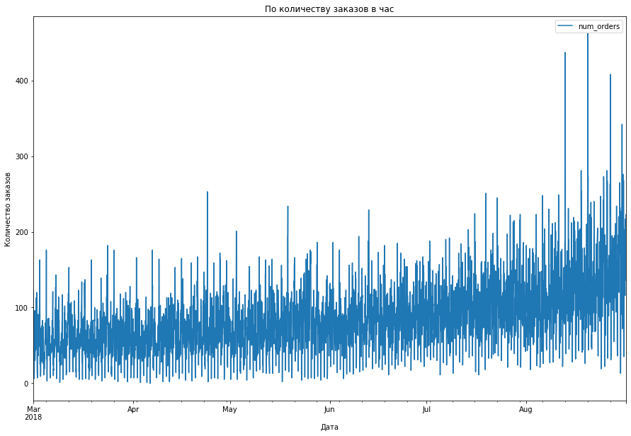
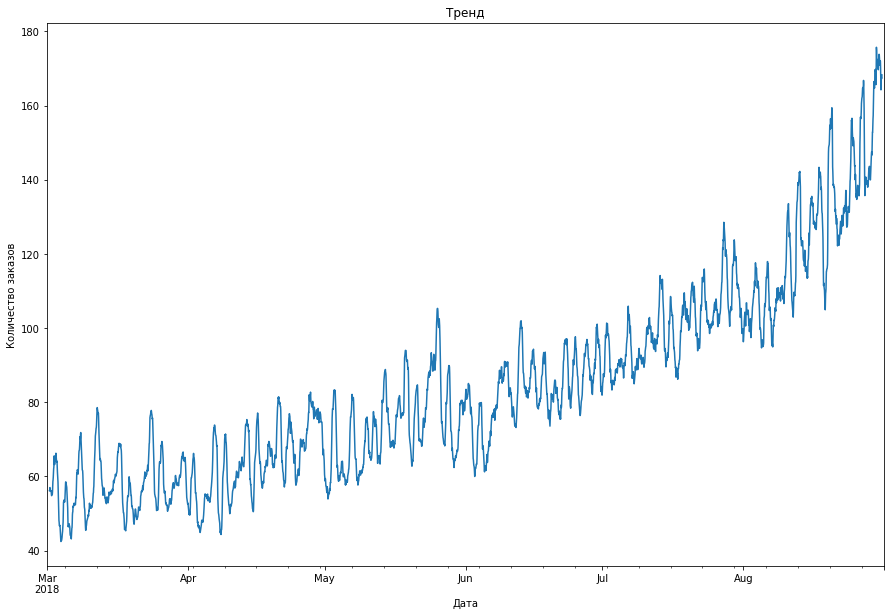
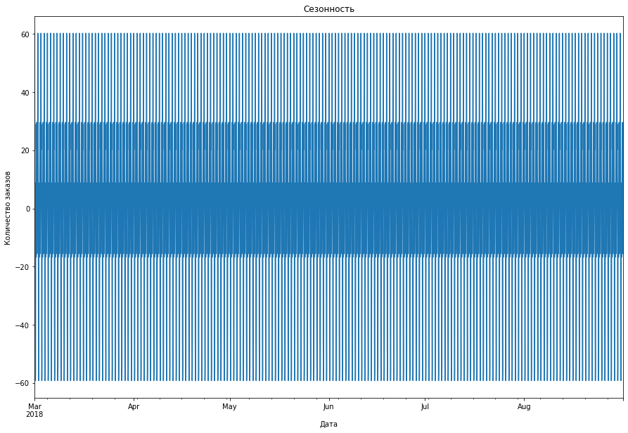
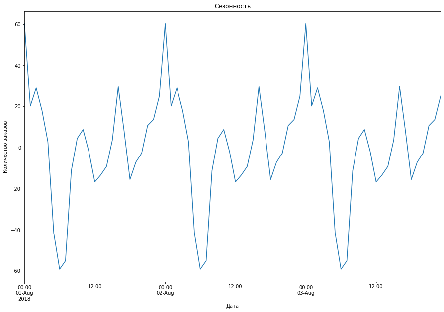
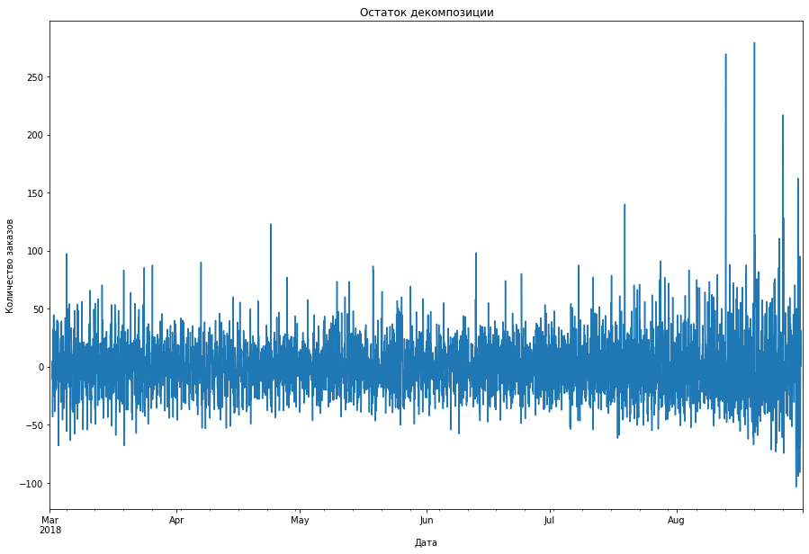
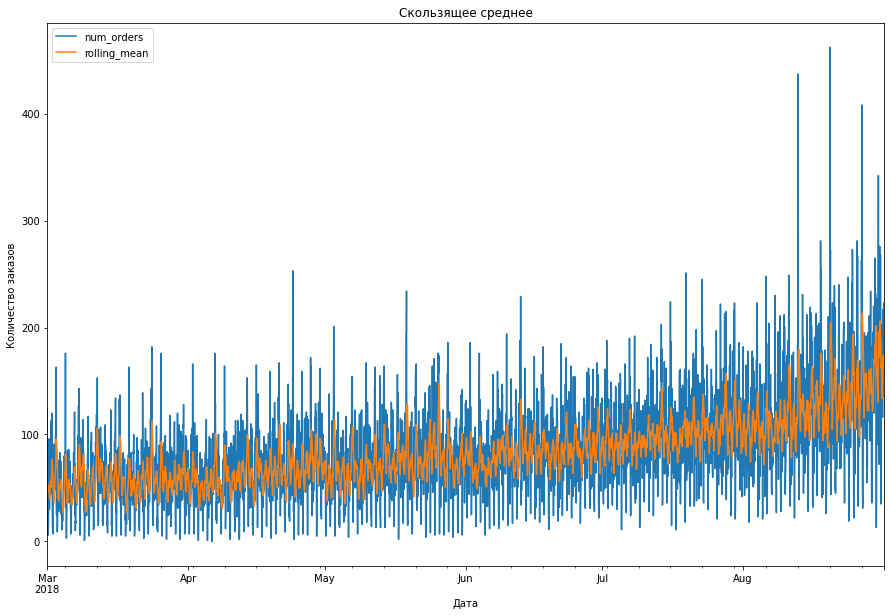

<h1>Содержание<span class="tocSkip"></span></h1>
<div class="toc"><ul class="toc-item"><li><span><a href="#Подготовка" data-toc-modified-id="Подготовка-1"><span class="toc-item-num">1&nbsp;&nbsp;</span>Подготовка</a></span></li><li><span><a href="#Анализ" data-toc-modified-id="Анализ-2"><span class="toc-item-num">2&nbsp;&nbsp;</span>Анализ</a></span></li><li><span><a href="#Обучение" data-toc-modified-id="Обучение-3"><span class="toc-item-num">3&nbsp;&nbsp;</span>Обучение</a></span></li><li><span><a href="#Тестирование" data-toc-modified-id="Тестирование-4"><span class="toc-item-num">4&nbsp;&nbsp;</span>Тестирование</a></span></li><li><span><a href="#Чек-лист-проверки" data-toc-modified-id="Чек-лист-проверки-5"><span class="toc-item-num">5&nbsp;&nbsp;</span>Чек-лист проверки</a></span></li></ul></div>

#  Прогнозирование заказов такси

Компания «Чётенькое такси» собрала исторические данные о заказах такси в аэропортах. Чтобы привлекать больше водителей в период пиковой нагрузки, нужно спрогнозировать количество заказов такси на следующий час. Постройте модель для такого предсказания.

Значение метрики *RMSE* на тестовой выборке должно быть не больше 48.

Вам нужно:

1. Загрузить данные и выполнить их ресемплирование по одному часу.
2. Проанализировать данные.
3. Обучить разные модели с различными гиперпараметрами. Сделать тестовую выборку размером 10% от исходных данных.
4. Проверить данные на тестовой выборке и сделать выводы.


Данные лежат в файле `taxi.csv`. Количество заказов находится в столбце `num_orders` (от англ. *number of orders*, «число заказов»).

 <div class="alert alert-success">
<h2> Комментарий ревьюера <a class="tocSkip"> </h2> 

<b>Все отлично!👍:</b> 
    
Вижу твое добавленное описание проекта. Молодец! Это поможет тебе расставлять акценты в выводах

## Подготовка


```python
import pandas as pd
import numpy as np
import matplotlib.pyplot as plt
from statsmodels.tsa.seasonal import seasonal_decompose
from sklearn.linear_model import LinearRegression
from lightgbm import LGBMRegressor
from sklearn.model_selection import train_test_split
from sklearn.model_selection import GridSearchCV
from sklearn.metrics import mean_squared_error, mean_absolute_error
from sklearn.model_selection import cross_val_score
from sklearn.model_selection import TimeSeriesSplit
```


```python
data =  pd.read_csv('/datasets/taxi.csv')
data.head()
```


<div>
<style scoped>
    .dataframe tbody tr th:only-of-type {
        vertical-align: middle;
    }

    .dataframe tbody tr th {
        vertical-align: top;
    }

    .dataframe thead th {
        text-align: right;
    }
</style>
<table border="1" class="dataframe">
  <thead>
    <tr style="text-align: right;">
      <th></th>
      <th>datetime</th>
      <th>num_orders</th>
    </tr>
  </thead>
  <tbody>
    <tr>
      <th>0</th>
      <td>2018-03-01 00:00:00</td>
      <td>9</td>
    </tr>
    <tr>
      <th>1</th>
      <td>2018-03-01 00:10:00</td>
      <td>14</td>
    </tr>
    <tr>
      <th>2</th>
      <td>2018-03-01 00:20:00</td>
      <td>28</td>
    </tr>
    <tr>
      <th>3</th>
      <td>2018-03-01 00:30:00</td>
      <td>20</td>
    </tr>
    <tr>
      <th>4</th>
      <td>2018-03-01 00:40:00</td>
      <td>32</td>
    </tr>
  </tbody>
</table>
</div>


```python
data.info()
```

    <class 'pandas.core.frame.DataFrame'>
    RangeIndex: 26496 entries, 0 to 26495
    Data columns (total 2 columns):
     #   Column      Non-Null Count  Dtype 
    ---  ------      --------------  ----- 
     0   datetime    26496 non-null  object
     1   num_orders  26496 non-null  int64 
    dtypes: int64(1), object(1)
    memory usage: 414.1+ KB


```python
data.describe()
```


<div>
<style scoped>
    .dataframe tbody tr th:only-of-type {
        vertical-align: middle;
    }

    .dataframe tbody tr th {
        vertical-align: top;
    }

    .dataframe thead th {
        text-align: right;
    }
</style>
<table border="1" class="dataframe">
  <thead>
    <tr style="text-align: right;">
      <th></th>
      <th>num_orders</th>
    </tr>
  </thead>
  <tbody>
    <tr>
      <th>count</th>
      <td>26496.000000</td>
    </tr>
    <tr>
      <th>mean</th>
      <td>14.070463</td>
    </tr>
    <tr>
      <th>std</th>
      <td>9.211330</td>
    </tr>
    <tr>
      <th>min</th>
      <td>0.000000</td>
    </tr>
    <tr>
      <th>25%</th>
      <td>8.000000</td>
    </tr>
    <tr>
      <th>50%</th>
      <td>13.000000</td>
    </tr>
    <tr>
      <th>75%</th>
      <td>19.000000</td>
    </tr>
    <tr>
      <th>max</th>
      <td>119.000000</td>
    </tr>
  </tbody>
</table>
</div>


```python
data['datetime']=pd.to_datetime(data['datetime'])
```


```python
data=data.set_index('datetime')
```


```python
data
```


<div>
<style scoped>
    .dataframe tbody tr th:only-of-type {
        vertical-align: middle;
    }

    .dataframe tbody tr th {
        vertical-align: top;
    }

    .dataframe thead th {
        text-align: right;
    }
</style>
<table border="1" class="dataframe">
  <thead>
    <tr style="text-align: right;">
      <th></th>
      <th>num_orders</th>
    </tr>
    <tr>
      <th>datetime</th>
      <th></th>
    </tr>
  </thead>
  <tbody>
    <tr>
      <th>2018-03-01 00:00:00</th>
      <td>9</td>
    </tr>
    <tr>
      <th>2018-03-01 00:10:00</th>
      <td>14</td>
    </tr>
    <tr>
      <th>2018-03-01 00:20:00</th>
      <td>28</td>
    </tr>
    <tr>
      <th>2018-03-01 00:30:00</th>
      <td>20</td>
    </tr>
    <tr>
      <th>2018-03-01 00:40:00</th>
      <td>32</td>
    </tr>
    <tr>
      <th>...</th>
      <td>...</td>
    </tr>
    <tr>
      <th>2018-08-31 23:10:00</th>
      <td>32</td>
    </tr>
    <tr>
      <th>2018-08-31 23:20:00</th>
      <td>24</td>
    </tr>
    <tr>
      <th>2018-08-31 23:30:00</th>
      <td>27</td>
    </tr>
    <tr>
      <th>2018-08-31 23:40:00</th>
      <td>39</td>
    </tr>
    <tr>
      <th>2018-08-31 23:50:00</th>
      <td>53</td>
    </tr>
  </tbody>
</table>
<p>26496 rows × 1 columns</p>
</div>


```python
data.info()
```

    <class 'pandas.core.frame.DataFrame'>
    DatetimeIndex: 26496 entries, 2018-03-01 00:00:00 to 2018-08-31 23:50:00
    Data columns (total 1 columns):
     #   Column      Non-Null Count  Dtype
    ---  ------      --------------  -----
     0   num_orders  26496 non-null  int64
    dtypes: int64(1)
    memory usage: 414.0 KB


Ресемплирование по одному часу


```python
data = data.resample('1H').sum()
data.head()
```


<div>
<style scoped>
    .dataframe tbody tr th:only-of-type {
        vertical-align: middle;
    }

    .dataframe tbody tr th {
        vertical-align: top;
    }

    .dataframe thead th {
        text-align: right;
    }
</style>
<table border="1" class="dataframe">
  <thead>
    <tr style="text-align: right;">
      <th></th>
      <th>num_orders</th>
    </tr>
    <tr>
      <th>datetime</th>
      <th></th>
    </tr>
  </thead>
  <tbody>
    <tr>
      <th>2018-03-01 00:00:00</th>
      <td>124</td>
    </tr>
    <tr>
      <th>2018-03-01 01:00:00</th>
      <td>85</td>
    </tr>
    <tr>
      <th>2018-03-01 02:00:00</th>
      <td>71</td>
    </tr>
    <tr>
      <th>2018-03-01 03:00:00</th>
      <td>66</td>
    </tr>
    <tr>
      <th>2018-03-01 04:00:00</th>
      <td>43</td>
    </tr>
  </tbody>
</table>
</div>


```python
data.isna().sum()
```


    num_orders    0
    dtype: int64


 <div class="alert alert-success">
<h2> Комментарий ревьюера <a class="tocSkip"> </h2>

<b>Все отлично!👍:  </b> 
    
С данными познакомились, проведен первичный аналитический осмотр!) Отлично, что проведено ресемплирование с использованием суммы. Полученная информация поможет нам в дальнейшем с предобработкой данных

## Анализ


```python
# График по количеству заказов в час
data.plot(figsize=(15,10))
plt.title('По количеству заказов в час')
plt.xlabel('Дата')
plt.ylabel('Количество заказов')
```


    Text(0, 0.5, 'Количество заказов')


    

    


Наблюдается тенденция по увеличению количества заказов


```python
decomposed = seasonal_decompose(data)
```


```python
#Тренд
decomposed.trend.plot(figsize=(15,10))
plt.title('Тренд')
plt.xlabel('Дата')
plt.ylabel('Количество заказов')
```


    Text(0, 0.5, 'Количество заказов')


    

    


Тренд растет


```python
#Сезонность
decomposed.seasonal.plot(figsize=(15,10))
plt.title('Сезонность')
plt.xlabel('Дата')
plt.ylabel('Количество заказов')
```


    Text(0, 0.5, 'Количество заказов')


    

    


Количество заказов не зависит от сезонности


```python
#Сезонность в меньшем масштабе, например три дня августа
decomposed.seasonal['2018-08-01':'2018-08-03'].plot(figsize=(15,10))
plt.title('Сезонность')
plt.xlabel('Дата')
plt.ylabel('Количество заказов')
```


    Text(0, 0.5, 'Количество заказов')


    

    


```python
#Остаток
decomposed.resid.plot(figsize=(15,10))
plt.title('Остаток декомпозиции')
plt.xlabel('Дата')
plt.ylabel('Количество заказов')
```


    Text(0, 0.5, 'Количество заказов')


    

    


```python

```


```python
data['rolling_mean'] = data.rolling(10).mean()
data.plot(figsize=(15,10))
plt.title('Скользящее среднее')
plt.xlabel('Дата')
plt.ylabel('Количество заказов')
plt.show()
```


    

    


```python
print('Скользящее среднее = ',decomposed.trend.mean())
```

    Скользящее среднее =  84.26974233454767


<div class="alert alert-warning">
    <h2> Комментарий ревьюера <a class="tocSkip"> </h2>
    
<b>Некоторые замечания и рекомендации💡:</b>  
    
Декомпозиция сделана верно. Можно еще  визуализировать сезонность на более коротком интервале

<br/>
<div class="alert alert-block alert-danger">
<h2> Комментарий ревьюера <a class="tocSkip"></h2>
    
<b>На доработку🤔:</b>
    
Тут следует еще добавить вывод, и описать найденные особенности в тренде и сезонности. 
Добавь, пожалуйста
 </div>

 <br/>    
<div class="alert alert-info">
<h2> Комментарий студента: <a class="tocSkip"> </h2>

Добавил вывод по графикам
</div> 

<br/> 

<div class="alert alert-success">
<h2> Комментарий ревьюера 2 <a class="tocSkip"> </h2>

<b>Все отлично!👍:</b> 

Вывод: на графике тренда видим постепенное увеличение числа заказов весной, летом услуги такси намного более востребованны. Для анализа сезонности не хватает данных: у нас только промежуток в полгода. Но если смотреть на график трех дней, можно отметить увеличение количества заказов в течение дня, с утра и до завершения суток, когда достигается максимальное значение.

## Обучение

Напишем функцию для признаков


```python
def make_features(data, max_lag, rolling_mean_size):
    
    data['dayofweek'] = data.index.dayofweek
    data['hour'] = data.index.hour
    data['day'] = data.index.day
    
    
    for lag in range(1, max_lag + 1):
        data['lag_{}'.format(lag)] = data['num_orders'].shift(lag)

    data['rolling_mean'] = data['num_orders'].shift().rolling(rolling_mean_size).mean()
    
    return data
```

<div class="alert alert-warning">
    <h2> Комментарий ревьюера <a class="tocSkip"> </h2>
    
<b>Некоторые замечания и рекомендации💡:</b>
        
При генерации новых признаков желательно написать функцию, чтобы она возвращала новый датафрейм, а не изменяла глобальную переменную.
        
1. Это хорошая практика (не изменять глобальные переменные внутри функции), которая улучшает читаемость кода.
2. В какой-то момент может появиться необходимость подбирать некоторые параметры используемый внутри функции. В этот момент копирование датасета станет обязательным.

        
        
        
Для этого внутри, в начале функции нужно задать новое имя датафрейму с `df.copy()`, в нем создать новые признаки, а в конце функции возвращать через `return` этот датафрейм
</div>


```python
make_features(data, 24, 10)
```


<div>
<style scoped>
    .dataframe tbody tr th:only-of-type {
        vertical-align: middle;
    }

    .dataframe tbody tr th {
        vertical-align: top;
    }

    .dataframe thead th {
        text-align: right;
    }
</style>
<table border="1" class="dataframe">
  <thead>
    <tr style="text-align: right;">
      <th></th>
      <th>num_orders</th>
      <th>rolling_mean</th>
      <th>dayofweek</th>
      <th>hour</th>
      <th>day</th>
      <th>lag_1</th>
      <th>lag_2</th>
      <th>lag_3</th>
      <th>lag_4</th>
      <th>lag_5</th>
      <th>...</th>
      <th>lag_15</th>
      <th>lag_16</th>
      <th>lag_17</th>
      <th>lag_18</th>
      <th>lag_19</th>
      <th>lag_20</th>
      <th>lag_21</th>
      <th>lag_22</th>
      <th>lag_23</th>
      <th>lag_24</th>
    </tr>
    <tr>
      <th>datetime</th>
      <th></th>
      <th></th>
      <th></th>
      <th></th>
      <th></th>
      <th></th>
      <th></th>
      <th></th>
      <th></th>
      <th></th>
      <th></th>
      <th></th>
      <th></th>
      <th></th>
      <th></th>
      <th></th>
      <th></th>
      <th></th>
      <th></th>
      <th></th>
      <th></th>
    </tr>
  </thead>
  <tbody>
    <tr>
      <th>2018-03-01 00:00:00</th>
      <td>124</td>
      <td>NaN</td>
      <td>3</td>
      <td>0</td>
      <td>1</td>
      <td>NaN</td>
      <td>NaN</td>
      <td>NaN</td>
      <td>NaN</td>
      <td>NaN</td>
      <td>...</td>
      <td>NaN</td>
      <td>NaN</td>
      <td>NaN</td>
      <td>NaN</td>
      <td>NaN</td>
      <td>NaN</td>
      <td>NaN</td>
      <td>NaN</td>
      <td>NaN</td>
      <td>NaN</td>
    </tr>
    <tr>
      <th>2018-03-01 01:00:00</th>
      <td>85</td>
      <td>NaN</td>
      <td>3</td>
      <td>1</td>
      <td>1</td>
      <td>124.0</td>
      <td>NaN</td>
      <td>NaN</td>
      <td>NaN</td>
      <td>NaN</td>
      <td>...</td>
      <td>NaN</td>
      <td>NaN</td>
      <td>NaN</td>
      <td>NaN</td>
      <td>NaN</td>
      <td>NaN</td>
      <td>NaN</td>
      <td>NaN</td>
      <td>NaN</td>
      <td>NaN</td>
    </tr>
    <tr>
      <th>2018-03-01 02:00:00</th>
      <td>71</td>
      <td>NaN</td>
      <td>3</td>
      <td>2</td>
      <td>1</td>
      <td>85.0</td>
      <td>124.0</td>
      <td>NaN</td>
      <td>NaN</td>
      <td>NaN</td>
      <td>...</td>
      <td>NaN</td>
      <td>NaN</td>
      <td>NaN</td>
      <td>NaN</td>
      <td>NaN</td>
      <td>NaN</td>
      <td>NaN</td>
      <td>NaN</td>
      <td>NaN</td>
      <td>NaN</td>
    </tr>
    <tr>
      <th>2018-03-01 03:00:00</th>
      <td>66</td>
      <td>NaN</td>
      <td>3</td>
      <td>3</td>
      <td>1</td>
      <td>71.0</td>
      <td>85.0</td>
      <td>124.0</td>
      <td>NaN</td>
      <td>NaN</td>
      <td>...</td>
      <td>NaN</td>
      <td>NaN</td>
      <td>NaN</td>
      <td>NaN</td>
      <td>NaN</td>
      <td>NaN</td>
      <td>NaN</td>
      <td>NaN</td>
      <td>NaN</td>
      <td>NaN</td>
    </tr>
    <tr>
      <th>2018-03-01 04:00:00</th>
      <td>43</td>
      <td>NaN</td>
      <td>3</td>
      <td>4</td>
      <td>1</td>
      <td>66.0</td>
      <td>71.0</td>
      <td>85.0</td>
      <td>124.0</td>
      <td>NaN</td>
      <td>...</td>
      <td>NaN</td>
      <td>NaN</td>
      <td>NaN</td>
      <td>NaN</td>
      <td>NaN</td>
      <td>NaN</td>
      <td>NaN</td>
      <td>NaN</td>
      <td>NaN</td>
      <td>NaN</td>
    </tr>
    <tr>
      <th>...</th>
      <td>...</td>
      <td>...</td>
      <td>...</td>
      <td>...</td>
      <td>...</td>
      <td>...</td>
      <td>...</td>
      <td>...</td>
      <td>...</td>
      <td>...</td>
      <td>...</td>
      <td>...</td>
      <td>...</td>
      <td>...</td>
      <td>...</td>
      <td>...</td>
      <td>...</td>
      <td>...</td>
      <td>...</td>
      <td>...</td>
      <td>...</td>
    </tr>
    <tr>
      <th>2018-08-31 19:00:00</th>
      <td>136</td>
      <td>173.3</td>
      <td>4</td>
      <td>19</td>
      <td>31</td>
      <td>207.0</td>
      <td>217.0</td>
      <td>197.0</td>
      <td>116.0</td>
      <td>133.0</td>
      <td>...</td>
      <td>268.0</td>
      <td>99.0</td>
      <td>230.0</td>
      <td>194.0</td>
      <td>276.0</td>
      <td>246.0</td>
      <td>158.0</td>
      <td>198.0</td>
      <td>142.0</td>
      <td>72.0</td>
    </tr>
    <tr>
      <th>2018-08-31 20:00:00</th>
      <td>154</td>
      <td>166.6</td>
      <td>4</td>
      <td>20</td>
      <td>31</td>
      <td>136.0</td>
      <td>207.0</td>
      <td>217.0</td>
      <td>197.0</td>
      <td>116.0</td>
      <td>...</td>
      <td>78.0</td>
      <td>268.0</td>
      <td>99.0</td>
      <td>230.0</td>
      <td>194.0</td>
      <td>276.0</td>
      <td>246.0</td>
      <td>158.0</td>
      <td>198.0</td>
      <td>142.0</td>
    </tr>
    <tr>
      <th>2018-08-31 21:00:00</th>
      <td>159</td>
      <td>162.9</td>
      <td>4</td>
      <td>21</td>
      <td>31</td>
      <td>154.0</td>
      <td>136.0</td>
      <td>207.0</td>
      <td>217.0</td>
      <td>197.0</td>
      <td>...</td>
      <td>35.0</td>
      <td>78.0</td>
      <td>268.0</td>
      <td>99.0</td>
      <td>230.0</td>
      <td>194.0</td>
      <td>276.0</td>
      <td>246.0</td>
      <td>158.0</td>
      <td>198.0</td>
    </tr>
    <tr>
      <th>2018-08-31 22:00:00</th>
      <td>223</td>
      <td>162.1</td>
      <td>4</td>
      <td>22</td>
      <td>31</td>
      <td>159.0</td>
      <td>154.0</td>
      <td>136.0</td>
      <td>207.0</td>
      <td>217.0</td>
      <td>...</td>
      <td>46.0</td>
      <td>35.0</td>
      <td>78.0</td>
      <td>268.0</td>
      <td>99.0</td>
      <td>230.0</td>
      <td>194.0</td>
      <td>276.0</td>
      <td>246.0</td>
      <td>158.0</td>
    </tr>
    <tr>
      <th>2018-08-31 23:00:00</th>
      <td>205</td>
      <td>170.8</td>
      <td>4</td>
      <td>23</td>
      <td>31</td>
      <td>223.0</td>
      <td>159.0</td>
      <td>154.0</td>
      <td>136.0</td>
      <td>207.0</td>
      <td>...</td>
      <td>182.0</td>
      <td>46.0</td>
      <td>35.0</td>
      <td>78.0</td>
      <td>268.0</td>
      <td>99.0</td>
      <td>230.0</td>
      <td>194.0</td>
      <td>276.0</td>
      <td>246.0</td>
    </tr>
  </tbody>
</table>
<p>4416 rows × 29 columns</p>
</div>


<div class="alert alert-warning">
    <h2> Комментарий ревьюера <a class="tocSkip"> </h2>
    
<b>Некоторые замечания и рекомендации💡:</b>


Метрика на тесте должна быть ниже 48, поэтому стоит попробовать задать параметр max_lag равным 24 при создании новых признаков функцией. В случае заказов такси самая очевидная сезонность - внутри суток, а в сутках 24 часа, это значение и будет оптимальным

<br/>    
<div class="alert alert-info">
<h2> Комментарий студента: <a class="tocSkip"> </h2>

сделал max_lag = 24
</div> 

<br/> 

<div class="alert alert-success">
<h2> Комментарий ревьюера 2 <a class="tocSkip"> </h2>

<b>Все отлично!👍:</b> 

Разделим на выборки, тестовую сделаем размером 10% от исходных данных


```python
train,test = train_test_split(data, shuffle=False, test_size=0.1)
```

 <div class="alert alert-success">
<h2> Комментарий ревьюера <a class="tocSkip"> </h2>

<b>Все отлично!👍:  </b>
    
Хорошо, что деление происходит последовательно по времени


```python
train = train.dropna()
```


```python
features_train = train.drop(['num_orders'],axis=1)
target_train = train['num_orders']
```


```python
features_test = test.drop(['num_orders'],axis=1)
target_test = test['num_orders']
```


```python

```

Проконтролируем размер


```python
features_train.shape
```


    (3950, 28)


```python
target_train.shape
```


    (3950,)


```python
features_test.shape
```


    (442, 28)


```python
target_test.shape
```


    (442,)


LinearRegression


```python
%%time
tscv = TimeSeriesSplit(n_splits=5)

regressor = LinearRegression()
print('# Train for root_mean_squared_error')
cv_RMSE_LR = (cross_val_score(regressor, 
                             features_train, 
                             target_train, 
                             cv=tscv, 
                             scoring='neg_mean_squared_error').mean() * -1) ** 0.5
print('Mean RMSE from CV of LinearRegression =', cv_RMSE_LR)
```

    # Train for root_mean_squared_error
    Mean RMSE from CV of LinearRegression = 27.372958358457
    CPU times: user 224 ms, sys: 734 ms, total: 958 ms
    Wall time: 898 ms


LGBMR


```python
%%time
model = LGBMRegressor()
parameters = [{'num_leaves':[25,50], 'learning_rate':[0.1,0.3], 'random_state':[12345]}]

tscv = TimeSeriesSplit(n_splits=5)

clf = GridSearchCV(model, parameters, scoring='neg_mean_squared_error', cv=tscv)
clf.fit(features_train, target_train)

print(clf.best_params_)
print()

mts = clf.cv_results_['mean_test_score']

rmse = (max(mts) * -1) ** 0.5
print('RMSE модели LGBMR =',rmse)
```


```python

```

<br/>
<div class="alert alert-block alert-danger">
<h2> Комментарий ревьюера <a class="tocSkip"></h2>
    
<b>На доработку🤔:</b>
    
При работе с временными рядами не следует использовать стандартную кросс-валидацию, так как в определенный момент тренировочная выборка окажется позже валидационной. Для решения этой проблемы стоит использовать <a href="https://scikit-learn.org/stable/modules/generated/sklearn.model_selection.TimeSeriesSplit.html">TimeSeriesSplit</a>. Объект этого типа нужно передать в параметр cv в метод основанный на кросс-валидации
    
(это касается абсолютно всех моделей, всех cross_val_score и всех SearchCV)
</div>

<br/>    
<div class="alert alert-info">
<h2> Комментарий студента: <a class="tocSkip"> </h2>

Добавил TimeSeriesSplit
</div> 

<br/> 

<div class="alert alert-success">
<h2> Комментарий ревьюера 2 <a class="tocSkip"> </h2>

<b>Все отлично!👍:</b> 

 <div class="alert alert-success">
<h2> Комментарий ревьюера <a class="tocSkip"> </h2>

<b>Все отлично!👍:  </b>
    
Молодец, что пробуешь разные модели в этом шаге)
</div>

## Тестирование

На тестовой выборке проверим модель LGBMR, так как она показала лучший результат


```python
model = LGBMRegressor(learning_rate=0.1, num_leaves=25, random_state=12345)
model.fit(features_train, target_train)
predictions = model.predict(features_test)
rmse = mean_squared_error(target_test, predictions) ** 0.5
print('RMSE модели LGBMR на тестовой выборке =', rmse)
```

<div class="alert alert-warning">
    <h2> Комментарий ревьюера <a class="tocSkip"> </h2>
    
<b>Некоторые замечания и рекомендации💡:</b>
    
На тестовой выборке получено хорошее качество (она у нас играет роль отложенной, holdout), но знай, что тестирование положено проводить для одной лучшей модели. На предыдущем шаге мы должны были настроить модели и выбрать одну наилучшую, опираясь на метрики данные заказчиком (это может быть качество, время обучения, скорость предсказания и т.д.). Тестированием мы моделируем работу модели на новых незнакомых ей данных, которые ни разу не использовались ни при тренировке, ни при валидации, и проверяем, не словили ли мы переобучение. А эти данные могут быть смещенными, с выбросами и т.д. То есть по таким данным некорректно заново переопределять модель-победитель.  Советую тебе статью, рассматривающую разные способы валидации моделей машинного обучения: https://towardsdatascience.com/validating-your-machine-learning-model-25b4c8643fb7 (нужен VPN)
        
Метрики качества на тестовой выборке для всех моделей можно вычислить только с целью исследования их смещения относительно аналогичных метрик на кросс-валидации/ валидационной выборке. Но это не означает, что модель-победитель должна выбираться исходя из сравнения метрик, полученных на тестовой выборке.   

<div class="alert alert-warning">
    <h2> Комментарий ревьюера <a class="tocSkip"> </h2>
    
<b>Некоторые замечания и рекомендации💡:</b>
    
В конце проекта желательно визуализировать результаты (построить 2 временных ряда на одном графике), показать предсказанные значения лучшей модели и реальные тестовые
        


Вывод: перед нами стояла задача создания модели, прогнозирующей количество заказов такси на следующий час. Лучшие результаты показала модель LGBMRegressor. Нам удалось добиться нужного значения метрики: RMSE = 41. Это меньше 48. Требование заказчика выполнено.

<div style="border:solid Chocolate 2px; padding: 40px">


<h2> Итоговый комментарий ревьюера <a class="tocSkip"> </h2>    
    
  
У меня сложилось хорошее общее впечатление о проекте, тебе удалось неплохо справиться с этим проектом. Молодец! Подготовлены данные для анализа, изучен каждый параметр. Все красиво визуализировано, построено несколько моделей регрессии и оценено их качество. Осмысленная аналитика и дельная модельная работа - многое удалось как надо)
    
Отмечу отдельные положительные моменты проекта🙂:
    
- в ходе проекта встречались  функции, помогающие избавиться от дублирования кода;
- много красивых визуализаций в проекте и хорошая интерпретация;
- при обучении моделей использована валидация и поиск гиперпараметров.
    
Есть несколько моментов всего, на которые стоит ещё раз взглянуть, я указал их в моих комментариях по ходу проекта. Предлагаю тебе доработать проект по моим комментариям, чтобы довести его до совершенства.

    
 
</div>

<div style="border:solid Chocolate 2px; padding: 40px">


<h2> Итоговый комментарий ревьюера 2 <a class="tocSkip"> </h2>    
    
     
  
Теперь почти идеально. Принимаю работу)
    
Если хочешь лучше разобраться в теме, то могу посоветовать тебе: 
    
Полезная лекция про временные ряды: https://www.youtube.com/watch?v=u433nrxdf5k    
    
Б.Б. Демешев - временные ряды https://disk.yandex.ru/i/LiDHB-B3A6Lz5A
    
Базовое применение ARIMA - https://colab.research.google.com/drive/17RnG91Eq8JBKyxToNzvCvjibfxum-oPj?usp=sharing
    
Канторович - Анализ временных рядов https://yadi.sk/i/IOkUOS3hTXf3gg
https://facebook.github.io/prophet/
    
https://facebook.github.io/prophet/docs/quick_start.html#python-api
    
https://nbviewer.jupyter.org/github/miptgirl/habra_materials/blob/master/prophet/habra_data.ipynb  
    
    
    
В этом проекте были отработаны все моменты. 
    
Успехов тебе в следующем спринте!
    
Рад был помочь тебе)
    
</div>

## Чек-лист проверки

- [x]  Jupyter Notebook открыт
- [ ]  Весь код выполняется без ошибок
- [ ]  Ячейки с кодом расположены в порядке исполнения
- [ ]  Данные загружены и подготовлены
- [ ]  Данные проанализированы
- [ ]  Модель обучена, гиперпараметры подобраны
- [ ]  Качество моделей проверено, выводы сделаны
- [ ]  Значение *RMSE* на тестовой выборке не больше 48

<h1>Содержание<span class="tocSkip"></span></h1>
<div class="toc"><ul class="toc-item"><li><span><a href="#Подготовка" data-toc-modified-id="Подготовка-1"><span class="toc-item-num">1&nbsp;&nbsp;</span>Подготовка</a></span></li><li><span><a href="#Анализ" data-toc-modified-id="Анализ-2"><span class="toc-item-num">2&nbsp;&nbsp;</span>Анализ</a></span></li><li><span><a href="#Обучение" data-toc-modified-id="Обучение-3"><span class="toc-item-num">3&nbsp;&nbsp;</span>Обучение</a></span></li><li><span><a href="#Тестирование" data-toc-modified-id="Тестирование-4"><span class="toc-item-num">4&nbsp;&nbsp;</span>Тестирование</a></span></li><li><span><a href="#Чек-лист-проверки" data-toc-modified-id="Чек-лист-проверки-5"><span class="toc-item-num">5&nbsp;&nbsp;</span>Чек-лист проверки</a></span></li></ul></div>
