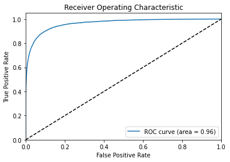

Привет!  меня зовут Люман Аблаев. Сегодня я проверю твой проект.
<br> Дальнейшее общение будет происходить на "ты" если это не вызывает никаких проблем.
<br> Желательно реагировать на каждый мой комментарий ('исправил', 'не понятно как исправить ошибку', ...)
<br> Пожалуйста, не удаляй комментарии ревьюера, так как они повышают качество повторного ревью.

Комментарии будут в <font color='green'>зеленой</font>, <font color='blue'>синей</font> или <font color='red'>красной</font> рамках:

<div class="alert alert-block alert-success">
<b>Успех:</b> Если все сделано отлично
</div>

<div class="alert alert-block alert-info">
<b>Совет: </b> Если можно немного улучшить
</div>

<div class="alert alert-block alert-danger">
<b>Ошибка:</b> Если требуются исправления. Работа не может быть принята с красными комментариями.
</div>

-------------------

Будет очень хорошо, если ты будешь помечать свои действия следующим образом:
<div class="alert alert-block alert-warning">
<b>Комментарий студента:</b> ...
</div>

<div class="alert alert-block alert-warning">
<b>Изменения:</b> Были внесены следующие изменения ...
</div>

<font color='orange' style='font-size:24px; font-weight:bold'>Общее впечатление</font>
* Приятно было проверять твою работу
- Я оставил некоторые советы, обрати на них внимание. Надеюсь они будут полезными или интересными
- Есть маленькие в работе, но я думаю ты быстро и легко их поправишь
- Давай еще разок


	

<font color='orange' style='font-size:24px; font-weight:bold'>Общее впечатление[2]</font>
* Спасибо за усердность!
- Было приятно с тобой сотрудничать.
- Недочеты исправлены - работа полностью корректна
- Не буду больше задерживать, продолжай в том же духе.

<font color='green'><b>Полезные (и просто интересные) материалы:</b> \
Для работы с текстами используют и другие подходы. Например, сейчас активно используются RNN (LSTM) и трансформеры (BERT и другие с улицы Сезам, например, ELMO). НО! Они не являются панацеей, не всегда они нужны, так как и TF-IDF или Word2Vec + модели из классического ML тоже могут справляться. \
BERT тяжелый, существует много его вариаций для разных задач, есть готовые модели, есть надстройки над библиотекой transformers. Если, обучать BERT на GPU (можно в Google Colab или Kaggle), то должно быть побыстрее.\
https://huggingface.co/transformers/model_doc/bert.html \
https://t.me/renat_alimbekov \
https://colah.github.io/posts/2015-08-Understanding-LSTMs/ - Про LSTM \
https://web.stanford.edu/~jurafsky/slp3/10.pdf - про энкодер-декодер модели, этеншены\
https://pytorch.org/tutorials/beginner/transformer_tutorial.html - официальный гайд
по трансформеру от создателей pytorch\
https://transformer.huggingface.co/ - поболтать с трансформером \
Библиотеки: allennlp, fairseq, transformers, tensorflow-text — множествореализованных
методов для трансформеров методов NLP \
Word2Vec https://radimrehurek.com/gensim/models/word2vec.html 

<font color='green'>Пример BERT с GPU:
```python
%%time
from tqdm import notebook
batch_size = 2 # для примера возьмем такой батч, где будет всего две строки датасета
embeddings = [] 
for i in notebook.tqdm(range(input_ids.shape[0] // batch_size)):
        batch = torch.LongTensor(input_ids[batch_size*i:batch_size*(i+1)]).cuda() # закидываем тензор на GPU
        attention_mask_batch = torch.LongTensor(attention_mask[batch_size*i:batch_size*(i+1)]).cuda()
        
        with torch.no_grad():
            model.cuda()
            batch_embeddings = model(batch, attention_mask=attention_mask_batch)
        
        embeddings.append(batch_embeddings[0][:,0,:].cpu().numpy()) # перевод обратно на проц, чтобы в нумпай кинуть
        del batch
        del attention_mask_batch
        del batch_embeddings
        
features = np.concatenate(embeddings) 
```
Можно сделать предварительную проверку на наличие GPU.\
Например, так: ```device = torch.device("cuda:0") if torch.cuda.is_available() else torch.device("cpu")```\
Тогда вместо .cuda() нужно писать .to(device)


<h1>Содержание<span class="tocSkip"></span></h1>
<div class="toc"><ul class="toc-item"><li><span><a href="#Подготовка" data-toc-modified-id="Подготовка-1"><span class="toc-item-num">1&nbsp;&nbsp;</span>Подготовка</a></span></li><li><span><a href="#Обучение" data-toc-modified-id="Обучение-2"><span class="toc-item-num">2&nbsp;&nbsp;</span>Обучение</a></span></li><li><span><a href="#Выводы" data-toc-modified-id="Выводы-3"><span class="toc-item-num">3&nbsp;&nbsp;</span>Выводы</a></span></li><li><span><a href="#Чек-лист-проверки" data-toc-modified-id="Чек-лист-проверки-4"><span class="toc-item-num">4&nbsp;&nbsp;</span>Чек-лист проверки</a></span></li></ul></div>

# Проект для «Викишоп»

Интернет-магазин «Викишоп» запускает новый сервис. Теперь пользователи могут редактировать и дополнять описания товаров, как в вики-сообществах. То есть клиенты предлагают свои правки и комментируют изменения других. Магазину нужен инструмент, который будет искать токсичные комментарии и отправлять их на модерацию. 

Обучите модель классифицировать комментарии на позитивные и негативные. В вашем распоряжении набор данных с разметкой о токсичности правок.

Постройте модель со значением метрики качества *F1* не меньше 0.75. 

**Инструкция по выполнению проекта**

1. Загрузите и подготовьте данные.
2. Обучите разные модели. 
3. Сделайте выводы.

Для выполнения проекта применять *BERT* необязательно, но вы можете попробовать.

**Описание данных**

Данные находятся в файле `toxic_comments.csv`. Столбец *text* в нём содержит текст комментария, а *toxic* — целевой признак.

## Подготовка


```python
pip install --upgrade pandas
```

    Requirement already satisfied: pandas in /opt/conda/lib/python3.9/site-packages (2.0.3)
    Requirement already satisfied: pytz>=2020.1 in /opt/conda/lib/python3.9/site-packages (from pandas) (2021.1)
    Requirement already satisfied: numpy>=1.20.3 in /opt/conda/lib/python3.9/site-packages (from pandas) (1.21.1)
    Requirement already satisfied: python-dateutil>=2.8.2 in /opt/conda/lib/python3.9/site-packages (from pandas) (2.8.2)
    Requirement already satisfied: tzdata>=2022.1 in /opt/conda/lib/python3.9/site-packages (from pandas) (2023.3)
    Requirement already satisfied: six>=1.5 in /opt/conda/lib/python3.9/site-packages (from python-dateutil>=2.8.2->pandas) (1.16.0)
    Note: you may need to restart the kernel to use updated packages.


```python
import numpy as np
import pandas as pd
import re
import nltk
from nltk import pos_tag
from nltk.stem import WordNetLemmatizer
from nltk.corpus import stopwords as nltk_stopwords
from sklearn.feature_extraction.text import TfidfVectorizer
from sklearn.model_selection import train_test_split, cross_val_score
from sklearn.linear_model import LogisticRegression
from sklearn.tree import DecisionTreeClassifier
from sklearn.ensemble import RandomForestClassifier
from sklearn.metrics import f1_score, roc_auc_score, roc_curve
from sklearn.model_selection import cross_val_predict
from sklearn.utils import shuffle
import matplotlib.pyplot as plt
from tqdm import tqdm
```


<div class="alert alert-block alert-success">
<b>Успех:</b> Импорты на месте
</div>


```python
data = pd.read_csv('/datasets/toxic_comments.csv')
data.head()
```


<div>
<style scoped>
    .dataframe tbody tr th:only-of-type {
        vertical-align: middle;
    }

    .dataframe tbody tr th {
        vertical-align: top;
    }

    .dataframe thead th {
        text-align: right;
    }
</style>
<table border="1" class="dataframe">
  <thead>
    <tr style="text-align: right;">
      <th></th>
      <th>Unnamed: 0</th>
      <th>text</th>
      <th>toxic</th>
    </tr>
  </thead>
  <tbody>
    <tr>
      <th>0</th>
      <td>0</td>
      <td>Explanation\nWhy the edits made under my usern...</td>
      <td>0</td>
    </tr>
    <tr>
      <th>1</th>
      <td>1</td>
      <td>D'aww! He matches this background colour I'm s...</td>
      <td>0</td>
    </tr>
    <tr>
      <th>2</th>
      <td>2</td>
      <td>Hey man, I'm really not trying to edit war. It...</td>
      <td>0</td>
    </tr>
    <tr>
      <th>3</th>
      <td>3</td>
      <td>"\nMore\nI can't make any real suggestions on ...</td>
      <td>0</td>
    </tr>
    <tr>
      <th>4</th>
      <td>4</td>
      <td>You, sir, are my hero. Any chance you remember...</td>
      <td>0</td>
    </tr>
  </tbody>
</table>
</div>


```python
data.info()
```

    <class 'pandas.core.frame.DataFrame'>
    RangeIndex: 159292 entries, 0 to 159291
    Data columns (total 3 columns):
     #   Column      Non-Null Count   Dtype 
    ---  ------      --------------   ----- 
     0   Unnamed: 0  159292 non-null  int64 
     1   text        159292 non-null  object
     2   toxic       159292 non-null  int64 
    dtypes: int64(2), object(1)
    memory usage: 3.6+ MB


```python
data.describe()
```


<div>
<style scoped>
    .dataframe tbody tr th:only-of-type {
        vertical-align: middle;
    }

    .dataframe tbody tr th {
        vertical-align: top;
    }

    .dataframe thead th {
        text-align: right;
    }
</style>
<table border="1" class="dataframe">
  <thead>
    <tr style="text-align: right;">
      <th></th>
      <th>Unnamed: 0</th>
      <th>toxic</th>
    </tr>
  </thead>
  <tbody>
    <tr>
      <th>count</th>
      <td>159292.000000</td>
      <td>159292.000000</td>
    </tr>
    <tr>
      <th>mean</th>
      <td>79725.697242</td>
      <td>0.101612</td>
    </tr>
    <tr>
      <th>std</th>
      <td>46028.837471</td>
      <td>0.302139</td>
    </tr>
    <tr>
      <th>min</th>
      <td>0.000000</td>
      <td>0.000000</td>
    </tr>
    <tr>
      <th>25%</th>
      <td>39872.750000</td>
      <td>0.000000</td>
    </tr>
    <tr>
      <th>50%</th>
      <td>79721.500000</td>
      <td>0.000000</td>
    </tr>
    <tr>
      <th>75%</th>
      <td>119573.250000</td>
      <td>0.000000</td>
    </tr>
    <tr>
      <th>max</th>
      <td>159450.000000</td>
      <td>1.000000</td>
    </tr>
  </tbody>
</table>
</div>


```python
data.isna().sum()
```


    Unnamed: 0    0
    text          0
    toxic         0
    dtype: int64


```python
data.duplicated().sum()
```


    0


```python
data['toxic'].value_counts()
```


    toxic
    0    143106
    1     16186
    Name: count, dtype: int64


Видим, что наблюдается дисбаланс классов

<div class="alert alert-block alert-success">
<b>Успех:</b> Отлично, что обнаружен дисбаланс - это очень важно в задачах калссификации
</div>

Лемматизация


```python
lemmatizer = WordNetLemmatizer()

def lemmatize_text(text):
    lemm_text = "".join(lemmatizer.lemmatize(text))
    cleared_text = re.sub(r'[^a-zA-Z]', ' ', lemm_text) 
    return " ".join(cleared_text.split())

data['lemm_text'] = data['text'].apply(lemmatize_text)
data = data.drop(['text'], axis=1)
```


```python
def get_wordnet_pos(word):
    tag = nltk.pos_tag([word])[0][1][0].upper()
    tag_dict = {"J": wordnet.ADJ,
                "N": wordnet.NOUN,
                "V": wordnet.VERB,
                "R": wordnet.ADV}
    return tag_dict.get(tag, wordnet.NOUN)
```


<div class="alert alert-block alert-danger">
    
<b>Ошибка:</b>  Для более корректной работы  WordNetLemmatizer, вместо со словом, желательно передавать его POS-тег (part of speech). https://webdevblog.ru/podhody-lemmatizacii-s-primerami-v-python/
    
</div>


<div class="alert alert-block alert-warning">
<b>Комментарий студента: Применил POS-тег</b>
</div>

<div class="alert alert-block alert-success">
    
<b>Успех[2]:</b> 👍
</div>


```python
data.head()
```


<div>
<style scoped>
    .dataframe tbody tr th:only-of-type {
        vertical-align: middle;
    }

    .dataframe tbody tr th {
        vertical-align: top;
    }

    .dataframe thead th {
        text-align: right;
    }
</style>
<table border="1" class="dataframe">
  <thead>
    <tr style="text-align: right;">
      <th></th>
      <th>Unnamed: 0</th>
      <th>toxic</th>
      <th>lemm_text</th>
    </tr>
  </thead>
  <tbody>
    <tr>
      <th>0</th>
      <td>0</td>
      <td>0</td>
      <td>Explanation Why the edits made under my userna...</td>
    </tr>
    <tr>
      <th>1</th>
      <td>1</td>
      <td>0</td>
      <td>D aww He matches this background colour I m se...</td>
    </tr>
    <tr>
      <th>2</th>
      <td>2</td>
      <td>0</td>
      <td>Hey man I m really not trying to edit war It s...</td>
    </tr>
    <tr>
      <th>3</th>
      <td>3</td>
      <td>0</td>
      <td>More I can t make any real suggestions on impr...</td>
    </tr>
    <tr>
      <th>4</th>
      <td>4</td>
      <td>0</td>
      <td>You sir are my hero Any chance you remember wh...</td>
    </tr>
  </tbody>
</table>
</div>


<div class="alert alert-block alert-info">
    
<b>Совет:</b>  Неплохо было бы для наглядности и самопроверки вывести результаты до/после.
</div>


<div class="alert alert-block alert-warning">
<b>Комментарий студента: Вывел ниже</b> 
</div>

<div class="alert alert-block alert-success">
    
<b>Успех[2]:</b> Есть
</div>


```python
data.info()
```

    <class 'pandas.core.frame.DataFrame'>
    RangeIndex: 159292 entries, 0 to 159291
    Data columns (total 3 columns):
     #   Column      Non-Null Count   Dtype 
    ---  ------      --------------   ----- 
     0   Unnamed: 0  159292 non-null  int64 
     1   toxic       159292 non-null  int64 
     2   lemm_text   159292 non-null  object
    dtypes: int64(2), object(1)
    memory usage: 3.6+ MB


```python
data.describe()
```


<div>
<style scoped>
    .dataframe tbody tr th:only-of-type {
        vertical-align: middle;
    }

    .dataframe tbody tr th {
        vertical-align: top;
    }

    .dataframe thead th {
        text-align: right;
    }
</style>
<table border="1" class="dataframe">
  <thead>
    <tr style="text-align: right;">
      <th></th>
      <th>Unnamed: 0</th>
      <th>toxic</th>
    </tr>
  </thead>
  <tbody>
    <tr>
      <th>count</th>
      <td>159292.000000</td>
      <td>159292.000000</td>
    </tr>
    <tr>
      <th>mean</th>
      <td>79725.697242</td>
      <td>0.101612</td>
    </tr>
    <tr>
      <th>std</th>
      <td>46028.837471</td>
      <td>0.302139</td>
    </tr>
    <tr>
      <th>min</th>
      <td>0.000000</td>
      <td>0.000000</td>
    </tr>
    <tr>
      <th>25%</th>
      <td>39872.750000</td>
      <td>0.000000</td>
    </tr>
    <tr>
      <th>50%</th>
      <td>79721.500000</td>
      <td>0.000000</td>
    </tr>
    <tr>
      <th>75%</th>
      <td>119573.250000</td>
      <td>0.000000</td>
    </tr>
    <tr>
      <th>max</th>
      <td>159450.000000</td>
      <td>1.000000</td>
    </tr>
  </tbody>
</table>
</div>


```python
data.isna().sum()
```


    Unnamed: 0    0
    toxic         0
    lemm_text     0
    dtype: int64


```python
data.duplicated().sum()
```


    0


```python
data['toxic'].value_counts()
```


    toxic
    0    143106
    1     16186
    Name: count, dtype: int64


## Обучение

Возьмем три модели: LogisticRegression, RandomForestClassifier и DecisionTreeClassifier


```python
features = data.drop(['toxic'], axis=1)
target = data['toxic']

features_train, features_test, target_train, target_test = train_test_split(
    features, target, test_size=0.3, random_state=12345)

features_valid, features_test, target_valid, target_test = train_test_split(
    features_test, target_test, test_size=0.5, random_state=12345)
```


```python
nltk.download('stopwords')
stopwords = set(nltk_stopwords.words('english'))

count_tf_idf = TfidfVectorizer(stop_words=stopwords)

features_train = count_tf_idf.fit_transform(features_train['lemm_text'])   
features_test = count_tf_idf.transform(features_test['lemm_text'])
features_valid = count_tf_idf.transform(features_valid['lemm_text'])

cv_counts = 2
```

    [nltk_data] Downloading package stopwords to /home/jovyan/nltk_data...
    [nltk_data]   Package stopwords is already up-to-date!


<div class="alert alert-block alert-success">

<b>Успех:</b> Хорошо, что векторизатор обучен только на обучающей выборке - это уменьшает переобучение 
</div>


<div class="alert alert-block alert-danger">
<b>Ошибка:</b>  Приводить английские тексты к юникоду не имеет смысла, так как это приводит только к увеличению занимаемой памяти. 
</div>


<div class="alert alert-block alert-warning">
<b>Комментарий студента: Убрал приведение к юникоду</b> 
</div>

<div class="alert alert-block alert-success">
    
<b>Успех[2]:</b> 👍
</div>


```python
print(features_train.shape)
print(target_train.shape)
```

    (111504, 136390)
    (111504,)


```python
print(features_test.shape)
print(target_test.shape)
```

    (23894, 136390)
    (23894,)


```python
print(features_valid.shape)
print(target_valid.shape)
```

    (23894, 136390)
    (23894,)


Кроссвалидация


```python
%%time

model_lr = LogisticRegression(random_state=12345, solver='liblinear')
train_f1 = cross_val_score(model_lr, 
                      features_train, 
                      target_train, 
                      cv=cv_counts, 
                      scoring='f1').mean()
print('f1 на CV', train_f1)
```

    f1 на CV 0.6606483045999401
    CPU times: user 3.88 s, sys: 6.91 s, total: 10.8 s
    Wall time: 10.8 s


<div class="alert alert-block alert-info">
<b>Совет: </b>  Также напомню, что внутри кросс-валидации происходих разбиение выборки на треин и валидацию. Однако, в таком случае векторизатор обучен на всей выборке, а это не совсем корректно. Для избежания такого эффекта можно использовать <a href="https://scikit-learn.org/stable/modules/generated/sklearn.pipeline.Pipeline.html">пайплайн</a>.
</div>


```python
%%time

model_rf = RandomForestClassifier(random_state=12345)
train_f1 = cross_val_score(model_rf, 
                      features_train, 
                      target_train, 
                      cv=cv_counts, 
                      scoring='f1').mean()
print('f1 на CV', train_f1)
```

    f1 на CV 0.692156801576377
    CPU times: user 13min 59s, sys: 1.03 s, total: 14min
    Wall time: 14min 1s


```python
%%time

model_dt = DecisionTreeClassifier(random_state=12345)
train_f1 = cross_val_score(model_dt, 
                      features_train, 
                      target_train, 
                      cv=cv_counts, 
                      scoring='f1').mean()
print('f1 на CV', train_f1)
```

    f1 на CV 0.7046764095803355
    CPU times: user 4min 9s, sys: 96.6 ms, total: 4min 9s
    Wall time: 4min 9s


Взвешивание классов


```python
%%time

model_lr_balanced = LogisticRegression(random_state=12345, class_weight='balanced')
train_f1_balanced = cross_val_score(model_lr_balanced, 
                                    features_train, 
                                    target_train, 
                                    cv=2, 
                                    scoring='f1').mean()
print('f1 на CV баланс', train_f1_balanced)
```

    f1 на CV баланс 0.7410237253567264
    CPU times: user 16 s, sys: 35.5 s, total: 51.5 s
    Wall time: 51.6 s


```python
%%time

model_rf_balanced = RandomForestClassifier(random_state=12345, class_weight='balanced')
train_f1_balanced = cross_val_score(model_rf_balanced, 
                                    features_train, 
                                    target_train, 
                                    cv=cv_counts, 
                                    scoring='f1').mean()
print('f1 на CV баланс', train_f1_balanced)
```

    f1 на CV баланс 0.6084766607589387
    CPU times: user 13min 7s, sys: 991 ms, total: 13min 7s
    Wall time: 13min 8s


```python
%%time

model_dt_balanced = DecisionTreeClassifier(random_state=12345, class_weight='balanced')
train_f1_balanced = cross_val_score(model_dt_balanced, 
                                    features_train, 
                                    target_train, 
                                    cv=cv_counts, 
                                    scoring='f1').mean()
print('f1 на CV баланс', train_f1_balanced)
```

    f1 на CV баланс 0.6159527553549822
    CPU times: user 1min 57s, sys: 136 ms, total: 1min 57s
    Wall time: 1min 57s


Даунсэмплинг


```python
data_train = data.iloc[target_train.index]
target_train_class_zero = data_train[data_train['toxic'] == 0]['toxic']
target_train_class_one = data_train[data_train['toxic'] == 1]['toxic']


target_train_class_zero_downsample = target_train_class_zero.sample(target_train_class_one.shape[0],
                                                                    random_state=12345)
target_train_downsample = pd.concat([target_train_class_zero_downsample, target_train_class_one])

features_train_downsample = data.iloc[target_train_downsample.index]


features_train_downsample, target_train_downsample = shuffle(features_train_downsample,
                                                             target_train_downsample,
                                                             random_state=12345)


features_train_downsample = count_tf_idf.transform(features_train_downsample['lemm_text'])


print('Доля:')
print(target_train_downsample.value_counts(normalize=True))

print(features_train_downsample.shape)
print(target_train_downsample.shape)
```

    Доля:
    toxic
    0    0.5
    1    0.5
    Name: proportion, dtype: float64
    (22596, 136390)
    (22596,)


<div class="alert alert-block alert-success">

<b>Успех:</b> downsample применен корректно.
</div>


<div class="alert alert-block alert-danger">
<b>Ошибка:</b>  Тоже самое с конвертацией
</div>


<div class="alert alert-block alert-warning">
<b>Комментарий студента: Здесь тоже убрал юникод</b> 
</div>

<div class="alert alert-block alert-success">
    
<b>Успех[2]:</b> 👍
</div>


```python
%%time

model_lr_downsample = LogisticRegression(random_state=12345, solver='liblinear')
model_lr_downsample.fit(features_train_downsample, target_train_downsample)
predictions_valid_lr_downsample = model_lr_downsample.predict(features_valid)

print("f1:", f1_score(target_valid, predictions_valid_lr_downsample))
```

    f1: 0.6964516129032258
    CPU times: user 1.65 s, sys: 3.92 s, total: 5.57 s
    Wall time: 5.54 s


<div class="alert alert-block alert-info">
    
<b>Совет:</b> Неплохо было бы подобрать гиперпараметр `C`
</div>


```python
%%time

best_model_rf = None
best_result_rf = 0
best_est_rf = 0
best_depth_rf = 0
for est in tqdm(range(1, 11)):
    for depth in range(1, 11):
        model_rf_downsample = RandomForestClassifier(random_state=12345, n_estimators=est, max_depth=depth)
        model_rf_downsample.fit(features_train_downsample, target_train_downsample)
        predictions_valid_rf_downsample = model_rf_downsample.predict(features_valid)
        result_rf = f1_score(predictions_valid_rf_downsample, target_valid)
        if result_rf > best_result_rf:
            best_model_rf = model_rf_downsample
            best_result_rf = result_rf
            best_est_rf = est
            best_depth_rf = depth
            
print(best_model_rf)
print('f1:', result_rf)
```

    100%|██████████| 10/10 [00:17<00:00,  1.71s/it]

    RandomForestClassifier(max_depth=10, n_estimators=10, random_state=12345)
    f1: 0.276302101393994
    CPU times: user 16.9 s, sys: 54.6 ms, total: 16.9 s
    Wall time: 17.1 s


    


<div class="alert alert-block alert-danger">
<b>Ошибка:</b>  
    
1) Здесь код падает.  Модель в переменной `model_rf`  у тебя не обученая.
    
2) На тестовой выборке нельзя подбирать гиперпараметры - она выполняет другую роль.  Мы для этого ее и откладывали, чтобы проверить, как хорошо настроенная модель будет работать на данных, под которые мы ее не подгоняли - исправь это везде

</div>


<div class="alert alert-block alert-warning">
<b>Комментарий студента: Все исправлено</b> 
</div>

<div class="alert alert-block alert-success">
    
<b>Успех[2]:</b> Есть контакт
</div>


```python
%%time

best_model_dt = None
best_result_dt = 0
for depth in range(1, 11):
    model_dt_downsample = DecisionTreeClassifier(random_state=12345, max_depth=depth)
    model_dt_downsample.fit(features_train_downsample, target_train_downsample)
    predictions_valid_dt_downsample = model_dt_downsample.predict(features_valid)
    result_dt = f1_score(target_valid, predictions_valid_dt_downsample)
    if result_dt > best_result_dt:
        best_model_dt = model_dt_downsample
        best_depth_dt = depth
        best_result_dt = result_dt

print(best_model_dt) 
print('f1:', result_dt)
```

    DecisionTreeClassifier(max_depth=9, random_state=12345)
    f1: 0.559432933478735
    CPU times: user 13.3 s, sys: 4.06 ms, total: 13.3 s
    Wall time: 13.3 s


<div class="alert alert-block alert-danger">
<b>Ошибка:</b>  Кросс-валидационные методы не совместимы с методами для борьбы с дисбалансом upsample/downsample. Так как внутри кросс-валидации происходит разбиение данных на трейн/валид. И тогда валидационные данные получаются сбалансированными (что отличается от нашей текущей задачи) - это тем самым ведет к смещенным оценкам или гиперпараметрам.

</div>


<div class="alert alert-block alert-warning">
<b>Комментарий студента: Убрал все лишнее</b> 
</div>

<div class="alert alert-block alert-success">
    
<b>Успех[2]:</b> 👍
</div>


График ROC-кривой


```python
model_lr_balanced = LogisticRegression(random_state=12345)

predicted_probs = cross_val_predict(model_lr_balanced, features_train, target_train, cv=cv_counts, method='predict_proba')

fpr, tpr, thresholds = roc_curve(target_train, predicted_probs[:, 1])

auc_roc = roc_auc_score(target_train, predicted_probs[:, 1])

plt.plot(fpr, tpr, label='ROC curve (area = %0.2f)' % auc_roc)
plt.plot([0, 1], [0, 1], 'k--')
plt.xlim([0.0, 1.0])
plt.ylim([0.0, 1.05])
plt.xlabel('False Positive Rate')
plt.ylabel('True Positive Rate')
plt.title('Receiver Operating Characteristic')
plt.legend(loc="lower right")
plt.show()

print('auc_roc:', auc_roc)


f1_scores = cross_val_score(model_lr_balanced, 
                            features_train, 
                            target_train, 
                            cv=cv_counts, scoring='f1')
f1_mean = f1_scores.mean()
print('f1 на CV:', f1_mean)


```


    

    


    auc_roc: 0.9641111491245011


Удалось достичь требуемого значения f1, показатель auc_roc близок к единице, это выше случайных 0.5


<div class="alert alert-block alert-danger">
<b>Ошибка:</b> Оценка f1 должна быть на тесте > 0.75, А оценка на кросс-валидации, используя downsampled данные - смещенная

</div>


<div class="alert alert-block alert-warning">
<b>Комментарий студента: Исправлено</b> 
</div>

<div class="alert alert-block alert-success">
    
<b>Успех[2]:</b> Есть контакт
</div>


По результатам исследований лучший показатель f1 у модели LogisticRegression. На ней и проведем финальное тестирование.


```python
model_best = LogisticRegression(random_state=12345, class_weight='balanced')

model_best.fit(features_train, target_train) 
predictions = model_best.predict(features_test)
result = f1_score(target_test, predictions)

print("f1 лучшей модели на тестовой выборке:", result)
```

    f1 лучшей модели на тестовой выборке: 0.750229399889888


    /opt/conda/lib/python3.9/site-packages/sklearn/linear_model/_logistic.py:763: ConvergenceWarning: lbfgs failed to converge (status=1):
    STOP: TOTAL NO. of ITERATIONS REACHED LIMIT.
    
    Increase the number of iterations (max_iter) or scale the data as shown in:
        https://scikit-learn.org/stable/modules/preprocessing.html
    Please also refer to the documentation for alternative solver options:
        https://scikit-learn.org/stable/modules/linear_model.html#logistic-regression
      n_iter_i = _check_optimize_result(


## Выводы

Вывод: по результатам исследования трех моделей мы установили лучшую - это LogisticRegression. Изначально наблюдался дисбаланс классов, который мы устранили с помощью их взвешивания и даунсэмплинга. Удалось добиться повышения F1-меры. В итоге на финальном тестировании нам удалось получить требуемое значение f1 - 0.75, значение auc_roc также выше константной модели.

<div class="alert alert-block alert-danger">
<b>Ошибка:</b> После анализа и выбора одной наилучшей модели, должно идти  ее тестирование. Другие модели тестовую выборку использовать не должны.
</div>

<div class="alert alert-block alert-warning">
<b>Комментарий студента: Тестирование проведено</b> 
</div>

<div class="alert alert-block alert-success">
    
<b>Успех[2]:</b> Получено хорошее качество на тесте!
</div>


## Чек-лист проверки

- [x]  Jupyter Notebook открыт
- [ ]  Весь код выполняется без ошибок
- [ ]  Ячейки с кодом расположены в порядке исполнения
- [ ]  Данные загружены и подготовлены
- [ ]  Модели обучены
- [ ]  Значение метрики *F1* не меньше 0.75
- [ ]  Выводы написаны
